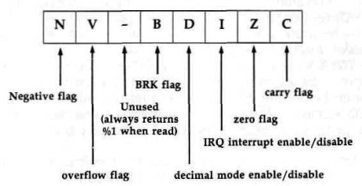

# $0000-$00FF

## 0 $00 D8502 <a name="00"></a>
### Data direction register for processor's on-chip I/O port
Bits 0-6 in this location control the direction of data flow for
the seven I/O (input/output) lines on the 8502 microprocessor
chip, labeled P0-P6. Setting a bit to %0 makes the corresponding line
an input, and its state can be read at the corresponding bit position
in location $01. Setting a bit to %1 makes the
corresponding line an output, and its state will be controlled
by the setting of the corresponding bit position in location
$01. The value here is initialized to 47/$2F by the IOINIT
routine [$E109], part of both the reset and RUN/STOP-RESTORE
sequences. This sets lines 0-3 and 5 for output and
lines 4 and 6 for input. Since only seven lines are provided,
bit 7 is not used. That bit will retain whatever value is written
to it, but its setting has no effect.

## 1 $01 R8502 <a name="01"></a>
### Data register for processor's on-chip I/O port
Each of the seven I/O lines on the 8502 microprocessor has a
corresponding bit in this location (bit 7 is unused). The direction
of data flow on the lines is controlled by location $00. If
an I/O port line is set for input, the corresponding bit here
will reflect the state of the input line: %0 if the line is low (0
volts), or %1 if the line is high (+5 volts). While a line is set
for input, values written to the corresponding bit have no effect.
If an I/O port line is set for output, its state will be controlled
by the corresponding bit in this location. Storing a %0
in the bit forces the output line to a low (0 volts) state, while
storing a %1 in the bit sets the line to a high (+5v state).
The I/O lines are connected as follows.

**Bits 0-1**: the lines connected to these bits control which of the
two 1K blocks of color memory will be visible at 55296-56319/
$D800-$DBFF when the I/O block is selected. For this purpose, the
lines should always be configured as outputs. Unlike
in the Commodore 64, these bits have no effect on whether
RAM or ROM is selected at a given address. In the 128, memory
management is the domain of the MMU chip.
Bit 0 controls which block the processor sees, while bit 1
controls which block the VIC chip sees. Setting either bit to
%0 selects block 0, while a setting of %1 selects block 1. The
setting of these bits is established during the screen-setup
portion of the screen IRQ routine [$C194], That routine sets both
bits to %1 for text mode (GRAPHIC 0), or for the text portion
of the split-screen modes (GRAPHIC 2 or GRAPHIC 4). For
the bitmapped modes (GRAPHIC 1 or GRAPHIC 3) or for the
bitmapped portion of the split-screen modes, bit 1 is set to
%0. Thus, the VIC sees different blocks of memory for the
modes, and drawing on the bitmapped screen will not disturb
colors on the text screen. To manipulate these bits in other
ways, the screen-setup portion of the IRQ routine must be disabled.

**Bit 2**: the line for this bit, known as the CHAREN line, determines
whether the VIC chip will see character ROM in its current video bank.
For proper functioning, the line should be
configured as an output. While this bit is %0, the VIC chip
will see character ROM beginning at an offset of 4096/$1000
from the start of the bank. The uppercase/graphics set will
appear to occupy locations with offsets of 4096-6143/
$1000-$17FF, and the lowercase/uppercase set will appear at
offsets of 6144-8191/$1800-$lFFF. The character sets will be
visible in all VIC video banks, not just banks 0 and 2 as was
the case in the Commodore 64. Only the VIC chip will see the
character ROM at these addresses; the processor will still see
the locations as RAM or system ROM, depending on the address and
bank configuration.
To disable this feature and allow the VIC chip to see
RAM at the character set image addresses, the CHAREN bit
must be set to %1. However, this cannot normally be done directly
because this bit has a shadow at location [217/$D9](#D9). During the text
mode-setup portion of the screen editor IRQ
routine [$C194], the value of bit 2 of the shadow location is
copied into this bit. Thus, to change this bit you should set bit
2 of the shadow location instead. If the screen-setup portion of
the IRQ routine is disabled (by storing the value 255/$FF in
location [216/$D8](#D8), for example), the setting of this bit can then
be changed directly. The IRQ routine always sets this bit to
%1 for bitmapped screen modes or for the bitmapped portion
of split-screen modes.

**Bit 3**: the line for this bit is connected to the CASS WRT
(cassette write) line of the cassette port. The setting of this bit
determines whether a signal is being written to the tape. For this
purpose, the line must be configured as an output.

**Bit 4**: the line for this bit is connected to the CASS SENSE
(cassette button sense) line of the cassette port. If the port line
is configured as an input, this bit can be read to determine
whether any buttons are currently pressed on the Datassette.
When no buttons are pressed (or when no Datassette is connected to the port),
this bit will be %1. Pressing any button
will change this bit to %0. Unfortunately, the bit merely detects whether
buttons are pressed, and cannot indicate which
specific buttons. If you press FAST FORWARD when instructed to press PLAY,
the 128 won't notice the difference.

**Bit 5**: the line for this bit controls the CASS MTR (cassette
motor) line of the cassette port. When this bit is %1 , the
power supply to the cassette motor, provided via the CASS
MTR line, is turned off. Setting this bit to %0 turns on the 9-
volt power supply to the motor. The setting of this bit is controlled by
a shadow location, the cassette motor interlock at
[192/$C0](#C0).

**Bit 6**: the line for this bit is connected to the CAPS LOCK key
on the keyboard. The line should be configured as an input to
read the state of this key. The bit will return a %1 while the
key is in the up position (CAPS LOCK off), and a %0 when
the key is down (CAPS LOCK on). The status of this bit is
read by the SCNKEY routine [$C55D](C000#C55D) during each system
IRQ, and bit 4 of location [211/$D3](#D3) will be assigned the opposite
setting of this bit.

**Bit 7**: there is no I/O port line connected to this bit, so the
value here is meaningless. The bit always returns a %0 when
read.

## 2 $02 BANK <a name="02"></a>
### Data register for processor's on-chip I/O port
The value here determines the bank to which the JMPFAR
routine [$02E3] will jump. Because the JSRFAR routine
[$02CD] calls JMPFAR as a subroutine, the value here also determines
the destination bank for a JSRFAR. This location
should be loaded with the number (0-15) of the desired bank
before either JMPFAR or JSRFAR is used.
The BASIC SYS statement is implemented using JSRFAR.
In that case, the value here is set from the value in location
981/$03D5, which holds the parameter from the most recent
BANK statement (15/$0F by default). The BASIC routine that
searches for a token in the runtime stack [$4FAA] also uses
location 2/$02 for temporary storage.

When the monitor is entered at the break entry point
[$B003], this location is loaded with the bank number in
which the system was operating when the BRK opcode was
encountered. When the monitor is entered at the cold-start entry point
[$B000], as by the BASIC MONITOR command, this
location is initialized to 15/$0F (for bank 15). The monitor R
command displays the value in this location as the first hexadecimal
digit of the PC value. The register change (;) command can be used
to alter the value stored here. The value
determines the bank for the monitor G (go to routine) and J
(jump to subroutine) commands, which use JMPFAR and
JSRFAR, respectively.

## 3-4 $03-$04 PC <a name="03"></a><a name="04"></a>
### Target address for JMPFAR and JSRFAR
The values here determine the address to which the JMPFAR
routine [$02E3] will jump. Because the JSRFAR routine
[$02CD] calls JMPFAR as a subroutine, the value here also determines
the destination address for a JSRFAR. These locations
should be loaded with the desired address before either
JMPFAR or JSRFAR is used. Contrary to the normal order of
address bytes, the high byte of the target address should be
stored in location 3/$03 and the low byte in location 4/$04.
When the monitor is entered at the break entry point
[$3003], these locations are loaded with the program counter
contents stored on the stack when the BRK opcode was encountered.

Because of the way the microprocessor handles
BRK, this value will be two bytes beyond the address of the
BRK ($00) opcode. When the monitor is entered at the coldstart entry point
[$B000], as by the BASIC MONITOR command, these locations are initialized to
45056/$B000 (the coldstart entry address). The monitor R command displays the
value in these locations as the four rightmost hexadecimal digits of the PC value.
The register change (;) command can be
used to alter the value stored here. The value determines the
target address for the monitor G (go to routine) and J (jump to
subroutine) commands, which use JMPFAR and JSRFAR,
respectively.

## 5 $05 S-REG <a name="05"></a>
### Status register storage for JMPFAR and JSRFAR
The value in this location is transferred to the processor's status
register when a routine is called with JMPFAR [$02E3]. Because JSRFAR
[$02CD] also uses JMPFAR, the value here will
also determine the initial status register value for a routine
called with JSRFAR. You can use this location to set up particular entry
conditions for the target routine. For example,
certain system routines behave differently depending on
whether the carry bit, bit 0 of the status register, is clear (%0)
or set (%1) when the routine is called. You can specify the entry setting
of the carry bit by setting bit 0 of this location. Next figure shows the
function of the various status register bits. If
you don't need any special entry conditions, it's best to set
this location to [0/$00](#00).

The contents of the status register upon return from the
target routine are stored in this location before return from
JSRFAR, so you can read this location to determine the exit
status of the routine. This is useful because system routines
often use status register bits, particularly carry, to return information
about the success of the operation performed by the
routine.



The BASIC 7.0 version of the SYS statement allows you
to specify a status register value, which will be placed in this
location before the JSRFAR to the specified address. The
RREG statement can be used to read the value here. The status register
value returned by RREG is actually the contents of
this location.

When the monitor is entered at the break entry point
[$B003], this location is loaded with the status register contents
stored on the stack when the BRK opcode was encountered.
When the monitor is entered at the cold-start entry point
[$B000], as by the BASIC MONITOR command, this location
is initialized to zero. The monitor R command displays the
value in this location under the heading SR. The register
change (;) command can be used to alter the value stored here.
The value determines the status register contents for the monitor G
(go to routine) and J (jump to subroutine) commands,
which use JMPFAR and JSRFAR, respectively.

## 6 $06 A_REG <a name="06"></a>
### Accumulator storage for JMPFAR and JSRFAR
The value in this location is transferred to the processor's
accumulator (A register) when a routine is called with JMPFAR
[$02E3]. Because JSRFAR [$02CD] also uses JMPFAR, the
value here will also determine the initial accumulator value for
a routine called with JSRFAR. You can use this location to set
up a particular entry value for the target routine. The contents
of the accumulator upon return from the target routine are
stored in this location before return from JSRFAR, so you can
read this location to determine the exit accumulator value. The
JSRFAR routine itself uses the accumulator after return from
the target routine, so you must look to this location for the
accumulator value from the target routine.
The BASIC 7.0 version of the SYS statement allows you
to specify an accumulator value, which will be placed in this
location before the JSRFAR to the specified address. The
RREG statement can be used to read the value here.
The accumulator value returned by RREG is actually the contents of
this location.

When the monitor is entered at the break entry point
[$B003], this location is loaded with the accumulator contents
stored on the stack by the IRQ/BRK handler [$FF17]. When
the monitor is entered at the cold-start entry point [$B000], as
by the BASIC MONITOR command, this location is initialized
to zero. The monitor R command displays the value in this location
under the heading AC. The register change (;) command can be used to
alter the value stored here. The value
determines the accumulator contents for the monitor G (go to
routine) and J (jump to subroutine) commands, which use
JMPFAR and JSRFAR, respectively.

## 7 $07 X_REG <a name="07"></a>
### X register storage for JMPFAR and JSRFAR
The value in this location is transferred to the processor's X
register when a routine is called with JMPFAR [$02E3]. Because JSRFAR
[$02CD] also uses JMPFAR, the value here will
also determine the initial X register value for a routine called
with JSRFAR, You can use this location to set up a particular
entry value for the target routine. The contents of the X register
upon return from the target routine are stored in this location before
return from JSRFAR, so you can read this location to determine the exit
X register value. The JSRFAR routine itself uses the X register after
return from the target routine, so
you must look to this location for the X register value from the
target routine.

The BASIC 7.0 version of the SYS statement allows you
to specify an X register value, which will be placed in this location
before the JSRFAR to the specified address. The RREG
statement can be used to read the value here. The X register
value returned by RREG is actually the contents of this
location.

When the monitor is entered at the break entry point
[$B003], this location is loaded with the X register contents
stored on the stack by the IRQ/BRK handler [$FF17]. When
the monitor is entered at the cold-start entry point [$B000], as
by the BASIC MONITOR command, this location is initialized
to zero. The monitor R command displays the value in this location under
the heading XR. The register change (;) command
can be used to alter the value stored here. The value determines the X
register contents for the monitor G (go to routine)
and J (jump to subroutine) commands, which use JMPFAR and
JSRFAR, respectively.

## 8 $08 Y_REG <a name="08"></a>
### Y register storage for JMPFAR and JSRFAR
The value in this location is transferred to the processor's Y
register when a routine is called with JMPFAR [$02E3]. Because
JSRFAR [$02CD] also uses JMPFAR, the value here will
also determine the initial Y register value for a routine called
with JSRFAR. You can use this location to set up a particular
entry value for the target routine. The contents of the Y register
upon return from the target routine are stored in this location before
return from JSRFAR, so you can read this location
to determine the exit Y register value.

The BASIC 7.0 version of the SYS statement allows you
to specify a Y register value, which will be placed in this location
before the JSRFAR to the specified address. The RREG
statement can be used to read the value here. The Y register
value returned by RREG is actually the contents of this
location.

When the monitor is entered at the break entry point
[$B003], this location is loaded with the Y register contents
stored on the stack by the IRQ/BRK handler [$FF17]. When
the monitor is entered at the cold-start entry point [$B000], as
by the BASIC MONITOR command, this location is initialized
to zero. The monitor R command displays the value in this location
under the heading YR. The register change (;) command
can be used to alter the value stored here. The value determines the
Y register contents for the monitor G (go to routine)
and J (jump to subroutine) commands, which use JMPFAR and
JSRFAR, respectively.

## 9 $09 STKPTR <a name="09"></a>
### Stack pointer storage for JSRFAR and monitor
This location is used in the JSRFAR routine [$02CD] to record
the value in the stack pointer upon return from the target routine.
The value here doesn't affect the setting of the stack
pointer; it merely records the exit value.

When the monitor is entered via either the cold-start entry
point [$B000] or the break entry point [$B003], the current
stack pointer value is stored in this location. The monitor R
command displays the value in this location under the heading SP.
The register change (;) command can be used to alter
the value stored here. The value here is restored to the
microprocessor's stack pointer before the JMPFAR in the G (go
to routine) command routine. This location will hold the stack
pointer value after a J (jump to subroutine) command, since
that routine uses JSRFAR.

## 9 $09 CHARAC or INTEGR
### Working storage for various routines
This location is used for several different purposes by a variety
of BASIC routines. It serves as temporary storage in the routine which
interprets ASCII characters as numeric values
[$50A0]. It holds the value of the desired search character in
the routine which searches for a particular character in a
BASIC program line [$52A2], and in the routine that puts a
string into the string pool [$869A]. It holds the low byte of the
integer value generated in the BASIC INT routine [$8CFB]. It
is also used for temporary storage of intermediate values while
performing BASIC AND or OR operations [$4C86],

## 10 $0A GRAPHM <a name="0A"></a>
### Working storage for various routines
This location is used for several different purposes by a variety
of BASIC routines. It serves as a counter of the number of digits in
the ASCII representation of a number during the routine
which interprets the characters as a numeric value [$50A0]. It
holds the value of the character which terminates the search in
the routine which looks for a particular character in a BASIC
program line [$52A2], and in the one that puts a string into
the string pool [$869A]. It is also used for temporary storage of
intermediate values while performing BASIC AND or OR operations [$4C86].

## 11 $0B TRMPOS <a name="0B"></a>
### Current screen column for TAB and SPC calculations
The value in this location is used during the portion of the
BASIC PRINT routine [$5554] that handles the TAB and SPC
functions. In the computation of the target column for the TAB
or SPC, this location will hold the current cursor column
value.

## 12 $0C VERCK <a name="0C"></a>
### BASIC LOAD/VERIFY flag
The same routine is used to perform both the load and verify
operations, so this flag indicates which is being performed, A
zero value here indicates a load operation, and a nonzero
value indicates verify. The value here is set during the
LOAD/VERIFY [$9129] and DLOAD/DVERIFY [$A1A4]
routines. Both operations use the Kernal LOAD routine
[$F265], which has its own load/verify flag at location
[147/$93](#93).

## 13 $0D COUNT <a name="0D"></a>
### Working storage for various routines
This location is used for different purposes by several BASIC
routines. It holds the most recently found token during program
tokenization [$430A]. In the routine that adds or deletes
BASIC program lines [$4DE2], this location holds the length of
the current line. It is also used as a counter in the RREG routine
[$50BD], and as a counter in the subroutines that find or
create array-variable elements.

## 14 $0E DIMFLG <a name="0E"></a>
### Array dimension flag
This location is used during the routines that create array variables
to indicate whether the routines are being called to as
the result of a DIM statement. For a DIM statement, this location
will contain a nonzero value; otherwise it will be set to
0/$00. This flag is used in testing for the REDIM'D ARRAY
ERROR condition.

## 15 $0F VALTYP <a name="0F"></a>
### Variable type flag
This location is used to indicate the type of variable currently
being evaluated. A value of 0/$00 indicates that the variable
is numeric. A nonzero value indicates that the variable is
string type. During the routine that finds or creates a variable
[$7AAF], this location is set to 0/$00 if the variable is numeric
type, or to 255/$FF if it is string type.

## 16 $10 INTFLG <a name="10"></a>
### Numeric variable type flag
If the variable currently being evaluated is numeric (see the
entry for location 15/$0F above), bit 7 of this location will be
used to indicate the numeric type. If that bit is %0, the variable
is standard (floating point) type. If the bit is %1, the variable
is integer type. During the routine that finds or creates a
variable [$7AAF], this location will be set to 0/$00 for floating
point variables or 128/$80 for integer variables.

## 17 $11 GARBFL <a name="11"></a>
### Working storage for various routines
This location is used for different purposes in several BASIC
routines. During string evaluation, it is used as a garbage
collection flag. A zero value indicates that no garbage collection has
been performed, while a nonzero value (1/$01)
indicates that garbage collection has taken place. The location
is also used as a quote mode flag during LIST; a value of
0/$00 indicates that quote mode is off, while a nonzero value
(1/$01) indicates that quote mode is in effect. In addition, this
location is used as temporary storage for the high byte of the
disk status variable during the evaluation of the reserved variable DS.

## 18 $12 SUBFLG <a name="12"></a>
### Integer/subscript prohibit flag
This location is used during the routine to find or create a
variable [$7AAF] to specify whether integer or subscripted (array)
variables are allowed. While the value here is zero, the
variable being evaluated can be of any type. The FOR and
DEF routines store the value 128/$80 here. For FOR, this prevents the
use of integer or array variables as loop indexes. For
DEF, this restricts the function definition to floating point variables
and also prevents the parentheses in the function definition from being
interpreted as indicating an array variable.
This location is reset to zero after each variable is evaluated,
and also during CLR [$51F8].

## 19 $13 INPFLG <a name="13"></a>
### Input source flag
BASIC uses a common input handling routine [$56B2] for
READ, GET (including GETKEY and GET#), and INPUT (including INPUT#).
This location is used to indicate which operation is being performed.
The value here will be 152/$98 for a
READ operation, 64/$40 for a GET, or 0/$00 for an INPUT.

## 20 $14 TANSGN <a name="14"></a>
### Comparison type flag - Tangent sign flag
The value in this location is used during the string and number
comparison routine [$4CB6] to specify the type of comparison being
performed, A value here of 1 indicates greater than
(>), 2 indicates equal ( -), and 4 indicates less than (<). The
values are cumulative, so a test for greater than or equal (> -)
would result in a value here of 3 (1 + 2). This location is also
used during the TAN function routine [$9459] to indicate the
sign of the resulting value.

## 21 $15 CHANNL <a name="15"></a>
### Logical file number for BASIC input and output
The value in this location specifies the logical file from which
BASIC will receive input and to which BASIC will direct output.
The default value is 0/$00, which indicates input from
the keyboard and output to the screen. Logical file 0 is reserved
for the system's use; you cannot open logical file 0.
Statements which get input or send output to other devices,
such as GET#, INPUT#, and PRINT*, will temporarily change
the value here to the channel number specified in the statement.

The CMD statement can also be used to change the value
here and direct all output to a specified logical file. However,
you can't depend on CMD (or POKEing a value here) to keep
all output flowing to the specified logical file. A number of
other BASIC statements reset the value here to 0/$00 each
time they are executed, restoring default input and output devices.
These statements include GET (and GET# and GETKEY),
INPUT#, and PRINT*.

## 22-23 $16-$17 LINNUM <a name="16"></a><a name="17"></a>
### Integer value of ASCII digit string
These are very busy locations, since the routine which reads
ASCII characters from program text and converts the result to
a two-byte line number value [$50A0] stores its results here.
Other routines which manipulate program lines, such as the
one which adds or deletes program lines, will use these locations to
hold the line number. Any statement which reads a
line number, including GOTO, GOSUB, LIST, and so on, will
expect to find the target line number in these locations. The
TRAP destination line number is held here during the ERROR
routine [$4D3C], and the COLLISION target line number is
held here during the GONE routine [$4A9F].

Machine language programmers can store line number
values in these locations, then jump into a BASIC routine at a
point beyond the line number evaluation step. For example, a
machine language program can enter a BASIC program at any
line number by jumping into the GOTO routine with the target line
number in these locations. The following section of
code performs the equivalent of GOTO 100:

``` Assembly
LDA #$64  // Place line number in $16-$17.
STA $16
LDA #$00
STA $17
LDA #$0F  // Bank number for BASIC ROM (15).
STA $02
LDA #$59  // Enter GOTO routine at $59FB.
STA $03
LDA #$FB
STA $04
JMP $02E3 // Use JMPFAR to call routine
```

## 24 $18 TEMPPT <a name="18"></a>
### Pointer into temporary string descriptor stack
The value in this location points to the next available slot in
the temporary string descriptor stack at 27-35/$1B-$23. This
location can have the following values:

|Value|Meaning|
|-|-|
|27/$1B|no entries (stack empty)|
|30/$1E|one entry|
|33/$21|two entries|
|36/$24|three entries (stack full)|

## 25-26 $19-$1A LASTPT <a name="19"></a><a name="1A"></a>
### Pointer to most recent descriptor stack entry
These locations hold the address of the most recent entry in
the temporary string descriptor stack at 27-35/$lB-$23. Location 25/$19
will hold the equivalent of the value in 24/$18
less three, and location 26/$lA will hold zero (it is assigned
this value during the BASIC cold-start sequence). For example,
when there are two entries on the stack, 24/$18 will hold $21,
while these two locations will hold $1E and $00, corresponding to
address $001E, the address of the second entry in the stack.

## 27-35 $1B-$23 TEMPST <a name="1B"></a><a name="23"></a>
### Temporary string descriptor stack
The three 3-byte entries here hold descriptors (length plus a 2-
byte pointer to the starting address of the string in the string
pool) for strings being evaluated or assembled. For strings being
assigned to variables, the descriptor value generated here
will be transferred to the variable table entry for that string.

## 36-37 $24-$25 INDEX <a name="24"></a><a name="25"></a>
### Multipurpose address pointer
These locations are used as an address pointer by several
BASIC routines, including the one at 927/$039F, which retrieves
characters from bank 0 (BASIC program text), and the
one at 951/$03B7, which retrieves characters from bank 1
(BASIC string storage). Numerous BASIC routines call those
character retrieval routines, including the one which inserts or
deletes program lines [$4DE2] and the one which updates
variable tags while making space for a new variable. The
pointer is also used in the LIST routine to read characters from
the keyword table, and in the floating-point routines to copy
floating values to and from the variable storage area in bank 1.
In addition, location [36/$24](#24) is used for temporary storage
during formula evaluation, and location 37/$25 is used as a
pointer into the ROM keyword tables when tokenizing program lines
[$43E2] or listing (detokenizing) program lines [$5123].

## 38-39 $26-$27 INDEX2 <a name="26"></a><a name="27"></a>
### Multipurpose address pointer
These locations are used as an address pointer by the routine
at 960/$03C0 which fetches characters from BASIC program
text in bank 0. That routine is called by several other BASIC
routines, including the one which adds or deletes program
lines. These locations are also used by the ERROR routine
[$4D3C] as a pointer to the specified error message in the message
table in ROM.

## 40-44 $28-$2C RESHO <a name="28"></a><a name="2C"></a>
### Temporary storage area for multiplication and division
This area is used to hold intermediate values during the
BASIC routines that perform floating-point multiplication and
division.

## 45-46 $2D-$2E TXTTAB <a name="2D"></a><a name="2E"></a>
### Start-of-BASIC-program pointer
The value in these locations points to the first address block 0
RAM used for BASIC program text. The value here is initialized to
7169/$1C01 during the BASIC cold-start sequence. In
the Commodore 64, the value here was initialized to the value
in the Kernal MEMSTR pointer, the bottom of memory established during
the Kernal reset sequence. However, the 128 always initializes the same
value here, without regard for the
value in MEMSTR (2565-2566/$0A05-$0A06).

The only Kernal routines that change the value here are
the ones that allocate or de-allocate a bitmapped graphics area
for the GRAPHIC statement. When a bitmapped graphics area
is allocated, BASIC program text is moved upward to start at
16385/$4001, above the bitmapped graphics area at 7168-16383/$1C00-$3FFF.
In this case, the values in these pointers will be
adjusted accordingly. The value here will be reset to
7169/$1C01 when the graphics area is de-allocated and the
BASIC program text is moved back down to its original
position.

During the NEW and RUN routines, the CHRGET pointer
([61-62/$3D-$3E](#3D)) is initialized with a value one less than the
address in these locations. You can store new values in these
locations to change the starting position of BASIC program
text-for example, if you wish to reserve free memory space in
block 0 RAM below the program. However, two other steps are
required to properly initialize the system to use the new starting
position: You must also store the value 0/$00 in the location
immediately before the address specified here (BASIC
requires that program text be preceded by a zero byte), and
you must perform a NEW to reset other pointers to reflect the
new start-of-BASIC position.

During execution of BASIC'S SAVE and DSAVE routines,
the value here determines the starting address of the data to be
saved.

## 47-48 $2F-$30 VARTAB <a name="2F"></a><a name="30"></a>
### Start-of-variables pointer
The value in these locations points to the first address in block
1 RAM used for scalar (nonarray) variable storage. The value
here is initialized to 1024/$0400 during the BASIC cold-start
sequence, and no other system routine changes that setting.
You can store new values in these locations to change the
starting position of the variable table-for example, if you
wish to reserve free memory space for data storage in block 1
RAM below the variables. However, to properly initialize the
system to use the the new starting position, you must perform
a CLR to reset other pointers to reflect the new start-of-variables
position. During the CLR routine [$51F8] {which is also performed
during NEW and BASIC cold start), the start-of-arrays
pointer ([49-50/$31-$32](#31)) and the end-of-arrays pointer
($33-$34) are also set to the value in these locations

## 49-50 $31-$32 ARYTAB <a name="31"></a><a name="32"></a>
### Start-of-arrays pointer
The value in these locations points to the first address in block
1 RAM used for the storage of array variables, which is also
one location above the last address used for array variables.
The value here is initialized to the start-of-variables value in
locations [47-48/$2F-$30](#2F) during the CLR routine [$51F8]
(which is also performed during NEW and BASIC cold start).

## 51-52 $33-$34 STREND <a name="33"></a><a name="34"></a>
### Start-of-free-memory pointer
The value in these locations points to the lowest address in
block 1 RAM available for the storage of strings, which is also
one location above the last address used for array variables.
The value here is initialized to the start-of-variables value in
locations [47-48/$2F-$30](#2F) during the CLR routine [$51F8]
(which is also performed during NEW and BASIC cold start).
When the value here equals the value in location [49-50/$31-$32](#31), no arrays are being used. The function FRE(l) will
return the difference between the value here and the one in
locations [53-54/$35-$36](#35), representing the remaining amount
of memory available for string storage. When the value in
[53-54/$35-$36](#35) (the FRETOP pointer) reaches the value here,
garbage collection is performed. If garbage collection cannot
remove enough unused strings to create free space between
the address here and the one pointed to by FRETOP, an OUT
OF MEMORY error occurs.

## 53-54 $35-$36 FRETOP <a name="35"></a><a name="36"></a>
### Bottom-of-string-space pointer
The value in these locations points to the lowest address in
block 1 RAM used for the string pool. All character strings
used in a BASIC program are stored in the area of block 1 between
the address pointed to in [57-58/$39-$3A](#39) and the
address pointed to here-an area called the string pool. Each
active string here will have a descriptor in the variable array
table areas at the bottom of block 1, or in the temporary descriptor
stack at [27-35/$1B-$23](#1B). The pool may also contain
inactive strings that the program is no longer using. The value
here is initialized to the top-of-memory value in locations
[57-58/$39-$3A](#39) during the CLR routine [$51F8] (which is also
performed as part of NEW and the BASIC cold-start sequence).

When the value here equals the value in location
[57-58/$39-$3A](#39), no strings have yet been used. Strings are
added from the top of memory downward. When the value
here reaches the value in [51-52/$33-$34](#33), garbage collection is
performed to remove inactive strings. If garbage collection
cannot remove enough unused strings to create free space between
the address here and the one in [51-52/$33-$34](#33), an
OUT OF MEMORY error occurs. The function FRE(1) will return the
difference between the value here and the one in locations
[51-52/$33-$34](#33), the amount of free memory remaining
for string storage.

## 55-56 $37-$38 FRESPC <a name="37"></a><a name="38"></a>
### Temporary pointer into the string pool
These locations are used by the routines that add strings to the
string pool as a pointer to the currently referenced string, and
as a pointer to the current string during the garbage collection
routines.

## 57-58 $39-$3A MAX_MEM_1 <a name="39"></a><a name="3A"></a>
### Top-of-memory pointer
The value in these locations determines the highest address in
block 1 RAM available for the string pool. Actually, the address value
here will be one location beyond the highest location used for the
string pool. The string pool is filled downward from the address
specified here.
The value in locations [53-54/$35-$36](#35) specifies the address
of the bottom of the
pool. When the value in those locations equals the value here,
the pool is empty. The BASIC cold-start routine initializes
these locations to 65280/$FF00, one location beyond the highest
contiguous address in block 1 RAM (MMU registers are
seen at 65280-65284/$FF00-$FF04 in all memory configurations).
You can reduce the value here to reserve memory at
the top of block 1 for other purposes such as data storage.
However, when you change the value here you should also
execute a CLR statement [$51F8] to reset the other string pool
pointers.

## 59-60 $3B-$3C CURLIN <a name="3B"></a><a name="3C"></a>
### Current BASIC line number
These locations hold the line number of the BASIC program
line currently being executed. After each program line is executed,
the routine which executes BASIC program lines
[$4AF3] will load these locations with the number of the next
line to be executed. The value here is used by various other
BASIC routines that need to know which line is currently being executed.
The value here is stored in locations 4608-4609/
$1200-$1201 by the routine that processes STOP or END
[$4BCA]. The value stored in those locations will be transferred back
here by the CONT routine [$5A60]. The value
here will be stored in locations 4617-4618/$1209-$120A
when an error is processed by the ERROR routine [$4D3C].
The value in those locations will be transferred back here by
the RESUME routine [$5F62].

## 61-62 $3D-$3E TXTPTR <a name="3D"></a><a name="3E"></a>
### Pointer for main BASIC character retrieval routine
These locations serve as the pointer into BASIC text for the
CHRGET routine, BASIC'S primary character retrieval routine.
In earlier Commodore computers, the entire CHRGET routine
was in zero page. The 128's CHRGET is located higher in the
common area, beginning at address 896/$0380, and only the
pointer is kept in zero page. CHRGET is designed to retrieve
the next nonspace character of BASIC text, so the first step in
CHRGET is to increment the address here. The routine also
has an alternate entry point called CHRGOT at 902/$0386,
which retrieves the current character (the one at the address
here) without incrementing the pointer.

The NEW, RUN, and LOAD routines all call the subroutine
[$5254] which initializes this pointer to one byte before the
start-of-BASIC value in locations [45-46/$2D-$2E](#2D). Because the
CHRGET routine is so heavily used, many BASIC routines affect the
value here. For example, any of the routines which send
the program to another line, such as GOTO, GOSUB, THEN,
and so on, must replace the current value here with the address
of the target line. The value here is stored in locations
4610-4611/$1202-$1203 by the routine that processes STOP
or END [$4BCA]. The value stored in those locations will be
transferred back here by the CONT routine [$5A60]. The value
here will be stored in locations 4622-4623/$120E-$120F
when an error is processed by the ERROR routine [$4D3C],
The value in those locations may be transferred back here by
the RESUME routine [$5F62].

The value here is also used as a pointer for the alternate
character retrieval routine at 969/$03C9, which fetches the
current text character without CHRGET's test for character type.

## 63-64 $3F-$40 FNDPNT <a name="3F"></a><a name="40"></a>
### Working pointer for various routines
These locations are used as a working pointer into the runtime
stack at 2048-2559/$0800-$09FF by the routines that search
for tokens in the stack. The RENUMBER routine [$5AF8] uses
these locations as an end-of-program pointer. The PRINT
USING routine [$9520] uses the routine at 939/$03AB (which
uses these locations as a pointer) to retrieve characters from
the template pattern string in block 1 RAM.

## 65-66 $41-$42 DATLIN <a name="41"></a><a name="42"></a>
### Line number of current DATA statement
These locations hold the line number of the BASIC program
line containing the DATA statement from which DATA items
are currently being read. These locations are updated by the
subroutine that searches for the start of the next DATA statement:
[$57CA], called during execution of the READ statement. The value
here isn't used by any system routine, but it
can be very helpful when you're debugging a program containing DATA
statements. Whenever a program stops with an
ILLEGAL QUANTITY or TYPE MISMATCH error message in
a line containing a READ statement, it's very likely that the
error is actually in the DATA line rather than the line specified in
the error statement (the one which contains READ).
You can find the line number from which the last, possibly erroneous,
DATA item was read using PRINT PEEK(65) + 256 * PEEK(66).

## 67-68 $43-$44 DATPTR <a name="43"></a><a name="44"></a>
### Pointer to next DATA item
These locations are used as a pointer to the address at which
the search for the next available DATA item will begin. The
subroutine that searches for the next DATA item [$57CA],
called during execution of the READ statement, will update
the value here to point to the start of the next DATA item.
The RESTORE statement, when used without a line number
parameter, resets the value here to the starting address of
BASIC program text (from locations [45-46/$2D-$2E](#2D), That
RESTORE subroutine is also called as part of the CLR routine,
which in turn is called as part of RUN. Thus, the search for
DATA items normally begins at the first program line. The
RESTORE statement can be used with a line number parameter to
change the value here. In that case, the pointer value
will be reset to the starring address of the specified line. The
specified line need not contain a DATA statement. It merely
specifies the line from which the search for the next DATA
statement will begin.

## 69-70 $45-$46 INPPTR <a name="45"></a><a name="46"></a>
### Text pointer for input
The common input routine [$56B2], used in the execution of
the GET, GETKEY, GET#, INPUT, INPUT*, and READ statements,
uses these locations as a pointer to the characters to be
read as input. The value here will be transferred into the
CHRGET pointer at 61-62/$3D-$3E so that CHRGET can be
used to retrieve characters from the input. The GET, GETKEY,
and GET* statements will initialize the value here to
513/$0201, an input buffer location set to 0/$00 to cause the
input routine to read the next character. The INPUT and INPUT*
statements will initialize the value here to 511/$01FF, a
location immediately before the input buffer set to 44/$2C,
the code for the comma character. The actual input will be in
the input buffer beginning at 512/$0200. The READ statement
will initialize these locations with the starting address of the
next DATA item (from locations [67-68/$43-$44](#43)).

## 71-72 $47-$48 VARNAM <a name="47"></a><a name="48"></a>
### Current variable name
These locations are used during the routine to find or create a
variable [$7AAF] to hold the compressed (two-byte) form of
the specified variable name. This compressed form will then
be used as a search pattern to check whether a variable of the
same name and type currently exists. If not, the characters
here will be used as the name for the new variable.

## 73-74 $49-$4A VARPNT <a name="49"></a><a name="4A"></a>
### Pointer to variable descriptor
These locations are used as a pointer to the first byte of the
descriptor for the variable-the address of the location just beyond
the two-character name in the variable table entry for
the variable. The value here is set upon exit from the routines
to find [$7AAF] or create [$7B90] a variable. The FN (user
defined function) routine will load these locations with the
address of the descriptor for the dummy variable in the function
definition.

## 75-76 $4B-$4C FORPNT <a name="4B"></a><a name="4C"></a>
### Variable descriptor pointer and working storage
These locations are used during the routine that assigns variable
values (LET [$53C6]) as a pointer to the variable value or
string descriptor. For numeric variables, the address here will
be the location in block 1 RAM where the value will be
stored. For string variables, the address here will be the location
in block 1 RAM where the length and pointer into the
string pool for the string will be stored. The FOR statement
uses the value here to find the address of the value for the
loop index variable.

For the WAIT statement [$6C2D], location 75/$4B holds
the test byte pattern and location 76/$4C holds the mask byte
pattern. Location 75/$4B is also used as an index into the current
line during the routine to list BASIC program lines [$5123],

## 77-78 $4D-$4E VARTXT <a name="4D"></a><a name="4E"></a>
### Temporary storage for text pointer
These locations are used for temporary storage for the
CHRGET pointer value from [61-62/$3D-$3E](#3D) during the common input
routine [$56B2], which uses CHRGET to retrieve
characters from the input source location. Location 77/$4D is
also used during the numeric expression evaluation routine
[$77EF] as a flag to indicate when the end of the expression
has been reached.

## 79 $4F OPMASK <a name="4F"></a>
### Relational operator flag
When the main expression evaluation routine [$77EF] finds a
relational operator (<, =, or >) in the current expression, it
stores a value here indicating which operator has been found.
For greater than (>) operations, the value here will be 1. For
equals ( = ), the value will be 2; for less than (<) it will be 4.
When the expression is evaluated, this value will be transferred to
location [20/$14](#14).

## 80-81 $50-$51 DEFPNT <a name="50"></a><a name="51"></a>
### Defined function pointer and working pointer
These locations are used by the routine that retrieves bytes
from the variable table entry for a function definition (FN).
That routine [$42CE] uses these locations as a pointer for one
of the bank 1 character retrieval subroutines [$03AB]. These
locations are also used as a working pointer by one of the
routines that reads values during garbage collection. That routine
[$42FB] also uses a bank 1 data retrieval subroutine [$03AB].
The routine that allocates the bitmapped graphics area [$9F4F]
uses these locations to hold the number of bytes that must be
moved upward to make room for the graphics area.

## 80-84 $50-$54 TEMPF3 <a name="50"></a><a name="54"></a>
### Temporary storage for floating-point value
These locations are used to temporarily hold the floating-point
value of the exponent during the routine to handle the
exponentiation (T) operator [$8FC1].

## 82-83 $52-$53 DSCPNT <a name="52"></a><a name="53"></a>
### Variable address storage and working pointer
The routine that creates space in the string pool for a new string
variable uses these locations to temporarily store the address
of the variable table entry. These locations are also used as a
pointer by the routine that retrieves characters from the string
poo] for the LEFT$, RIGHT$ and MID$ functions [$42D8].

## 85 $55 HELPER <a name="55"></a>
### HELP flag
Bit 7 of this location is tested in the routine which lists BASIC
program lines [$5123] to determine whether the line is being
displayed by LIST or by HELP. When the bit is %1, the subroutine
at 22956/$59AC will be called to highlight the portion
of the line where the most recent error occurred. The HELP
statement routine [$5986] sets bit 7 to %1 before it calls the
line-listing routine, and clears it to %0 afterwards.

## 86-88 $56-$58 JMPER <a name="56"></a><a name="56"></a>
### BASIC function execution vector
This vector is used to execute the routines that handle BASIC
functions. Location 86/$56 is initialized during the BASIC
cold-start sequence with the value 76/$4C, the 8502 JMP
opcode. The function dispatch routine [$4BF7]
loads 87-88/$57-$58 with the address of the routine that performs the desired
function operation. A JSR $0056 instruction then executes the
function-handling routine.

## 89-93 $59-$5D TEMPF1 <a name="59"></a><a name="5D"></a>
### Floating-point work area
These locations are used as a temporary floating-point work
area during the series evaluation routine [$9086] for the LOG,
SIN, COS, TAN, and ATN functions. Location 89/$59 is also
used for temporary storage during the routine [$9D7C] which
subtracts the contents of one pair of bitmapped graphics storage
locations from the contents of another pair of locations.

## 90-91 $5A-$5B ARRYPNT <a name="5A"></a><a name="5B"></a>
### Multipurpose working pointer
These locations are used as a pointer to the destination of text
being moved in the routine to add new BASIC program lines
to memory [$4DE2] and as a pointer into array space when
making room for a new variable [$7B90]. They are also used to
hold the line link value during RENUMBER [$5AF8].

## 92-93 $5C-$5D HIGHTR <a name="5C"></a><a name="5D"></a>
### Multipurpose address pointer
These locations serve as a pointer for the routine that reads
the source text being moved in the routine to add new BASIC
program lines. This routine [$42DD] uses one of the common
bank 0 character retrieval routines [$039F]. The locations serve
as a pointer in the routine to read source bytes when creating
space for new variables. This routine [$42E2] uses one of the
common bank 1 character retrieval routines [$03AB]. The locations
are used during the RENUMBER routine [$5AF8] to hold
the number of the line currently being renumbered.

## 93-95 $5D-$5F STR1 <a name="5D"></a><a name="5F"></a>
### String length and pointer for MID$
When MID$ is used as a statement [$5901] (to add characters
to a string), these locations hold the descriptor of the original
string. Location 93/$5D holds the length, and locations
94-95/$5E-$5F hold the address and are used as a pointer.

## 94-98 $5E-$62 TEMPF2 <a name="5E"></a><a name="62"></a>
### Temporary storage for floating-point value
These locations are used to store an intermediate value from
floating-point accumulator #1 (FAC1) during the series evaluation
routine [$909C] for the EXP function.

## 94-95 $5E-$5F <a name="5E"></a><a name="5F"></a>
### Working pointer for garbage collection
These locations are used as a pointer to the tag bytes for the
current string during the routine that performs string pool
garbage collection [$92EA].

## 95 $5F DECCNT <a name="5F"></a>
### Decimal point position
This location is used during the routine [$8E42] that creates a
character string representing the value in floating-point accumulator
#1 (FAC1) to hold the position within the string for
the decimal point. The location is also used as a loop counter
in the routine [$7E3E] to calculate the amount of memory
needed for an array.

## 96-98 $60-$62 STR2 <a name="60"></a><a name="62"></a>
### Substring length and pointer for MID$
When MID$ is used as a statement [$5901] (to add characters
to a string), these locations hold the descriptor of the substring
to be added. Location 96/$60 holds the length, and locations
97-98/$61-$62 hold the address and are used as a pointer.

## 96-104 $60-$68 T0-T2 <a name="60"></a><a name="68"></a>
### Monitor zero-page pointers and working storage
These locations are used by many routines in the monitor. The
monitor routine [$B7CE] that determines the numeric value of
a parameter in the input buffer leaves the value in locations
96-98/$60-$62 (in low- to high-byte order), so any numeric
value in a monitor command is at least initially held there. For
monitor commands that accept two or more address parameters, the
first address is transferred into locations 102-104/
$66-$68, and the value there is then used as a working
pointer to the byte to be read or written. The monitor's indirect
fetch [$B11A], indirect store [$B12A], and indirect compare
[$B13D] routines use 102-103/$66-$67 for the address pointer
and [104/$68](#68) for the bank value. The starting address is subtracted
from the ending address, and the result is transferred
to 99-101/$63-$65. The value in those locations is then used
as a count of bytes to be affected by the operation. The
compare/transfer routine [$B231], which accepts three address
parameters, uses 102-104/$66-$68 as the pointer to the
source address for the compare or transfer and 96-98/$60-$62
as the pointer to the destination address.

Some monitor routines also make alternate use of some of
these locations. The memory display routine [$B152] uses
96-98/$60-$62 as a count of lines to be displayed. During assembly
[$B406], 99/$63 holds the length of the current instruction, and
location 100/$64 holds the addressing mode
type. Locations 99-100/$63-$64 are used to unpack mnemonics during
disassembly [$B6A1], and 99/$63 serves as a
counter during directory display [$BB03].

## 97-98 $61-$62 LOWTR <a name="61"></a><a name="62"></a>
### Multipurpose address pointer
A wide variety of BASIC routines use these locations as a
pointer. They serve as the pointer for a heavily used routine
[$42EC] to read characters from BASIC program text. (That
routine uses one of the common bank 0 character retrieval
subroutines [$039F].) The routine is called by the routine
which adds or deletes program lines [$4DE2], the one which
searches for a line number [$5064] (in which case the starting
address of the line is returned in these locations), LIST
[$50E2], and DELETE [$5E87]. These locations also serve as
the pointer for a routine [$4300] to read values from the variable
table. That routine uses one of the common bank 1 character
retrieval subroutines [$03AB].

The routine is called by
the routine [$7AAF] which searches the variable table to check
whether a variable with a specified name already exists, and
the one [$7CAB] which performs a similar search for array
names. If an existing name is found, the address of the table
entry for the variable or array will be returned in these
locations.

## 99-103 $63-$67 FAC1 <a name="63"></a><a name="67"></a>
### Floating-point accumulator 1
These locations are the primary work area for all routines
which use floating-point math, which includes all of BASIC'S
mathematical functions. Any numerical value used in a BASIC
program will be converted to a floating-point value here for
further processing. The result of any BASIC operation which
performs a numerical calculation will be held in these locations.
Floating-point notation is rather complicated. This method
of representing numbers has three components: the mantissa,
the base, and the exponent. You may be familiar with BASIC'S
scientific notation. For example, the value 73,500 will be represented
as 7.35E4, BASIC'S shorthand for 7.35 X 104. In this
format, the 7.35 is the mantissa, the 10 is the base, and the 4
is the exponent. In BASIC'S internal floating-point format, the
base value is 2; location 99/$63 holds the exponent, and locations
100-103/$64-$67 hold the mantissa. The exponent is
held in excess-128 format, meaning that 129 has been added
to the exponent value. This is a little trick to avoid having to
deal with negative exponents. To get the true exponent value,
subtract 129. Only the lower 31 bits of the four-byte mantissa
value are used, and the mantissa is normalized-adjusted so
that its value is always effectively in the range 1-1.9999.
Thus, the formula for converting the FAC1 contents into a
decimal value is:
<pre>
value = (1 + (mantissa / (2 T 31))) * 2 t (exponent - 129)
</pre>
The routine which converts the contents of FAC1 into a
two-byte integer value will leave the results of the conversion
in locations 102-103/$66-$67. Some routines which don't use
floating-point math use these locations for other purposes.
Locations 102-103/$66-$67 are used as a pointer by the routine
[$42E7] that reads values from the variable table. That routine
uses one of the common bank 1 character retrieval subroutines
[$03AB].

## 104 $68 FACSGN <a name="68"></a>
### Sign of FAC1
Bit 7 of this location is used to indicate the sign of the value in
FAC1. The value here will be 0/$00 for positive values in
FAC1 and 255/$FF for negative values. As long as the floatingpoint
value is held in the accumulator, this location will be
used to indicate its sign. When the floating-point value is
stored in a variable, the setting of this bit will be copied to the
highest bit of the mantissa. Likewise, when a value is copied
from a variable into the accumulator, the setting of bit 7 of the
most significant byte of the mantissa is copied here.

## 105 $69 SGNFLG <a name="69"></a>
### Sign flag during conversion
### Count of terms in series evaluation
This location is used as a flag during the routine [$8D22] that
calculates the floating-point value equivalent of a string of
digit characters to indicate whether the string being converted
has a leading negative sign. During the series evaluation routine
[$909C], this location holds the number of terms in the
series.

## 106-110 $6A-$6E FAC2 <a name="6A"></a><a name="6E"></a>
### Floating-point accumulator 2
These locations are the second floating-point accumulator area,
used in those operations that require a second floating-point
value. Location 106/$6A is the exponent and locations 107-110/
$6B-$6E are the mantissa. All operations that involve both
accumulators will transfer the results to FAC1.

## 111 $6F ARGSGN <a name="6F"></a>
### Sign of FAC2
Bit 7 of this location indicates the sign of FAC2, just as
location [104/$68](#68) does for FAC1.

## 112 $70 ARISGN <a name="70"></a>
### Sign comparison flag
The routines that load values into FAC1 [$8A89] and FAC2
[$8AB4] perform an exclusive-OR of the values in locations
[104/$68](#68) and [111/$6F](#6F)-the signs of the values in the respective
floating-point accumulators. Thus, this location will hold
0/$00 if both signs are positive or both are negative, or
255/$FF if the signs are different.

## 112-113 $70-$71 STRNG1 <a name="70"></a><a name="71"></a>
### Multipurpose address pointer
These locations are used as an address pointer by the routine
[$42F1] which loads characters from strings in BASIC program
text for transfer into the string pool. That routine uses a common
bank 0 character retrieval subroutine [$039F]. The locations are
also used as a pointer by the routine [$42F6] that
reads characters from the first string in a concatenation operation.
That routine uses a common bank 1 character retrieval
subroutine [$03AB].

## 113 $71 FACOV <a name="71"></a>
### Rounding flag for FAC1
When a pair of floating-point mantissas are adjusted for a
math operation, any extra bits that must be shifted out of the
smaller mantissa are held here and used to round the final result
to extend the accuracy of the operation.

## 114-115 $72-$73 STRNG2 <a name="72"></a><a name="73"></a>
### Multipurpose address pointer and working storage
In the series evaluation routine, these locations are used as a
pointer to the constant values used in the series evaluation. In
the VAL routine [$804A], these locations are used as a pointer
into the character string to be translated into a floating-point
value. These locations are used as working storage in the
routines that calculate the amount of memory required for an
array. In the DEC routine [$8072], these locations are used as
a work area for converting the hexadecimal string characters
into a two-byte integer value.

## 116-117 $74-$75 AUTINC <a name="74"></a><a name="75"></a>
### Step value for autoincrement
These locations hold the step value for automatically incrementing
the line number if autoincrement mode is active.
After each BASIC program line is entered while this mode is
active, the value here will be added to the previous line number
and the resulting new line number will be printed on the
screen. Autoincrement mode will be active whenever these locations
contain a nonzero value. These locations are reset to
0/$00 during the BASIC cold-start sequence, and during the
RUN subroutine [$5A81] that resets flags. The value here can
be set using the AUTO statement.

## 118 $76 MVDFLG <a name="76"></a>
### Graphics area flag
The value here indicates whether the bitmapped graphics
color and screen area has been allocated at 7168-16383/
$1C00-$3FFF, in which case the start of the BASIC program
area will have been moved to 16384/$4000. A value of 0/$00
here indicates that no graphics area is allocated, while a
nonzero value indicates that the area has been allocated and the
BASIC program area has been moved. This location is initialized
to 0/$00 (no graphics area) during the BASIC cold-start
sequence. When the graphics area is allocated, this location is
decremented (to 255/$FF). The only BASIC statement that resets this
location is GRAPHIC CLR--the value here isn't affected by NEW or
CLR-so once a graphics area is allocated it
will remain allocated until the computer is reset or a GRAPHIC
CLR statement is executed.

## 119 $77 Z_P_TEMP_1 <a name="77"></a>
### General-purpose working storage
This location is used for temporary storage by a variety of
BASIC routines.

## 120 $78 HULP <a name="78"></a>
### String offset pointer
This location is used during the routine [$5901] that handles
MID$ as a statement to hold the offset from the start of the
string to the substring being replaced. It's also used during the
PLAY string-processing subroutine [$6DE1] to hold the offset
to the next character waiting to be processed in the string.

## 121 $79 SYNTMP <a name="79"></a>
### Multipurpose temporary storage
This location is used for temporary storage by a number of
different BASIC routines.

## 122 $7A MTXTPTR <a name="7A"></a>
### Index into input buffer for monitor
The monitor uses this location to store the position of the
next character to be read from the input buffer (512-672/
$0200-$02A0).

## 122-124 $7A-$7C DSDESC <a name="7A"></a><a name="7C"></a>
### Descriptor for disk error string DS$
These locations are used as the descriptor for the disk status
string provided by the reserved variable DS$. Location
122/$7A will hold the length of the string, and locations
123-124/$7B-$7C will hold the address of the string. The
length value is initialized to 0/$00, effectively emptying the
string, during the CLR routine [$51F8], which is also part of
NEW and RUN. The routine to generate the error string [$A778]
will set the values here whenever the DS or DS$
variables are used.

## 125-126 $7D-$7E TOS <a name="7D"></a><a name="7E"></a>
### BASIC runtime stack pointer
These locations are used as the pointer into the BASIC
runtime stack at 2048-2559/$0800-$09FF. This stack area is
used to hold information for FOR, GOSUB, and DO statements.
The value here is the address of the next free location in
the stack, which is filled from
top to bottom-from 2559/$09FF down to 2048/$0800.
Unlike the processor's stack with its automatic pointer, the
pointer into this stack must be updated explicitly. The pointer
value is reset to 2559/$09FF during the CLR routine [$51F8],
which is also part of NEW and RUN. Each time an entry is
placed on the stack, the pointer value here is decremented by
the number of bytes in the stack entry. Whenever an entry is
retrieved from the stack, the value is incremented by the number
of bytes to be removed.

## 127 $7F RUNMOD <a name="7F"></a>
### RUN mode flag
This location is used to indicate the current operating mode of
the computer. When the value here is 0/$00, BASIC is in immediate
mode. No program is executing; BASIC is waiting for
a command or a program line to be entered. When bit 6 is set
to %1 (flag value of 64/$40), a program is being loaded for
execution (the RUN "filename" statement has been used).
When bit 7 is set to %1 (flag value 128/$80), a BASIC program is being
executed. The value here is reset to 0/$00 during the step of the main
BASIC loop that displays the READY
prompt. The RUN subroutine [$5A81] to set flag values will
set this location to 128/$80, unless the option to load and run
a disk file has been used. In that case, the flag will be set to
64/$40 while the file is loading, then to 128/$80 when it begins running.

## 128 $80 POINT <a name="80"></a>
### Decimal point position
This location is used during the PRINT USING routine [$9] to
hold the number of digits to be printed before the decimal
point.

## 128-129 $80-$81 PARST <a name="80"></a><a name="81"></a>
### Parameter flags for DOS support commands
The various disk command routines set these locations before
calling the routine [$A32F] that processes parameters for disk
commands. The values here indicate which parameters are
valid for the command being processed. When a bit is %1, the
parameter string for the command can include the corresponding element:

|Location|Bit|Parameter element|
|-|-|-|
|128/$80|0|source filename|
||1|destination filename (following TO)|
||2|logical file number (#)|
||3|device number (U)|
||4|source drive number (D)|
||5|destination drive number (D following TO)|
||6|file type parameters (L or W)|
||7|save-with-replace indicator (@)|
|129/$81|0|bank number (B)|
||1|starting address (P)|
||2|ending address (P following TO)|

## 130 $82 OLDSTK <a name="82"></a>
### Storage for processor stack pointer
This location is used to store the current processor stack
pointer value before a BASIC program line is executed
[$4AF3]. If an error occurs while the line is being executed, the
value here will be restored to the stack pointer during the
error-handling routine [$4D3C],

## 131 $83 COLSEL <a name="83"></a>
### Color source for current graphics command
The first parameter in graphics commands such as DRAW,
CIRCLE, BOX, and so on, is the color source number. That
value is held here after the parameter is evaluated. For the
standard bitmapped (GRAPHIC 1) screen, valid values are 0
(background) and 1 (foreground). For multicolor bitmapped
(GRAPHIC 3) screens, values of 2 and 3 are also valid to select
the additional multicolor sources. If the parameter is omitted,
the value here will default to 1 (foreground)

## 132 $84 MULTICOLOR_1 <a name="84"></a>
### Color source 2 storage
This location holds the current color number for color source 2.
The value here doesn't have any immediate effect on the
screen display, but whenever the COLOR statement routine
[$69E2] is executed, the lower four bits of the value here will
be copied into the lower four bits of the multicolor video matrix
fill byte at 995/$03E3. That value will be used to fill the
video matrix area when the multicolor bitmapped (GRAPHIC
3) screen is cleared. Thus, the value here eventually determines
the color of multicolor bitmapped pixels represented by
%10 bit pairs. This is the bit pattern that will be produced for
lines drawn when color source 2 is specified. During the
BASIC cold-start sequence, this location is initialized to 1
(white). The value here can be changed using the statement
COLOR 2,n, where n is a standard BASIC color number
(1-16). Remember that the color change is effective only after
the multicolor bitmapped screen is cleared.

## 133 $85 MULTICOLOR_2 <a name="85"></a>
### Color source 3 storage
This location holds the current color number for color source 3.
The value here doesn't have any immediate effect on the
screen display, but whenever the bitmapped screen is cleared,
block 0 of color memory (55296-56319/$D800-$DBFF) is
filled with the value here. Thus, the value here eventually
determines the color of multicolor bitmapped pixels represented
by %11 bit pairs. This is the bit pattern drawn for lines when
color source 3 is specified. During the BASIC cold-start sequence,
this location is initialized to 2 (red). The value here
can be changed using the statement COLOR 3,n, where n is a
standard BASIC color number (1-16). Remember that the color
change is effective only after the multicolor bitmapped screen
is cleared.

## 134 $86 FOREGROUND <a name="86"></a>
### Current foreground color (source 1) storage
This location holds the current color number for color source 1. 
The value here doesn't have any immediate effect on the
screen display, but whenever the COLOR statement routine
[$69E2] is executed, the lower four bits of the value here will
be copied into the upper four bits of both the standard video
matrix fill byte at 994/$03E2 and the multicolor video matrix
fill byte at 995/$03E3. One of these values, depending on the
display mode, will be used to fill the video matrix area when
the bitmapped screen is cleared. Thus, the value here eventually
determines the color of standard bitmapped pixels represented by
%1 bits or of multicolor bitmapped pixels represented
by %10 bit pairs. During the BASIC cold-start sequence, this
location is initialized to 13/$0D (light green). The value here
can be changed using the statement COLOR 1,n, where n is a
standard BASIC color number (1-16). Remember that the color
change is effective only after the screen is cleared.

## 135-136 $87-$88 SCALE_X <a name="87"></a><a name="88"></a>
### Horizontal scaling factor
These locations hold the horizontal scaling factor for BASIC
graphics routines. If scaling is in effect (indicated when the
scaling flag at 4458/$116A holds a nonzero value), the specified
horizontal (x) coordinates for all graphics routine parameters will
be adjusted according to the value here to get the
true bitmap coordinates. The value here can be changed using
the SCALE statement. If the first parameter in the statement is
1 (scaling on), the factor here is calculated from the second parameter
according to the following formula:
<pre>
scaling factor = (65535 * 320)/scaling parameter
</pre>
If the parameter is omitted, a default value of 20480/$5000
(for a bitmapped screen) or 10240/$2800 (for a multicolor
bitmapped screen)
is supplied. This allows a scaled screen of
1024 horizontal positions (x coordinates 0-1023).

## 137-138 $89-$8A SCALE_Y <a name="89"></a><a name="8A"></a>
### Vertical scaling factor
These locations hold the vertical scaling factor for BASIC
graphics routines. If scaling is in effect (indicated when the
scaling flag at 4458/$116A holds a nonzero value), the specified
vertical (y) coordinates for all graphics routine parameters
will be adjusted according to the value here to get the true bitmap
coordinates. The value here can be changed using the
SCALE statement. If the first parameter in the statement is 1
(scaling on), the factor here is calculated from the third parameter
according to the following formula:
<pre>
scaling factor = (65535 * 200)/scaling parameter
</pre>
If the parameter is omitted, a default value of 12800/$3200 is
supplied. This allows a scaled screen of 1024 vertical positions
(y coordinates 0-1023).

## 139 $8B STOPNB <a name="8B"></a>
### PAINT mode flag
Bit 7 of this location is used during the PAINT statement routine
[$61A8] to specify whether the fill stops at pixels where
the source color is encountered (indicated when the bit is %0)
or whether all nonbackground pixels will be filled (indicated
when this bit is %1). This location is normally set according to
the fourth parameter of the PAINT statement, to 0/$00 if the
parameter is 0 or omitted, or to 128/$80 if the parameter is 1.

## 140-141 $8C-$8D GRAPNT <a name="8C"></a><a name="8D"></a>
### Address pointer for graphics routines
These locations are used as an address pointer by several
BASIC graphics routines. The value here points to the address
within the bitmap where a character pattern will be copied
during CHAR [$67D7]. The locations serve as a pointer to the
area being filled during the SCNCLR [$6A79]. In the general
pixel-drawing routine, these locations point to the bitmap address
where the pixel will be drawn.

## 142-143 $8E-$8F VTEMP <a name="8E"></a><a name="8F"></a>
### Temporary storage for graphics routines
These locations are used for temporary storage by a variety of
BASIC graphics routines

## 144 $90 STATUS <a name="90"></a>
### Status flag for tape and serial bus operations
This location records the status of the most recent tape or serial
bus operation. In general, when the operation has been
successful the value here is 0/$00, while a nonzero value indicates
that an error has occurred or that the end of the file has
been reached. The value here is reset to zero at the beginning
of any load or save, or whenever a file is opened to tape or a
serial device. Various error conditions are indicated by setting
particular bits to %1. The bits are used as follows:

|Bit|Bit value|Serial bus|Tape|
|-|-|-|-|
|0|1/$01|timeout during write||
|1|2/$02|timeout during read||
|2|4/$04||short block (leader read where data expected)|
|3|8/$08||long block (data read where leader expected)|
|4|16/$10|mismatch during verify|unrecoverable read error (or mismatch during verify)|
|5|32/$20||checksum mismatch for block|
|6|64/$40|EOF (end of file)|end-of-file marker read|
|7|128/$80|device not present|end-of-tape marker read|

In BASIC, the reserved variable ST returns the value here
when the current I/O device is tape (1) or serial (4 or larger).
For RS-232 operations, the status is instead recorded in location
2580/$0A14.

## 145 $91 STKEY <a name="91"></a>
### Scan value of STOP key column
This location holds the current status of the keyboard column
containing the RUN/STOP key. The Kernal UDTIM routine
[$F5F8], which is part of the system jiffy IRQ sequence, includes
a section which reads the current column of the keyboard matrix.
The current state of that column is
stored in this location (unless the key connected to row 7 of
the column has been pressed at the same time as some key in
columns 1 or 6, which contain the SHIFT keys). The proper
functioning of this routine depends on the fact that the
SCNKEY routine [$C55D](C000#C55D), normally performed earlier in the
IRQ sequence, leaves the system set to scan column 7, the one
containing the RUN/STOP key (in row 7). When the Kernal
STOP routine [$F66E] is called to determine whether the
RUN/STOP key is currently pressed, it checks this location
rather than actually reading the keyboard.

This location can also be used to read any of the other
keys in column 7. The value here will be 255/$FF when no
key in that column is pressed. Pressing a key sets a corresponding
bit here to %0. The values here when the respective keys are pressed
are as follows:

|Key|Bit|Value|
|-|-|-|
|1|0|254/$FE|
|←|1|253/$FD|
|CTRL|2|251/$FB|
|2|3|247/$F7|
|SPACE|4|239/$EF|
|COMMODORE|5|223/$DF|
|Q|6|191/$BF|
|RUN/STOP|7|127/$7F|

## 146 $92 SVXT <a name="92"></a>
### Tape-timing baseline adjustment factor
This location is used during routines which read from tape to
hold a value representing the difference between the actual
time required to read a bit from tape and the standard rime.
This value is used to adjust other timing constants to compensate
for minor variations in tape motor speeds.

## 147 $93 VERCK <a name="93"></a>
### Kernal load/verify flag
### Monitor operation flag
The same Kernal routine is used to perform both load and verify
operations. This location is used during the routines which
read data from tape and disk to specify which operation has
been called for. The value in the accumulator upon entry to
the Kernal LOAD routine [$F265] will be stored here.
The monitor compare/transfer routine [$B231] uses this
location as an operation flag. A value of zero here indicates
that a compare operation is being performed, while a value of
128/$80 indicates a transfer operation. The monitor byte-pattern
search routine [$B2CE] stores the number of characters in the
search buffer here. The monitor load/save/verify setup routine
stores the character code of the current command (L, S, or
V) here.

## 148 $94 C3P0 <a name="94"></a>
### Serial deferred character flag
This location is used to indicate whether a character is waiting
in the one-byte character buffer at [149/$95](#95). Bit 7 of this location
will be %0 if no character is waiting, or %1 if the buffer
contains a byte awaiting transmission.

## 149 $95 BSOUR <a name="95"></a>
### Serial character buffer
This location is used as a buffer for bytes sent over the serial
bus. The operating system maintains this buffer so that the
last byte of a file can be sent with the EOI handshake to identify
it as the final byte. Location [148/$94](#94) is used to indicate
whether the current value here represents a character awaiting
transmission. It's very important to close serial bus files
opened for writing; otherwise, the final byte with the end-offile
handshake won't be sent.

## 150 $96 SYNO <a name="96"></a>
### Cassette block synchronization count
This location is used during routines which read from tape to
indicate when the system has read leader bytes and is waiting
for the end of the leader segment.

## 151 $97 XSAV <a name="97"></a>
### Temporary register storage
This location is used for temporary storage of the Y register
value during the Kernal GETIN subroutine for RS-232, and for
temporary storage of the X register value during the Kernal
BASIN routine for tape.

## 152 $98 LDTND <a name="98"></a>
### Number of files currently open
This location records the number of active files-the number
of files which have been opened but not yet closed. This value
also serves as an index to the next available entry in the logical
file number, device number, and secondary address tables
at 866-895/$0362-$037F. The value here is reset to 0/$00 (no
files open) when zero page is cleared during the reset sequence.
The Kernal CLALL routine [$F222] will also reset this
location to 0/$00. The value here is incremented each time a
logical file is opened, and decremented each time one is
closed. An attempt to open an additional file when this location
contains 10/$0A, indicating that the maximum 10 files
are already open, will result in a TOO MANY FILES error.

## 153 $99 DFLTN <a name="99"></a>
### Current input device
The value here specifies the current input device number for
the Kernal GETIN and BASIN routines, When a logical file is
selected for input by the CHKIN routine, the device number
value for the file is read from that file's entry in the device
number table at 876-885/$036C-$0376 and stored here. The
CLRCH routine will reset the value here to 3/$03, to make
the keyboard the default input device.

## 154 $9A DFLTO <a name="9A"></a>
### Current output device
The value here specifies the current output device number for
the Kernal BSOUT routine. When a logical file is selected for
output by the CKOUT routine, the device number value for
the file is read from that file's entry in the device number
table at 876-885/$036C-$0376 and stored here. The CLRCH
routine will reset the value here to 0/$00, to make the screen
the default output device.

## 155 $9B PRTY <a name="9B"></a>
### Tape character parity
This location is used during routines which read from tape to
calculate the parity of the byte currently being read. Bytes
stored on tape have an extra parity bit added to make an odd
total number of %1 bits in the combined character (eight data
bits plus parity). This location is used to make sure that an
odd total number of bits is read back for each character.

## 156 $9C DPSW <a name="9C"></a>
### Tape dipole received flag
This location is used when a byte is being read from tape to
indicate whether all bits of the byte have been received
(indicated by a nonzero value), or whether bits are still being
read (indicated by a value of 0/$00).

## 157 $9D MSGFLG <a name="9C"></a>
### Kernal message control flag
This location controls whether Kernal messages will be displayed.
The Kernal routines have two types of messages: control messages
(PRESS PLAY ON TAPE, SEARCHING FOR,
and so on) and error messages (I/O ERROR # followed by a
number). This location controls which types of messages, if
any, will be displayed. When the value here is set to 0/$00,
no Kernal messages are displayed. Setting bit 6 to %1 enables
error messages, while setting bit 7 to %1 enables control messages.
The value here can be set using the Kernal SETMSG
routine [$F75C]. The BASIC routine MAIN [$4DB7], which is
responsible for the READY prompt, sets this flag to 128/$80
(control messages only), since BASIC provides its own error
messages. When the RUN routine is executed to run a program,
the value here is reset to 0/$00 (no messages). The
monitor changes the setting to 192/$C0 (all messages).

## 158 $9E PTR1 <a name="9E"></a>
### Tape pass 1 error-log pointer
The Commodore tape system records two copies of each block
of data written to tape. If errors are detected while the first
copy is being read, the address where the erroneous byte is located
is stored in the tape error-log area at the bottom of page
1, This location is used as an offset to the next available twobyte
address slot in the error log. The value here is reset to
0/$00 at the beginning of the operation. An unrecoverable error occurs
if the value here exceeds 60/$3C, indicating that
more than 31 errors have been logged.

This location is also used to hold the offset into the specified
filename during the routine which checks to determine
whether a particular tape header has been found, and for temporary
storage of the type identifier byte when header blocks
are being written to tape.

## 159 $9F PTR2 <a name="9F"></a>
### Tape pass 2 error-log pointer
This location is used during the routine which reads the second
copy of each tape data block to indicate the offset to the
next slot in the tape error log. That slot will contain the address
of the next byte that needs correcting in the second pass.
This location is also used to hold the offset into the filename
in the tape header when the routine is checking whether a
particular tape header has been found.

The monitor assemble routine [$B406] also uses this
location to store the position of the next character to be processed
from the instruction address buffer (2720-2729/$0AA0-$0AA9).

## 160-162 $A0-$A2 TIME <a name="A0"></a><a name="A2"></a>
### Software jiffy clock
These three bytes comprise the jiffy clock, a counter maintained
by the operating system. Location 160/$A0 is the high
byte, 161/$A1 the middle byte, and 162/$A2 the low byte.
The UDTIM routine [$F5F8], called during each system jiffy
IRQ interrupt sequence, will increment this counter 60 times
per second. UDTIM checks and compensates for PAL video
systems, so these locations are incremented 60 times per second
regardless of whether interrupts occur at the North American rate
of 60 times per second or the European rate of 50
times per second.

Thus, location 162/$A2 will be incremented
every 1/60 second; location 161/$A1 every 1/60 *
256 = 4.27 seconds; and location 160/$A0 every 4.27 * 256
= 1092 seconds, or every 18.2 minutes. All three locations
(along with the rest of zero page) are reset to 0/$00 during
the reset sequence. The UDTIM routine will also reset the locations
to 0/$00 if the value here reaches $4F1AO1, corresponding to
24 hours after the start of the count. The Kernal
RDTIM routine [$F65E] can be used to read these locations,
and the SETTIM routine [$F665] can be used to change the
value here. From BASIC, the reserved variables TI and TI$ can
be used to read the values here (TI$ converts the value to
hours:minutes:seconds format). TI$ can also be used to change
the value here.

Although this timer is easy to use, especially from BASIC
with TI and TI$, it's not particularly accurate for timekeeping
applications. These locations depend on the system IRQ interrupt,
which is affected by a number of operations. For example, the system
interrupt is turned off during loads and
saves to tape or disk, effectively stopping the clock. The more
tape or disk operations you perform, the more inaccurate your
clock time becomes.

## 163 $A3 PCNTR/R2D2 <a name="A3"></a>
### Tape: Count of bits to be read or written
### Serial: EOI flag
When characters are being read from or written to tape, this
location is used as a countdown for the number of bits remaining
to be received or sent.

When characters are being sent over the serial bus, this
location is used to indicate when an EOI (end or identify) handshake
should be performed to mark the end of the file. The
EOI sequence is added when bit 7 of this location is set to %1.

## 164 $A4 FIRT/BSOUR1 <a name="A4"></a>
### Tape: Half-cycle indicator
### Serial: Byte received
When bits are being read from or written to tape, this location
is used to indicate which half-cycle for the bit is currently being
received or sent.

When characters are being received over the serial bus,
this location is used to assemble received bits into complete
bytes.

## 165 $A5 CNTDN/COUNT <a name="A5"></a>
### Tape: Leader synchronization countdown
### Serial: Count of bits to send / burst mode byte count
During the routines which write blocks of data to tape, this location
is used to provide the countdown characters that come
at the end of each leader segment. The value here is initialized
to 9; it will then be repeatedly written to tape and decremented
until the value reaches zero.
When characters are being sent over the serial bus, this
location is used as a countdown of bits to be sent. The value
here is initialized to 8 for each byte and decremented each
time a bit is sent. When bytes are being read from the serial
bus, this location is used to indicate whether an EOI handshake
has been detected. The value is initialized to 0/$00,
then incremented after the first EOI is received. During highspeed
burst mode loads, this location is used as a count of the
number of bytes read from the current disk sector.

## 166 $A6 BUFPT <a name="A6"></a>
### Pointer into cassette buffer
This location is used during the tape BASIN routine to hold
the offset to the next character to be read from the cassette
buffer. This location is incremented after each character is read
from the buffer. When the value here reaches 192/$C0, all
characters have been read from the buffer, so another block of
data will be read into the buffer (if another is available) and
the value here will be reset to 0/$00. During the tape BSOUT
routine, this location holds the offset of the next available position
in the cassette buffer. This location is incremented each
time a character is added to the buffer. The buffer is considered filled
when the value here reaches 192/$C0, at which the
block of data will be written to tape and the value here will be
reset to 0/$00.

## 167 $A7 SHCNL/INBIT <a name="A7"></a>
### Tape: Leader dipole count / block indicator
### RS-232: Current bit received
During the routines which write to tape, this location is used
as one counter in a timing loop to specify the number of leader
dipoles to be written. When reading from tape, this location
is used to indicate which block is being read.

When characters are being received over the RS-232 interface, this
location holds the most recently received bit.

## 168 $A8 RER/BITCI <a name="A8"></a>
### Tape: Half-cycle indicator for writing / error flag for reading
### RS-232: Count of bits remaining to be received
When bits are being written to tape, this location is used to
indicate which half-cycle of the dipole for the bit is currently
being written. When characters are being received from tape,
this location is used as a flag to indicate an error in the received byte.

When characters are being received over the RS-232 interface,
this location is used as a countdown for the number of
bits to be received for the current character. The value here
will be initialized from 2581/$0A15 for each character.

## 169 $A9 REZ/RINONE <a name="A9"></a>
### Tape: Word marker flag / half-cycle flag
### RS-232: Start bit received flag
When characters are being written to tape, this location is used
to indicate whether a word marker dipole has yet been written
for the current character. When characters are being read from
tape, this location is used to indicate whether the next halfcycle
should be a long or short one.

When characters are being received over the RS-232 interface, this
location is used to indicate whether a start bit has
been received yet, A nonzero value here indicates that the system is
still waiting for a start bit, while a value of 0/$00
means that a start bit has been received.

## 170 $AA RDFLG/RIDATA <a name="AA"></a>
### Tape: Read phase flag
### RS-232: Assembly byte for received bits
During the routines which read from tape, this location indicates
the current stage of the operation. When the value here
is 0/$00, the reading routine is waiting for the synchronization
countdown characters to be read. Nonzero values less
than 64/$40 indicate that block countdown characters are being read.
A value of 64/$40 indicates that the first copy of the
data block has been read, while a value of 128/$80 indicates
that all characters from the first block have been read and the
routine is waiting for the second copy.

When characters are being received over the RS-232 interface, the bits
received are shifted into this location until a full
byte has been assembled.

## 171 $AB SHCNH/RIPRTY <a name="AB"></a>
### Tape: Leader dipole counter / checksum work byte
### RS-232: Received byte parity
During the routines which write to tape, this location is used
as one counter in a timing loop to specify the number of leader
dipoles to be written. During the routines which read from
tape, this location is used for computing the checksum for the
block being read.

When characters are being received over the RS-232 interface,
this location is used to indicate whether an odd or even
number of %1 bits have been received, to determine the parity
of the received bit.

## 172-173 $AC-$AD SAL-SAH <a name="AC"></a><a name="AD"></a>
### Kernal working address pointer
These locations are used as a pointer to the address of the current
byte to be written to tape or saved to disk, or the address
where the byte read from tape or from a disk boot sector is to
be stored. The Kernal has several routines to service this pointer,
including one [$ED51] to load this pointer with the operation
starting address in [193-194/$C1-$C2](#C1), one [$EEC1] to increment the
address here, and one [$EEB7] to compare the address here against
the operation ending address at 174-175/$AE-$AF
There is also a routine [$F7CC] to retrieve the character at
the pointer address from the bank specified in [198/$C6](#C6),
and one [$F7BC] to store the current accumulator contents at
the pointer address in the bank specified in [198/$C6](#C6).

## 172-175 $AC-$AF <a name="AC"></a><a name="AF"></a>
### Work area for disk booting
The Kernal BOOT-CALL routine [$F890] uses locations
172-173/$AC-$AD to hold the address at which the contents
of additional boot sectors are to be stored. Location 174/$AE
holds the bank number for the additional data. Location 175/$AF
holds the number of disk sectors to be loaded during the
boot process.

## 174-175 $AE-$AF EAL-E AH <a name="AE"></a><a name="AF"></a>
### Kernal address pointer
This location is used during the routines which read from or
write to tape, or in saving to disk, to hold the ending address
for the operation. For loading from disk, this location is used
as a working pointer to the address where data is stored. After
all bytes have been loaded, the locations will hold the ending
address. Actually, in all cases the pointer will hold the address
of the location immediately following the last one involved in the
operation. The Kernal SAVF routine [$F53E]
initializes these locations with the contents of the X and Y registers
when the routine is called. The Kernal provides a routine
[$F7C9] to retrieve the character at the pointer address from
the bank specified in [198/$C6](#C6), and one [$F7BF] to store the
current accumulator contents at the pointer address in the
bank specified in [198/$C6](#C6).

## 176 $B0 CMPO <a name="B0"></a>
### Tape adjustable baseline compensation factor
This location is used during tape routines to indicate whether
the current baseline time (the time allotted for a particular
type of dipole) needs to be slightly increased or decreased.
This allows the computer to compensate for slight variations
in tape speed.

## 177 $B1 TEMP <a name="B1"></a>
### Working storage for compensation factor computation
This location is used as a work byte for computing the baseline
compensation factor at [176/$B0](#B0).

## 178-179 $B2-$B3 TAPE1 <a name="B2"></a><a name="B3"></a>
### Pointer to cassette buffer
These locations hold the starting address of the 192-byte cassette
buffer. The value here is initialized to 2816/$0B00 by the
Kernal RAMTAS routine, part of the reset sequence. No
Kernal routine changes this default setting. The routines that
read and write data to tape test these locations to insure that
the address is greater than 512/$0200.

## 180 $B4 SNSW1/BITTS <a name="B4"></a>
### Tape: leader/data flag
### RS-232: Count of bits transmitted
During routines which read from tape, this location is used to
indicate whether the routine is currently waiting for the start
of a data block (indicated by a value of 0/$00 here) or reading
data from a block (indicated by a nonzero value here).

When bytes are being sent over the RS-232 interface, this
location holds the count of bits sent for the current character.

## 181 $B5 DIFF/NXTBIT <a name="B5"></a>
### Tape: Leader completed flag
### RS-232: Next bit to send
During routines which read from tape, this location is used to
indicate when the end of a leader segment has been reached.
The value here is set to 0/$00 when the word marker at the
end of a leader is read.
When bytes are being sent over the RS-232 interface, bit 2
of this location is used to hold the setting of the next bit to be
sent.

## 182 $B6 PDP/RODATA <a name="B6"></a>
### Tape: Error flag / end of block flag
### RS-232: Character being sent
When an error is detected while a character is being read from
tape, this location is set to a nonzero value to indicate that the
character has not been read successfully. During routines
which write to tape, this location is used as a flag to indicate
when end-of-block processing should be performed.

When bytes are being sent over the RS-232 interface, this
location holds the character being sent. Bits are pulled off one
at a time from right to left.

## 183 $B7 FNLEN <a name="B7"></a>
### Length of current filename
This location holds the length of the filename for the current
I/O operation. The value here can be set using the Kernal
SETNAM routine [$F731]. The starting address for the filename
is held in locations [187-188/$BB-$BC](#BB), and the bank
number where the filename is found is held in location
[199/$C7](#C7).

## 184 $B8 LA <a name="B8"></a>
### Logical file number
This location holds the logical file number for the current I/O
operation. The value here can be set using the Kernal SETLFS
routine [$F738]. When a file is opened, the value here will be
transferred into the logical file number table at 866-875/$0362-$036B.

## 185 $B9 SA <a name="B9"></a>
### Current secondary address
This location holds the secondary address for the current I/O
operation. The value here can be set using the Kernal SETLFS
routine [$F738]. When a file is opened, the value here will be
transferred into the secondary address table at 886-895/
$0376-$037F.

## 186 $BA FA <a name="BA"></a>
### Current device number
This location holds the device number for the current I/O operation.
The value here can be set using the Kernal SETLFS
routine [$F738], When a file is opened, the value here will be
transferred into the device number table at 876-885/$036C-$0375.

## 187-188 $BB-$BC FNADR <a name="BB"></a><a name="BC"></a>
### Pointer to start of filename
These locations hold the starting address of the filename for
the current I/O operation. The value here can be set using the
Kernal SETNAM [$F731]. Location [183/$B7](#B7) holds the length
of the filename, and location [199/$C7](#C7) holds the bank number
in which the filename is located.

## 189 $BD OCHAR/ROPRTY <a name="BD"></a>
### Tape: Byte read from tape / byte to be written to tape
### RS-232: Parity calculation working storage
### Serial: Current byte during burst mode load
For tape operations, this location holds the byte most recently
read, or the byte currently being written.

When bytes are being sent over the RS-232 interface, this
location is used to indicate whether an even or odd number of
%1 bits have been sent in the current character. This information is
used to determine the value of the parity bit if one is
to be sent.

During high-speed burst mode loads from disk, this location holds the
byte most recently received from the drive.

## 190 $BE FSBLK <a name="BE"></a>
### Block count
This location is used during routines which read from or write
to tape to specify which of the two images of the current block
is currently being read or written.

## 191 $BF MYCH/DRIVE <a name="BF"></a>
### Tape: Assembly area for byte being read
### Disk: Default drive number for booting
When characters are being read from tape, the bits read are
assembled in this area until a complete byte is formed; then the
value is transferred to location [189/$BD](#BD) for evaluation or
storage.

During the BOOT_CALL routine [$F890], this location is
used to hold the character code for the specified drive number.
The contents of the accumulator when the routine is called
will be stored here

## 192 $C0 CAS1 <a name="C0"></a>
### Tape motor interlock
This location is used to control bit 5 of the processor I/O port
at location [1/$01](#01). The system jiffy IRQ sequence includes a
subroutine [$EED0] which tests bit 4 of the processor port to
determine whether any Datassette buttons are pressed. If no
buttons are pressed, this location is set to 0/$00 and bit 5 of
the port is set to %1 to turn off power to the cassette motor.
When a button is pressed, this location is checked. If it con
tains a 0/$00, the port bit is set to turn off the power. Thus,
the cassette motor can't be powered when no button is
pressed or while this location contains 0/$00. When this location
is set to any nonzero value, the setting of the port bit is
not affected by the IRQ subroutine, so-as long as a button is
pressed-the motor can be turned on and off, changing the
setting of the port bit.

## 193-194 $C1-$C2 STA <a name="C1"></a><a name="C2"></a>
### Kernal address pointer
These locations are used by the Kernal SAVE routine [$F542]
to hold the starting address of the area of memory to be saved
to disk or tape, The value is loaded from the zero-page pointer
specified in the accumulator upon entry to the routine.

These locations are also used by the Kemal BOOT_CALL
routine. Location 193/$C1 holds the track number and location
194/$C2 holds the sector number for the block currently
being read from disk.

## 195-196 $C3-$C4 TMP2/MEMUSS <a name="C3"></a><a name="C4"></a>
### Kernal address pointer
The contents of the X and Y registers upon entry to the Kemal
LOAD routine [$F265] are stored here. If the secondary address that
preceded the LOAD was 0/$00, a relocating load
was specified, so this address is used as the starting address
for the loaded data.

These locations are also used as a working pointer in the
routine [$E1F0] to initialize the soft reset vector.

## 197 $C5 DATA <a name="C5"></a>
### Bit read from tape / checksum of block written to tape
During routines which read from tape, this location is used to
indicate the value of the bit most recently read. During
routines which write to tape, this location is used for working
storage of the checksum being calculated for the block.

## 198 $C6 BA <a name="C6"></a>
### Bank where data for save, load, or verify is found
This location holds the bank number from which data will be
saved by the Kernal SAVE routine or to which data will be
loaded or verified by the Kernal LOAD routine. The value
here doesn't affect the current system configuration; it only
specifies the bank for load, save, or verify operation data. The
Kernal SETBANK routine [$F73F] can be used to set the value
here.

## 199 $C7 FNBANK <a name="C7"></a>
### Bank where filename for open, save, load, or verify is found
This location holds the bank number in which the filename for
the current I/O operation is found. The value here can be set
using the Kernal SETBANK routine [$F73F].

## 200-201 $C8-$C9 RIBUF <a name="C8"></a><a name="C9"></a>
### Pointer to RS-232 input buffer
The value in these locations determines the starting address of
the 256-byte RS-232 input buffer-the area where characters
are stored as they are received via the RS-232 interface. The
value here is initialized to 3072/$0C00 by the RAMTAS routine [$E093],
part of the reset sequence. This places the input
buffer at its default position, and no system routine changes
this setting.

## 202-203 $CA-$CB ROBUF <a name="CA"></a><a name="CB"></a>
### Pointer to RS-232 output buffer
The value in these locations determines the starting address of
the 256-byte RS-232 output buffer-the area where characters
are stored while they await transmission via the RS-232 interface.
The value here is initialized to 3328/$0D00 by the
RAMTAS routine [$E093], part of the reset sequence. This
places the output buffer at its default position, and no system
routine changes this setting.

## 204-205 $CC-$CD KEYTAB <a name="CC"></a><a name="CD"></a>
### Pointer to current keyboard decode table
The value in these locations determines the starting address of
the 89-byte area of memory which will be used to decode the
current keyboard matrix code in location [212/$D4](#D4). The
SCNKEY routine [$C55D](C000#C55D), part of the normal IRQ sequence,
checks on the shift-key status (in location [211/$D3](#D3)) and
selects the proper value from the list of keyboard table
pointers at $830-841/$033E-$0349.

## 206-207 $CE-$CF IMPARM <a name="CE"></a><a name="CF"></a>
### Pointer for Kernal PRIMM routine
These locations are used as a working pointer to the character
to be printed during the Kernal PRIMM routine [$FA17].

## 208 $D0 NDX <a name="D0"></a>
### Number of characters in the keyboard buffer
This location holds the number of characters awaiting processing
in the keyboard buffer at 842/$034A. The value here is
initialized to zero by the CINT routine, part of the RESET sequence.
This location is also reset to zero by the STOP routine
if the STOP key is pressed. It is incremented during the
SCNKEY routine [$C55D](C000#C55D) whenever a character is added to
the buffer, and decremented whenever a key is removed (by
the Kernal BASIN or GETIN routines). The value here is not
allowed to exceed the maximum keyboard buffer length specified
in location 2592/$0A20.

## 209 $D1 KYNDX <a name="D1"></a>
### Number of characters pending from programmable key string
This location holds the number of characters remaining to be
read from the string for the most recently pressed programmable key.
The value here is initialized to zero by the CINT routine, part of the
RESET sequence. When the press of a
programmable key is detected during the SCNKEY routine
[$C6CA], the length of the string for that key is stored here.
The value is then decremented as each character is read from
the string (by GETIN or BASIN).

## 210 $D2 KEYIDX <a name="D2"></a>
### Pointer into the programmable key definition area
This location holds the offset to the next character to be read
from the programmable key definition string area at 4106-4351/
$100A-$10FF. When the press of a programmable key is detected during
the SCNKEY routine [$C6CA], the offset to the
definition string for that key is stored here. The value here is
incremented as each character is read from the string.

## 211 $D3 SHFLAG <a name="D3"></a>
### Shift key status flag
This location is set during the SCNKEY routine [$C55D](C000#C55D) to indicate
which of the shift keys-SHIFT, Commodore, CTRL,
ALT, or CAPS LOCK-are currently being pressed. Each key
has a corresponding bit which is set to %1 when the key is
pressed:

|Key|Bit|Bit value|
|-|-|-|
|Shift|0|1/$01|
|Commodore|1|2/$02|
|CONTROL|2|4/$04|
|ALT|3|8/$08|
|CAPS LOCK|4|16/$10|

The values are cumulative; if both SHIFT and CONTROL are
pressed simultaneously, the value here will be 5 (4 + 1).
Based on the value here, the SCNKEY routine chooses a keyboard
table pointer value to be stored in [204-205/$CC-$CD](#CC).

Bit 7 of this location is also used as a flag to indicate
when the extra characters read using the VIC chip lines are
being scanned.

## 212 $D4 SFDX <a name="D4"></a>
### Current key pressed
This location is used during the SCNKEY routine [$C55D](C000#C55D),
part of the system jiffy IRQ sequence, to hold a value indicating
which key was pressed. Each key has a unique keyscan
matrix code here, but the code values are different from either
character codes or screen codes. Refer to Appendix C for a list
of keyscan codes. The key's keyscan code (0-87) serves as an
offset into the keyboard decoding table pointed to by locations
[204-205/$CC-$CD](#CC) to select the character code to be added to
the keyboard buffer at 872/$034A. A scan code of 88 indicates
that no key was pressed.

It's possible to read this location as an alternative to using
the BASIC GET or GETKEY statements or the machine language GETIN
routine when you want to check for the press of
a particular key. For example, the two following statements
produce the same result, a delay until the X key is pressed:

``` Basic
100 IF PEEK(212)<>23 THEN 100
100 GET K$:IF K$="X" THEN 100
```
Certain keyscan codes will not normally be recorded here.
The codes for the left and right SHIFT keys, the CONTROL
key, the Commodore key, and the ALT key-codes 15, 52, 58,
61, and 80, respectively--are normally intercepted during the
SCNKEY routine and used to generate the value at [211/$D3](#D3).
The CAPS LOCK, 40/80 DISPLAY, and RESTORE keys are
not part of the keyscan matrix, and the SHIFT LOCK key is
just a switch that has the effect of holding down the left
SHIFT key.

## 213 $D5 LSTX <a name="D5"></a>
### Last key pressed
At the end of the SCNKEY routine [$C55D](C000#C55D), the value in
[212/$D4](#D4) is transferred here. This value is then used during
the next pass through SCNKEY to determine if the same key
is still being pressed. If so, no additional character code will be
added to the keyboard buffer unless key repeating is enabled.

## 214 $D6 CRSW <a name="D6"></a>
### Input source flag
This location is used during the screen editor BASIN routine
[$C29B] to indicate whether the line of input is to come from
the keyboard or from the screen. The default value of 0/$00
selects input from the keyboard, while a nonzero value selects
input from the screen. The Kernal BASIN routine [$EF06] will
set this location to 3/$03 before calling the screen editor
routine when screen input is requested. Bit 7 of this location is
used as an end-of-input flag; however, this is not handled
properly for input from the screen.

## 215 $D7 MODE <a name="D7"></a>
### Active screen flag
Bit 7 of this flag determines which text screen is considered
the active display. While the bit is %1, the 80-column display
is selected. While the bit is %0, the 40-column display is
active. Note that the inactive screen isn't actually turned off; it
retains whatever display it had when the other screen was
selected. However, only the active screen has a "live" cursor,
and all printing is directed there. During the reset and
RUN/STOP-RESTORE sequences, the screen editor initialization
routine [$C07B] sets this flag according to the position of
the 40/80 DISPLAY key.

While it is often useful to check this flag to determine
which display is active, it shouldn't be changed to switch
active displays. Instead, use the escape sequence (ESC X) or the
Kernal SWAPPER routine [$FF5F]. There's more to changing
active displays than just toggling the flag bit-the active and
inactive screen editor variable tables, line link bitmaps, and
tab stop bitmaps must also be exchanged.

## 216 $D8 GRAPHM <a name="D8"></a>
### Target bank for JMPFAR and JSRFAR
This location is used during the screen IRQ routine [$C194] to
determine which display mode is selected for the 40-column
(VIC) screen. The value here has no effect on the 80-column
(VDC) screen. When this location contains 0/$00, text mode is
selected. Bits 5-7 control the graphics mode configurations:

|Bit|Bit value|Mode selected|
|-|-|-|
|5|32/$20  | bitmapped|
|6|64/$40  | split bitmapped/text|
|7|128/$80 | multicolor|

More than one of these can be selected at one time. The standard
graphics modes place the following values here:

|Mode|Value|
|-|-|
|GRAPHIC 0|0/$00|
|GRAPHIC 1|32/$20|
|GRAPHIC 2|96/$60|
|GRAPHIC 3|160/$A0|
|GRAPHIC 4|224/$E0|

While the standard screen editor interrupt routine is in
use, the value here determines how the screen mode will be
set up. As a result, you cannot directly change the bitmapped
or multicolor mode control bits of the VIC chip, since those
bits will be set according to the value here. You can turn off
the screen-setup portion of the screen editor IRQ routine by
storing the value 255/$FF here. This gives you direct control
over the VIC chip register settings, but disables BASIC'S ability
to change display modes.

## 217 $D9 CHAREN <a name="D9"></a>
### CHAREN bit shadow
Bit 2 of this location serves as a shadow for the CHAREN bit
bit 2 of the processor I/O port at location [1/$01](#01). The value of
the bit in this location is copied to the port bit during each
pass through the text screen-setup portion of the screen editor
IRQ routine [$C194]. Thus, the setting of the port bit cannot
be changed directly while the standard interrupt routine is in
use. Instead, you must set the bit here to the desired value
and let the interrupt routine set the port bit accordingly.

The setting of the CHAREN bit determines whether the
VIC chip sees the ROM character sets at offsets of 4096/$1000
and 6144/$1800 in the current video bank. When the bit is
%0, the standard ROM character set is visible to the VIC.
When the bit is set to %1, the VIC instead sees the true
contents of memory in the video bank.

## 218-223 $DA-$DF SEDSAL <a name="DA"></a><a name="DF"></a>
### Screen editor zero-page work area
Assorted screen editor routines use these locations for various
functions.
Location 218/$DA is used as temporary storage by the routines
that calculate bit positions in the line link map
[$CB9F] or tab stop table [$C961, $C96C]. During a number of
routines, location 222/$DE is used as temporary storage for
the current cursor column, and 223/$DF is used as storage for
the current cursor row.

For the PFKEY routine [$CCA2], location 218/$DA holds
the length of the current key definition string.
Location 219/$DB holds the total length of all programmable
key definitions.
Location 220/$DC holds the current key number (0-9).
Location 221/$DD holds the index to the next key definition
beyond the current one.
Location 222/$DE holds the
MMU setting for the bank where the definition string is found.
223/$DF is used as temporary storage for the index in the X
register.

For the INIT80 routine [$CE0C], locations 218-219/
$DA-$DB are used as a pointer to the character ROM at
53248/$D000. The screen-scrolling routine [$C40D] uses locations
218-219/$DA-$DB as a pointer to the start of screen
memory for the current line. Locations 220-221/$DC-$DD
are used as pointers to the start of attribute memory for the
current screen line.

## 224-225 $E0-$E1 PNT <a name="E0"></a><a name="E1"></a>
### Pointer to first screen memory location for current line
Whenever the cursor is moved onto a new line, the screen
memory address corresponding to the leftmost column of that
line is calculated and stored in these locations. These locations
can then be used as a pointer to screen memory locations for
the current line. The value 236/$EC serves as an offset to the
current cursor column. The low byte of the address comes
from the value in the table at 49203/$C033 corresponding to
the current row (multiplied by 2 if the 80-column display is
active). The high byte comes from the value in the table at
49228/$C04C corresponding to the current row, adjusted for
the starting screen memory page value in 2619/$0A3B in the
case of the 40-column (VIC) display, or for the starting screen
memory page value in 2606/$0A2E in the case of the 80-column
(VDC) display. Since the tables have only 25 valid entries,
the screen editor cannot support an output window with
more than 25 rows.

## 226-227 $E2-$E3 USER <a name="E2"></a><a name="E3"></a>
### Pointer to first attribute memory location for current line
Whenever the cursor is moved onto a new line, the color
memory address corresponding to the leftmost column of that
line is calculated and stored in these locations. These locations
can then be used as a pointer to attribute memory locations
for the current line. The value 236/$EC serves as an offset to
the current cursor column. The low byte of the address comes
from the value in the table at 49203/$C033 corresponding to
the current row (multiplied by 2 if the 80-column display is
active). The high byte comes from the value in the table at
49228/$C04C corresponding to the current row, adjusted for a
starting page of 216/$D8 in the case of the 40-column (VIC)
display, or for the starting color memory page value in
2607/$0A2F in the case of the 80-column (VDC) display.
Since the tables have only 25 valid entries, the screen editor
cannot support an output window with more than 25 rows.

## 228 $E4 SCBOT <a name="E4"></a>
### Bottom margin of current window
The value in this location determines which screen row will be
the bottom margin of the current output window. This value
should be greater than or equal to the value in location
[229/$E5](#E5). This location is reset to the maximum column number from
location [237/$ED](#ED) when the window is reset to full
screen size, as when the CINT screen editor initialization routine
is executed. This location can be assigned a specific row
number using the screen editor WINDOW routine [$CA1B],
which has a screen editor jump table entry at 49197/$C02D.
From BASIC, the WINDOW statement can be used to change
the value here. The ESC T sequence will cause the row number
for the current cursor position to be stored here.

## 229 $E5 SCTOP <a name="E5"></a>
### Top margin of current window
The value in this location determines which screen row will be
the top row of the current output window. This value must be
less than or equal to the value in location [228/$E4](#E4). The value
here is reset to 0/$00, the top row of the screen, when the
window is reset to full screen size, as when the CINT screen
editor initialization routine is executed. This location can be
assigned a specific row number using the screen editor WINDOW
routine [$CA1B], which has a screen editor jump table
entry at 49197/$C02D. From BASIC, the WINDOW statement
can be used to change the value here. The ESC T sequence
will cause the row number for the current cursor position to
be stored here.

## 230 $E6 SCLF <a name="E6"></a>
### Left margin of current window
The value in this location determines which screen column
will be the left margin of the current output window. This
value must be less than or equal to the value in location
[231/$E7](#E7). The value here is reset to 0/$00, the left edge of the
screen, when the window is reset to full screen size, as when
the CINT screen editor initialization routine is executed. This
location can be assigned a specific column number using the
screen editor WINDOW routine [$CA1B], which has a screen
editor jump table entry at 49197/$C02D. From BASIC, the
WINDOW statement can be used to change the value here.
The ESC T sequence will cause the column number for the
current cursor position to be stored here.

## 231 $E7 SCRT <a name="E7"></a>
### Right margin of current window
The vaiue in this location determines which screen column
will be the right margin of the current output window. This
value should be greater than or equal to the value in location
[230/$E6](#E6). This location is reset to maximum column number
from location [238/$EE](#EE) when the window is reset to full screen
size, as when the CINT screen editor initialization routine is
executed. This location can be assigned a specific column
number using the screen editor WINDOW routine [$CA1B],
which has a screen editor jump table entry at 49197/$C02D.
From BASIC, the WINDOW statement can be used to change
the value here. The ESC B sequence will cause the column
number for the current cursor position to be stored here.

## 232 $E8 LSXP <a name="E8"></a>
### Cursor row for start of input
This location determines the starting row for the logical line of
input characters to be read by the BASIN routine [$C29B].
Location [235/$EB](#EB) will hold the row for the end of the input line.

## 233 $E9 LSTP <a name="E9"></a>
### Cursor column for start of input
This location determines the starting column for the logical
line of input characters to be read by the BASIN routine
[$C29B]. Location 2608/$0A30 will hold the column for the
end of the input line.

## 234 $EA INDX <a name="EA"></a>
### Column of last nonspace character on logical line
The screen editor includes a routine [$CBC3] to find the position
of the last nonspace character in the current logical line.
That routine stores the column number of the character position here.

## 235 $EB TBLX <a name="EB"></a>
### Cursor row
This location holds the cursor's horizontal position on the
screen. When the cursor is moved onto a new line, the value
here is used as an offset into the screen memory line base
starting address tables during the calculation of the starting
address for the current screen memory line ([224-225/$E0-$E1](#E0)) and the starting address for the current color memory
line ([226-227/$E2-$E3](#E2)). When the output window is
cieared or the cursor is moved to the home position, the value
here will be reset to the value in location [229/$E5](#E5), the top
margin of the window. The value here is incremented whenever
the cursor wraps around from the right margin of the
window back to the left-or whenever a RETURN character
(code 13/$0D), SHIFT-RETURN (code 141/$8D), or cursordown
(code 17/ $11) is printed-unless the increment would
cause the value here to exceed the bottom margin value in
[228/$E4](#E4). The action taken in that case depends on whether
the scrolling flag (248/$F8) is set to allow new lines to be
scrolled onto the screen. If so, the value here remains unchanged
and a new line is opened at the bottom of the window.
If scrolling is not allowed, the value here is reset to the
value in [229/$E5](#E5) to wrap the cursor to the top of the window.

The PLOT routine [$CC6A] can be used to set or read the
value here, but the vertical coordinate used by PLOT is relative
to the current top margin. That is, the vertical offset
placed here when PLOT is used will be the vertical coordinate
specified in the PLOT call plus the current top margin value in
235/$EB, and the coordinate value returned by PLOT will be
the value here less the current top margin value in [229/$E5](#E5).

## 236 $EC PNTR <a name="EC"></a>
### Position of cursor within current physical line
This location holds the cursor's horizontal position on the
screen. The value here is used as an offset from the starting
address of the current screen memory line ([224-225/$E0-$E1](#E0))
to determine the screen memory position of the current character,
and as an offset from the starting address of the current
color memory line ([226-227/$E2-$E3](#E2)) to determine the color
memory position of the current character.
When the output window is cleared or when the cursor is
moved to the home position, the value here will be reset to
the value in location [230/$E6](#E6), the left margin of the output
window. Each time a character is printed to the window, the
value here is incremented, unless the increment would cause
the value here to exceed the value in location [231/$E7](#E7).
In that case, the value here is reset to the left margin value
in [230/$E6](#E6). The value here is also reset to the left margin
value whenever a RETURN character (code 13/$0D) or SHIFT-RETURN
(code 141/$8D) is printed.

The PLOT routine [$CC6A] can be used to set or read the
value here, but the coordinates supplied to PLOT are relative
to the current left margin. That is, the horizontal offset placed
here when PLOT is used will be the horizontal coordinate
specified in the PLOT call plus the current left margin value in
[230/$E6](#E6), and the coordinate value returned by PLOT will be
the value here less the current left margin value in [230/$E6](#E6).

## 237 $ED LINES <a name="ED"></a>
### Maximum number of rows allowed in output window
The value here determines the maximum bottom row for the
output window. The current bottom row number is specified
in location [228/$E4](#E4). When the window is reset to full screen
size by printing two {HOME} characters (code 19/$13) in sequence
(or by directly calling the screen editor window reset
routine [$CA24]), location [228/$E4](#E4) will be reset to the value
here. This location is set to 24/$18 during the CINT screen
editor initialization routine, which establishes the default
maximum of 25 horizontal rows of characters in the output
window (remember that row numbering begins at zero). No
system routine changes this setting, but you can reduce the
value here to restrict the maximum height of the output window.
However, you should not increase the value above the
default setting, since the screen editor printing routines will
not properly support a window more than 25 lines tall.

## 238 $EE COLUMNS <a name="EE"></a>
### Maximum number of columns allowed per row
The value here determines the maximum right margin column
for the output window. The current right margin column number
is specified in location [231/$E7](#E7). When the window is reset
to full screen size by printing two {HOME} characters (code
19/$13) in sequence (or by directly calling the screen editor
window reset routine [$CA24]), location [231/$E7](#E7) will be reset
to the value here.

During the CINT screen editor initialization
routine, this location is set to 39/$27 if the 40-column (VIC)
display is the default, or to 79/$4F if the 80-column (VDC)
display is the default. This establishes the default widths of
the respective displays (remember that column numbering
begins at zero). No system routines change these settings, but
you can reduce the value here to restrict the maximum width
of the output window. However, you should not increase the
value above the default settings, since the screen editor
printing routines will not properly support windows wider than the
respective defaults.

## 239 $EF DATAX <a name="EF"></a>
### Character to print
This location is used during the screen editor printing routines
to hold the character code (not the screen code) for the
character to be printed.

## 240 $F0 LSTCHR <a name="F0"></a>
### Last character printed
This location is used during the screen editor printing routines
to hold the character code for the previous character printed.
After each character is printed, the code for that character is
transferred here from location [239/$EF](#EF). The value is used to
detect when certain key sequences have been printed, such as
the escape (ESC) sequences and the HOME HOME sequence
to reset the output window margins. One shortcut to printing
an escape sequence is to set this location to 27/$1B (the code
for the ESC character), then call the screen BSOUT routine
[$C00C] with the accumulator holding the second character of
the escape sequence.

## 241 $F1 COLOR <a name="F1"></a>
### Attribute of current character
The value in this location determines the color (and attribute
for the VDC display) that will be used for the next character
printed to the output window. When the screen code for the
character is placed in screen memory, the value here will be
placed in the corresponding position in color memory. When
the 40-column (VIC) screen is the active display, only the
lower four bits of this location are meaningful. Those bits will
hold the VIC color code (0-15) for the character position. For the
80-column (VDC) display, the lower four bits also hold the
color value, but the relationship of values to colors is different
from that for the VIC chip.

When the VDC display is active, the upper four bits of
this location hold the attribute value for the next character to
be printed. 

**Bit 4** determines whether
the character will flash. Printing character code 15/$0F will set
bit 4 to %1, which specifies a flashing character. Printing
character code 143/$8F resets bit 4 to %0, which turns off the
flashing attribute. 

**Bit 5** determines whether the character will
be underlined. Printing character code 2/$02 will set bit 5 to
%1, which specifies an underlined character. Printing character
code 130/$82 resets bit 5 to %0, which turns off the underlining
attribute. 

**Bit 6** could be used to determine whether
the character is reversed. Setting the bit to %1 specifies a
reversed image of the character pattern, and resetting the bit to
%0 specifies a normal character. However, the 128's screen
editor does not make use of this feature. Instead, each standard
character set contains both normal and reversed character
patterns and reversed characters are obtained by selecting the
reversed character pattern. 

**Bit 7** determines which of the two
character sets will be used. When the bit is %0, the first
(uppercase/graphics) set is selected, while setting the bit to
%1 selects the second (lowercase/graphics) set. Thus, the
VDC allows both character sets to be used on the same display.
When the VDC display is active, printing character code
14/$0E sets this bit to %1, and printing character code
142/$8E resets the bit to %0. If character set switching with
the SHIFT-Commodore key combination is allowed, then that
combination will toggle the value of this bit.

The CINT screen editor initialization routine will set this
location to 13/$0D if the VIC screen is the default display, or
to 7/$07 if the VDC screen is the default. This selects light
green characters for the VIC display or light cyan characters
with no special attributes for the VDC display. The color value
in the lower four bits can be changed by printing any of the
16 color change characters.

## 242 $F2 TCOLOR <a name="F2"></a>
### Temporary storage for attribute byte
This location is used to temporarily preserve the value from
[241/$F1](#F1) during screen editor routines that insert or delete
characters or scroll screen lines.

## 243 $F3 RVS <a name="F3"></a>
### Reverse mode flag
The value in this location determines whether reverse mode is
active. Reverse mode is active whenever this location contains
a nonzero value. In this case, bit 7 will be set to %1 in each
screen code placed in screen memory by the BSOUT screen
printing routine. This effectively converts screen codes
0-127/$00-$7F to codes 128-255/$80-$FF. In the default
character sets, character patterns in the upper half of each set
are the reverse image of corresponding patterns in the lower
half. The value here is initialized to 0/$00 (reverse mode off)
by the CINT screen editor initialization routine. This location
is set to 128/$80 when the reverse-on character (code 18/$12)
is printed, and reset to 0/$00 when the reverse-off character
(code 146/$92) is printed. The value here is also reset to zero
each time a carriage return character (code 13/$0D) or shifted
return (code 141/$8D) is printed to end the line. This location
can also be reset to zero to disable reverse mode with either
the ESC O or ESC ESC sequences.

## 244 $F4 QTSW <a name="F4"></a>
### Quote mode flag
This value in this location determines whether quote mode is
active. Quote mode will be in effect whenever this location
contains a nonzero value. In this case, cursor movement keys,
CONTROL key combinations, Commodore-number key (color
change) combinations, and the insert key (SHIFT-INST/DEL)
are deferred-they appear as reverse characters within the
current screen line instead of having any direct effect on the
screen display. The value here is initialized to 0/$00 (quote
mode off) by the CINT screen editor initialization routine. The
value here is exclusive-ORed with 1/$01 each time a quote
character (code 34/$22) is printed. Thus, quote mode will
normally be on after an odd number of quotes (1, 3, and so on)
and off after an even number of quotes (2, 4, and so on). This
location is reset to zero each time a carriage return character
(code 13/$0D) or shifted return (code 141/$8D) is printed to
end the logical line. This location can also be reset to zero to
disable insert mode with either the ESC O or ESC ESC sequences.

## 245 $F5 INSRT <a name="F5"></a>
### Number of pending inserts
This location holds the number of character positions which
have been inserted in the current logical line. This is
significant because insert mode is normally active for
inserted character positions. Insert mode is similar to quote mode-cursor
movement and color change characters are deferred-except
that the insert key is not deferred in insert mode and the
delete key (INST/DEL) is deferred. Insert mode is active
whenever this location contains a nonzero value. The value here is
incremented each time a blank character position is inserted in
the current line, and decremented each time a character is
typed in one of the inserted positions. This location is
initialized to 0/$00 (insert mode off) by the CINT screen
editor initialization routine. It is also reset to zero
each time a carriage
return character (code 13/$0D) or shifted return (code
141/$8D) is printed to end the line. This location can also be
reset to zero to disable insert mode with either the ESC O or
ESC ESC sequences.

## 246 $F6 INSFLG <a name="F6"></a>
### Autoinsert mode flag
Bit 7 of this location determines whether the autoinsert feature
is active. When the bit is %1, autoinsert mode is active, and a
space is inserted following each character printed to the
screen. If the bit is %0, autoinsert mode is disabled. In this
case, the cursor simply moves to the next character position
after each character is printed. This location is initialized to
0/$00 (autoinsert mode off) during the CINT screen editor
initialization routine. It is also reset to zero by the BASIC
subroutine that sets flag values when a RUN statement is
executed [$5A81]. This location is set to 255/$FF (which sets
bit 7 to %1) when the ESC A sequence is printed. It can be
reset to 0/$00 with the ESC C sequence.

## 247 $F7 LOCKS <a name="F7"></a>
### Case switching / scroll pause control flag
Bit 7 of this location determines whether the SHIFT-Commodore
key combination can be used to switch character sets. If
this bit is %0, the SCNKEY routine [$C55D](C000#C55D) will switch character
sets whenever the SHIFT-Commodore combination is detected.
Setting this bit to %1 disables character set switching
with SHIFT-Commodore. However, you can still change character
sets by printing character 14/$0E for the lowercase/uppercase set,
or character 142/$8E for the uppercase/graphics set. There is no provision for preventing character set
switching using the character codes. This location is initialized
to 0/$00 (switching enabled) by the CINT screen editor
initialization routine. The bit can be set to %1 by printing character
code 11/$0B, and reset to %0 by printing character code
12/$0C. Note that this is a change from earlier Commodore
models, where character 8/$08 disabled switching and character
9/$09 reenabled switching.

Bit 6 of this location controls whether the NO SCROLL
key or CONTROL-S key combination can be used to pause
output to the screen. If this bit is %0, NO SCROLL or
CONTROL-S will pause printing to the screen until another key is
pressed. Setting this bit to %1 prevents pausing, so that
neither NO SCROLL or CONTROL-S will have any effect on
screen output. The Commodore key can still be used to slow
down printing. This location is initialized to 0/$00
(pause enabled), and no system routine changes the setting of this bit.
Since the screen editor doesn't provide any character code or
escape sequence for disabling the pause feature, you must
change the value here directly if you wish to make use of the
pause disable feature.

## 248 $F8 SCROLL <a name="F8"></a>
### Scroll/link control flag
Bit 7 of this location is tested during the screen editor cursor
movement routines to determine whether a new line will be
scrolled onto the output window after printing on the current
bottom line. If the bit is %0, a new blank line will be opened
at the bottom of the screen (and the top line will be scrolled
off the screen) after printing on the bottom line. Setting the bit
to %1 prevents scrolling; after printing on the bottom line, the
cursor will wrap around to the top screen line. This bit can be
set to %1 with the ESC M sequence, and reset to %0 with ESC
L.

Bit 6 of this location controls whether physical screen
lines can be linked together to form logical lines. For example,
BASIC allows logical lines up to 160 characters long. If this bit
is %0, linking is allowed. The line link bitmap at
862-865/$035E-$0361 will indicate which physical lines are part of
longer logical lines. Setting this bit to %1 disables line linking,
in which case no logical line can be more than one physical
line long. This location is initialized to 0/$00 (linking enabled)
during the CINT screen editor initialization routine, and no
system routine changes the setting of this bit. Since the screen
editor doesn't provide a character code or escape sequence for
changing this bit, you must change the value here directly if
you wish to make use of the linking disable feature.

## 249 $F9 BEEPER <a name="F9"></a>
### Bell enable flag
Bit 7 of this location controls whether or not a tone is
produced when character code 7, the {BELL} character, is printed.
If the bit is %0, then a tone is produced. Setting the bit to %1
prevents the tone. The location is tested during the screen
BSOUT subroutine that handles character 7 [$C98E]. The
location is initialized to 0/$00 (bell enabled) during the CINT
screen editor initialization routine. The flag bit can be set to
%1 using the ESC H sequence, and reset to %0 with ESC G.

## 250 $FA Unused <a name="FA"></a>
This location is unused in the sense that it is not intentionally
altered by any 128 Kernal or BASIC routine. However, a bug
in the screen editor CINT [$C07B] and SWAPPER [$CD2E]
routines causes this location to be overwritten whenever those
routines are executed. Because those routines are called during
the RUN/STOP-RESTORE sequence, any value you place in
this location will be overwritten any time you press
RUN/STOP-RESTORE, as well as whenever you switch
screens. Thus, if you use this location in your programs it
should be only as temporary working storage, not for important
values you might want preserved in the cases mentioned above.

## 251-254 $FB-$FE Unused <a name="FB"></a><a name="FE"></a>
These locations are unused by any 128 ROM routines, and are
thus available for use in your BASIC and machine language
programs. This area is not affected by RUN/STOP-RESTORE,
but remember that all zero-page locations, including these, are
cleared to zero during a reset (unless the RUN/STOP key is
held down during the reset; see the reset routine [$E000] for
details).

## 255 $FF <a name="FF"></a>
This location is used as part of the assembly area for character
strings representing the digits of numeric values.
