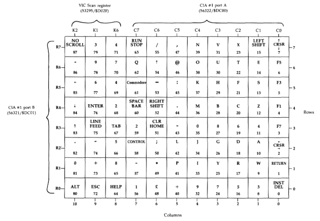

# $C000-$CFFF

Most major screen editor routines can, and should, be entered
through their respective entries in the following jump table.
Each three-byte table entry consists of a JMP opcode followed
by the address of the target routine.

## 49152 $C000 JCINT <a name="C000"></a>
Entry point for the routine at 49275/$C07B which establishes
the default characteristics for both the 40- and 80-column displays.
This entry is part of both the reset and RUN/STOP RESTORE sequences.
No preliminary setup is required, but
the behavior of the routine is affected by the setting of the
initialization status flag (2564/$0A04). The keyboard decoding
table pointers and screen editor indirect vectors are initialized
only when bit 6 of the flag is %0. If you wish to preserve decoding
table pointers or indirect vectors while resetting other
screen editor characteristics, set this bit to %1 before you call
the routine.

## 49155 $C003 JDISPLY <a name="C003"></a>
Entry point for the routine at 52276/$CC34, which deposits a
screen code and attribute value at the current cursor position.
Call this entry with the accumulator holding the screen code
(not the character code) for the desired character and the X
register holding the attribute value for the character.

## 49158 $C006 JKEYIN <a name="C006"></a>
Entry point for the routine at 49716/$C234, which retrieves a
single character from the keyboard. In official Commodore literature,
this routine has the rather nondescriptive name LP2.
This entry is used by the Kernal GETIN routine [SEEEB] when
the keyboard is the input device. (The keyboard, device 0, is
the 128's default input device.) Upon return, the accumulator
will contain the retrieved character. Be sure to see the warning
in the KEYIN entry about calling this routine directly.

## 49161 $C009 JGETSCRN <a name="C009"></a>
Entry point for the routine at 49819/$C29B, which retrieves a
character from a line of keyboard or screen input. In official
Commodore literature, this routine has the rather nondescriptive
name LOOP5. This entry is used by the Kernal BASIN
routine [$EF06] when input is requested from the keyboard
(device 0) or the screen (device 3). The input source is determined
by the value in the flag at [214/$D6](0000#D6). When the flag has
a nonzero value, the character at the current cursor position is
read and returned in the accumulator. When the end of the
line of input is reached, the routine returns the code for the
RETURN character, the value 13/$0D. If the flag is zero, the
routine accepts characters from the keyboard and displays
them on the screen until RETURN is pressed. It then returns
the first character of the input in the accumulator and sets the
source flag to a nonzero value so that subsequent calls retrieve
characters from the input line displayed on the screen. In
either case, the source flag should be set only before the first
call to this routine for any given line of input.

For keyboard input, the starting and ending columns and
the row for the input line are set automatically. For screen input,
the character is read from the row specified in [235/$EB](0000#EB) at
the column specified in [236/$EC](0000#EC). These locations normally
hold the current cursor position and are advanced one position
to the right after each call to this routine. However, the locations
can also be reset to any row and column you desire. The
screen input line ends on the row specified in 2608/$0A30 at
the column specified in [234/$EA](0000#EA). Neither of these locations is
set automatically, so you must specify the ending position
before calling for input from the screen. The X and Y register
contents will be preserved during this routine.

## 49164 $C00C JPRINT <a name="C00C"></a>
Entry point for the routine at 50989/$C72D, which prints a
character at the current cursor position using the current
attribute (in [241/$F1](0000#F1)). This routine is used by the Kernal
BSOUT routine [$EF79] when the screen is specified as the
output device. The screen, device 3, is the 128's default
output device. Call the entry with the accumulator containing the
character code (not the screen code) for the character to be
displayed. The accumulator and X and Y register contents are
preserved during this routine.

## 49167 $C00F JSCRORG <a name="C00F"></a>
Entry point for the routine at 52315/$CC5B, which returns
information about the current window size. This entry is the
target of the Kernal jump table entry SCRORG [$FFED], Upon
return, the X register will hold the number of columns (minus 1)
in the current window, and the Y register will hold the
number of rows (minus 1). The accumulator will hold the
maximum column number for the active screen (39 for the 40-
column display or 79 for the 80-column display).

## 49170 $C012 JSCNKEY <a name="C012"></a>
Entry point for the routine at 50525/$C55D, which scans the
keyboard matrix for a keypress. This entry is the target of the
Kernal jump table entry SCNKEY [$FF9F]. If a key is found to
be pressed, its corresponding character code will be placed in
the keyboard buffer for retrieval by the GETIN or BASIN
routines, unless the key is a shift key or programmable key.
Both of those get special handling (see the SCNKEY routine
for details).

## 49173 $C015 JREPEAT <a name="C015"></a>
Entry point for the routine at 50769/$C651, actually an
alternative entry into the SCNKEY routine. At this point,
the routine expects location [212/$D4](0000#D4) to contain the keyscan matrix
code for the current key, [211/$D3](0000#D3) to hold the status of the
shift keys, and [204-205/$CC-$CD](0000#CC) to point to the keyboard
decoding table selected according to the shift key status. This
table entry is most useful when intercepting the KEYVEC indirect
vector (see the entry at 826/$033A for details).

## 49176 $C018 JPLOT <a name="C018"></a>
Entry point for the routine at 52330/$CC6A, which reads or
sets the cursor position. This entry is the target of the Kernal
jump table entry PLOT [$FFF0], If called with the carry bit
clear, the cursor is moved to the row specified in the X register
and the column specified in the Y register (the row and column
settings are relative to the current home position of the
window). The carry bit will be set upon return if the specified
position is outside the current window boundaries. If called
with the carry set, the routine returns with the row number of
the current cursor position in the X register and the column
number in the Y register (again, the numbers will be relative
to the current home position of the window).

## 49179 $C01B JCRSR80 <a name="C01B"></a>
Entry point for the routine at 52567/$CD57, which moves the
cursor on the 80-column display to the row and column specified in
[235/$EB](0000#EB) and [236/$EC](0000#EC), respectively. The 40-column
display's cursor is maintained by software, so it follows these
pointers automatically, but the position of the 80-column
cursor must be set explicitly.

## 49182 $C01E JESCAPE <a name="C01E"></a>
Direct entry point into the escape sequence handling routine
[$C9BE], Normal entry into the handler begins with an indirect
jump through the ESCVEC vector (824-825/$0338-$0339).
That vector normally points to this table entry, which in turn
jumps back into the handling routine at the point immediately
following the indirect jump.

## 49185 $C021 JKEYSET <a name="C021"></a>
Entry point for the routine at 52386/$CCA2, which redefines
a programmable key. This entry is the target of the Kernal
jump table entry PFKEY [$FF65]. Call this entry with the X
register containing the key number (1-10), the Y register
containing the length of the definition string, and the accumulator
holding the address of a two-byte zero-page pointer to the
string. The zero-page byte immediately following the pointer
should contain the number of the memory bank in which the
string resides.

## 49188 $C024 JSCNIRQ <a name="C024"></a>
Entry point for the routine at 49556/$C194, which handles
the screen editor portion of the IRQ handling sequence. This
includes setting up the screen display mode, scanning the keyboard,
and managing the cursor for 40-column display.

## 49191 $C027 JINIT80 <a name="C027"></a>
Entry point for the routine at 52748/$CE0C, which initializes
the character patterns for the 80-column display. This entry is
the target of the Kernal jump table entry INIT80 [$FF62]. The
routine copies the contents of the 40-column display's character
ROM ($D000-$DFFF in bank 14) into the character definition area
of the 8563 chip's private block of RAM.

## 49194 $C027 JSWAPPER <a name="C027"></a>
Entry point for the routine at 52526/$CD2E, which switches
active screen displays. This entry is the target of the Kernal
jump table entry SWAPPER [$FF5Fj. The routine exchanges
the screen variable tables, tab stop tables, and line link tables,
and toggles the active screen flag ([215/$D7](0000#D7)). This will redirect
printing to whichever screen was previously inactive.

## 49197 $C02D JWINDOW <a name="C02D"></a>
Entry point for the routine at 51739/$CA1B, which sets the
position of a corner of the output window. To set the top row
and left column of the window, call this entry with the carry
bit clear, the accumulator holding the row number, and the X
register holding the column number. To set the bottom row
and right column of the window, call this entry with the carry
bit set, the accumulator holding the row number, and the X
register holding the column number.

## 49200 $C030 Unused <a name="C030"></a>
Three unused bytes filled with the value 255/$FF.

## 49203 $C033 SADDRTBL <a name="C033"></a>
### Table of screen line starting addresses
Locations 49203-49227/$C033-$C04B hold the low bytes of
the address in 40-column screen memory for the column 0 position
in each of the 25 screen lines. Locations
[49228-49252/$C04C-$C064](#C04C)
hold the high bytes for the line addresses for
the default 40-column screen position (at 1024/$0400). These
table values are used in conjunction with the screen base addresses,
2619/$0A3B for the 40-column screen or $2606/$0A2E
for the 80-column screen, to calculate the actual starting address
for each line of screen and attribute memory.

## 49253 $C065 SCNVCTRS <a name="C065"></a>
### Table of default screen editor indirect vectors
The five two-byte values here are copied to the screen editor
indirect vector table at 820-829/$0334-$033D when the system
is reset. In each case, the default indirect vector merely returns
control to the location immediately following the indirect jump,

## 49263 $C06F KEYPTRS <a name="C06F"></a>
### Table of default keyboard decoding table pointers
The six two-byte values here, the addresses of the ROM keyboard
decoding tables, are copied to the keyboard decode
pointer table at 830-841/$033E-$0349 when the system is
reset.

## 49275 $C07B CINT <a name="C07B"></a>
Initializes screen editor constants, variables, tables, and vectors.
This routine has a screen editor jump table entry at 49152/$C000
and a Kernal jump table entty at 65409/$FF81.
Sets the default values for all working storage memory locations used
by screen editor routines. This routine is part of
both the reset and RUN/STOP-RESTORE sequences. The CIA
chip register (56576/$DD00) that controls VIC-II chip memory
banking is set to have the VIC-II see memory from its bank 0,
corresponding to addresses 0-16383/$0000-$3FFF in block 0
of system RAM (VIC-II banks are different from MMU banks;
see Chapter 8 for more details). Bit 1 of the processor I/O
register (1/$01) is set to %1 to make block 1 of color memory
(the block for 40-column text screen color) visible at
55296/$D800. The Kernal CLRCH routine [$FFCC] is called to
reset normal I/O sources: input from the keyboard and output
to the screen. The SID chip volume register (54296/$D418) is
set to zero to silence any sound output (a step not present in
the Commodore 64's CINT routine). Screen editor RAM variables
and constants are initialized as follows:

|Location|Value|Meaning|
|-|-|-|
|208/$D0|0|Keyboard buffer empty|
|209/$D1|0|No function key pending|
|214/$D6|0|Input from the keyboard|
|216/$D8|0|40-column display set for text mode|
|217/$D9|0|CHAREN shadow cleared|
|2592/$0A20|10/$0A|Maximum of 10 keys in buffer|
|2593/$0A21|0|Printing pause flag cleared|
|2594/$0A22|128/$80|All keys repeat if held down|
|2595/$0A23|4/$04|Delay between repeats initialized|
|2596/$0A24|10/$0A|Delay before repeats initialized|
|2598/$0A26|0|40-column cursor will blink|
|2599/$0A27|10/$0A|Cursor blink switch initialized|
|2600/$0A28|10/$0A|Cursor blink countdown initialized|
|2603/$0A2B|96/$60|80-column cursor set for blinking block|
|2604/$0A2C|20/$14|40-column text screen and character base initialized (screen at 1024/$0400, character set seen at 4096/$1000)|
|2605/$0A2D|120/$78|40-column bitmap and matrix base initialized (matrix at 7168/$1C00, bitmap at 8192/$2000)|
|2606/$0A2E|0|Base page for screen memory in 8563 RAM (screen at 0/$0000)|
|2607/$0A2F|8/$08|Base page for attribute memory in 8563 RAM (attributes begin at 2048/$0800)|
|2612/$0A34|208/$D0|Default raster line for split screen (text portion starts at line 20)|
|2619/$0A3B|4/$04|Base page for 40-column screen memory (value read from 49228/$C04C)|

Also during this setup, the active screen flag (215/$D7) is
set for 40-column mode, and bit 7 of the MMU mode configuration
register (54533/$D505) is set to %1 to enable reading of
the 40/80 DISPLAY key. While the 40-column display is active, default
tab stops are set and default screen editor variables are copied from
the table at 52852/$CE74 into 224-249/$E0-$F9. At the same time,
default variables for the 80-column display are copied from the table
at 52878/$CE8E into
2624-2649/$0A40-$0A59. However, there is a bug in this
portion of the routine: The copy loop uses an index of 26/$1A
instead of the proper value 25/$19, so the byte following the
40-column table is also copied to 250/$FA, and the byte following
the 80-column table is also copied to 2650/$0A5A.
The screen editor indirect vectors (820-829/$0334-$033D) are
initialized from the table at 49253/$C065.

Next, bit 6 of the initialization status flag (2564/$0A04) is
checked. If the bit is set to %1 , the following steps to load
keyboard table pointers and key definition strings are skipped.
If the bit is clear, the keyboard decoding table pointers
(830-841/$033E-$0349) are initialized from the table at
4926/$C06F, and the default programmable key definitions
are copied to the definition area at 4096/$1000 from the table
at 52904/$CEA8. After the values are copied, bit 6 of the flag
is set to %1 to indicate that these steps have been performed.
The flag is cleared before this routine is called by the reset
routine [$E000], so these steps will always be performed during
a reset. However, the RUN/STOP-RESTORE sequence
[$FA53] does not affect the flag, so any changes to programmable
key definitions or keyboard decoding table pointers will remain
intact after RUN/STOP-RESTORE.

Default tab stops are then established for the 80-column
screen, and the 80-column window is reset to full screen size
and cleared. The 40-column window is also reset to full screen
size and cleared. Finally, the position of the 40/80 DISPLAY
key is read (by checking bit 7 of 54533/$D505), and the selected
display will become the active screen upon exit.

## 49474 $C142 CLEAR <a name="C142"></a>
Clears the current window and homes the cursor.
Also handles clear screen character, CHR$(147).
Sets the cursor to the home position and clears rows until the
bottom of the window is reached, then falls through into the
following routines to return the cursor to the home position
and set pointers.

## 49488 $C142 HOME <a name="C150"></a>
Moves the cursor to the home position of the current window.
Sets the cursor row ([235/$EB](0000#EB)) and starting row for input
([232/$E8](0000#E8)) to the top row of the current window ([229/$E5](0000#E5)),
and the cursor column ([236/$EC](0000#EC)) and starting column for input
([233/$E9](0000#E9)) to the left margin of the current window
([230/$E6](0000#E6)), then falls through into the next routine to set
pointers to that line.

## 49500 $C15C SETLINE <a name="C15C"></a>
Sets starting address pointers for the current line.
Loads the line number where the cursor currently resides
([235/$EB](0000#EB)) into the X register, then falls through
into the next routine to set pointers to that line.

## 49502 $C15E SETADDR <a name="C15E"></a>
Sets starting address pointers for a specified line.
Calculates the screen memory address corresponding to the
leftmost column of the screen line specified in the X register
and places the address in the pointer at [224-225/$E0-$E1](0000#E0).
The low byte of the address comes from the table at 49203/$C033
(multiplied by 2 if the 80-column display is active). The
high byte is calculated by taking a value from the table at
49228/$C04C, masking off all but the lowest two bits (and
multiplying the result by 2 if the 80-column screen is active),
then ORing the result with the starring page value for the active
screen 2619/$0A3B for the 40-column display or
2606/$0A2E for the 80-column display.

Next (at 49532/$C17C), the attribute memory address
corresponding to the leftmost column of the specified screen
line is calculated and placed in the pointer at [226-227/$E2-$E3](0000#E2).
The low byte of the address is taken directly from
the low byte of the screen memory pointer ([224/$E0](0000#E0)).
For the 40-column screen, the high byte is calculated by masking off
all but the lowest two bits of the screen memory pointer high
byte ([225/$E1](0000#E1)), then ORing the result with the value
[216/$E8](0000#E1)216/$D8 (40-column color memory always starts
at $D800). For the 80-column screen, the high byte is
calculated by masking off all but the lowest three bits of the
screen memory pointer high byte ([225/$E1](0000#E1)), then ORing
the result with the attribute memory starting page value (2607/$0A2F).

## 49556 $C194 SCNIRQ <a name="C194"></a>
Performs screen and keyboard portion of IRQ functions.
This routine has a jump table entry at 49188/$C024.
Begins by checking whether the current IRQ is the result of a
raster interrupt.
If it's not, then this can't be a normal jiffy IRQ, so the routine
skips the screen setup steps and just scans the keyboard and
blinks the cursor before exiting. If it is a raster interrupt, the
routine checks whether the screen mode flag (216/$D8) contains
the value 255/$FF. If so, the routine again skips ahead to
scan the keyboard, blink the cursor, and exit. The 128 itself
never puts that value into the flag, but you can use this feature
when you set up your own custom screen mode or raster
interrupt (see the entry for location 216/$D8 for details).

The routine then checks whether the raster is currently on
scan line 256 or higher. If so, the interrupt occurred while the
raster was beyond the visible portion of the screen. This offscreen
raster interrupt is the normal jiffy IRQ source for the
128-quite a different technique from the CIA timer-driven
jiffy IRQ for the Commodore 64. The interrupt is actually
triggered at line 255, but the raster will have moved to the
next scan line by the time its position is checked here. For an
offscreen interrupt, the VIC-II chip registers will be set according
to the screen mode flag value, using the step at 49631/$C1DF
for mode 0 (a full text screen) or the one at 49587/$C1B3
for a bitmapped or split-screen mode.

If the interrupt occurred above scan line 255, bit 6 of the
screen mode flag is tested. If that bit is set to %1 , a split
screen mode is in use, so a branch is taken to 49631/$C1DF
to set VIC-II registers for the text portion of the display.
Otherwise, the registers are merely reset for whichever mode
is currently in use, which produces no obvious effect.

At 49587/$C1B3, the bitmapped or multicolor bitmapped
screen is established. If a split screen is in use, the scan line
value for the split, stored in 2612/$0A34, is loaded into the
VIC-II's raster compare register ([53266/$D012](D000#D012)). The processor
I/O register ([1/$01](0000#01)) is set to make block 0 of color memory-
the block for multicolor source 3-visible at 55296/$D800,
and the VIC memory control register ([53272/$D018](D000#D018)) is loaded
with the bitmap base address, stored in 2605/$0A2D. Bit 5 of
VIC control register 1 ([53265/$D011](D000#D011)) is set to %1 to enable
the bitmapped display. If the mode flag indicates that multicolor
bitmapped mode was selected, bit 4 of VIC control register 2
([53270/$D016](D000#D016)) is also set to %1 to enable that feature.

At 49631/$C1DF, the 40-column text screen (or the text
area of a split screen) is established. The VIC-II's raster
compare register ([53266/$D012](D000#D012)) is loaded with 255/$FF to trigger
the offscreen raster interrupt. The processor I/O register
([1/$01](0000#01)) is set to make block 1 of color memory-the block for
40-column text color-visible at 55296/$D800, and the VIC
memory control register ([53272/$D018](D000#D018)) is loaded with the
screen and character memory base value, stored in $2604/$0A2C.
The VIC control register bits for bitmapped and multicolor
are cleared to disable those display modes. Finally, a
short delay loop is executed if the text portion of a split screen
is being established. This is to insure that the switch from
bitmapped to text modes occurs while the raster is off the right
edge of the visible screen area, which prevents the flicker that
would occur if the change occurred in the middle of scanning
a line.

If the IRQ source is a raster interrupt which occurred on
the visible screen (to set up the text portion of a split screen),
the routine exits at this point with the status register carry bit
clear. In all other cases, the routines to scan the keyboard for a
keypress [$C55D] and handle 40-column cursor blinking
[$C6E7] are called, and the carry bit will be set upon exit.

## 49716 $C234 KEYIN <a name="C234"></a>
Performs GETIN from keyboard.
This routine has a jump table entry at 49158/$C006.
Checks [209/$D1](0000#D1) to see whether any characters remain to be
read from the definition string for the most recently pressed
programmable key. If so, a character is read from the definition
area, with the value in 210/$D2 used as an offset from
the start of the definition area (4106/$100A). The count of remaining
characters is decremented and the offset into the definition area
is incremented; then the routine exits with the
character in the accumulator, the status register carry bit clear,
and IRQ interrupts reenabled.

If no programmable key string characters are pending, the
character at location 842/$034A, the first character in the
keyboard buffer, is returned in the accumulator. Any remaining
characters in the buffer are shifted one position to the left to
remove the retrieved character from the buffer; then the count
of characters in the buffer ([208/$D0](0000#D0)) is decremented. Upon
exit, the status register carry bit will be clear and IRQ
interrupts will be reenabled.

Unlike other major screen editor routines with jump table
entries, you should avoid calling this one directly. To retrieve
keypresses, call the Kernal GETIN routine via its jump table
entry (65508/$FFE4) with the current input device ([153/$99](0000#99))
set to zero to indicate keyboard input. The Kernal GETIN routine
[$EEEB] verifies that a character is waiting to be read from
either a programmable key string or the keyboard buffer
before it calls this routine. If you call this routine with no
characters available (with [208/$D0](0000#D0) and [209/$D1](0000#D1)
both containing
zero), you'll cause serious problems. The contents of
all page 3 locations above the keyboard buffer (and part of 40-
column screen memory in page 4) will be garbled. This area
includes the vital indirect fetch and store routines; you'll have
to reset the computer to recover.

## 49752 $C258 KEYLIN <a name="C258"></a>
Accepts a line of keyboard input and returns the first character.
The normal entry point for this routine is 49755/$C25B.
Turns on the cursor, then waits until a character is available in
the keyboard buffer or from a programmable key definition
string. The routine above is called to retrieve the character,
and unless it's a RETURN character, code 13/$0D, the routine
loops to display the character on the screen at the current
cursor position (using the PRINT routine [$C72D]), move the
cursor to the next position, and wait for another character to
become available. When RETURN is encountered, the routine
falls out of this loop and stores the RETURN code in the input
source flag ([214/$D6](0000#D6)) so that subsequent calls to the keyboard
BASIN routine will retrieve characters from the line of input
that has been displayed on the screen. The routine then sets
pointers to the input screen line and jumps to
[49852/$C2BC](#C2BC)
in the following routine to exit with the accumulator holding
the first character of the input-unless no other characters
were typed before RETURN, in which case the routine
branches to [49829/$C2A5](#C2A5) in the following routine to exit with
the RETURN character code in the accumulator.

## 49819 $C29B GETSCRN <a name="C29B"></a>
Performs BASIN from screen or keyboard.
This routine has a jump table entry at 49161/$C009.
Stashes the contents of the X and Y registers on the stack for
later restoration, then checks the input source flag ([214/$D6](0000#D6)).
If the flag value is zero, indicating input from the keyboard,
the preceding routine is used to accept a line of input from the
keyboard. If the flag is nonzero, but with bit 7 clear (%0), the
routine branches ahead to 49852/$C2BC to retrieve a character
from a screen line. If bit 7 is set (%1), the end of the input
line has been reached, so (at 49829/$C2A5) the input source
flag is reset to zero and a RETURN character is printed unless
output is to a device other than the screen. The routine then
exits with the RETURN character code, 13/$0D, in the accumulator
(the X and Y registers will be restored to their original
values).

At 49852/$C2BC, the screen code at the current cursor
position is retrieved and converted into the corresponding
character code (disassemble $C2C2-$C2D8 to see the conversion process).
The routine then checks whether the end of input has been reached.
If so, bit 7 of the input flag is set to %1
to indicate that all characters have been read from the current
input line.

The cursor is then moved right to the next character position
in the line. If the calculated character code is 222/$DE,
the pi (K) character, it's replaced with 255/$FF, an alternative
value (and BASIC token) for that character. Before exiting, the
original X and Y register values placed on the stack at the start
of the routine are restored, and retrieved character code is
loaded into the accumulator. The status register carry bit will
be clear upon exit.

Although there are no bugs in this routine, its calling
Kernal routine (BASIN [$EF06]) will not correctly retrieve a
line of input from the screen (keyboard input functions properly).
The screen input setup portion of BASIN has two major
flaws: It does not set the ending row for input (2608/$0A30),
and it resets the input source flag ([214/$D6](0000#D6)) before
each character is retrieved (so that the setting of bit 7 is lost). Together,
these bugs make it impossible to determine when the end of
the input is reached. The following is an example of the
proper technique for retrieving a line of input from the screen:

``` Assembly
      LDA $EB       // Set ending row for input
      STA $0A30     // (same as starting row)
      LDA $E7       // Set ending column for input
      STA $EA       // (to right window margin)
      LDA #$03      // Set screen as input source
      STA $D6       // (any nonzero value will do)
      LDX #$00      // Initialize storage offset
LOOP  JSR $C009     // Read character from the screen
      CMP #$0D      // Is it RETURN?
      BEQ EXIT      // Exit if so
      STA $0C00,X   // Stash character from screen
      INX           // increment the offset
      BNE LOOP      // Loop for another character
EXIT  RTS
```

## 49919 $C2FF QUOTECK <a name="C2FF"></a>
Handles quote mode flag.
Checks whether character value in the accumulator is 34/$22,
the quote (") character. If so, bit 1 of the quote mode flag
([244/$F4](0000#F4)) is toggled, turning quote mode on if it was previously
off or off if it was previously on. The character value
will still be in the accumulator upon exit.

## 49932 $C30C PRNTEXIT <a name="C30C"></a>
Provides common exit for screen BSOUT subroutines.
Stores the current character code ([239/$EF](0000#EF)) as the previous
character code (240/$F0). The subroutine to move the cursor
on the 80-column screen [$CD57] is called to actually move
the cursor if that display is active. This is necessary because
the 80-column screen's cursor is controlled by hardware (not
by software, like the 40-column screen's cursor), so it doesn't
automatically move when its corresponding row and column
pointers are updated. The pending insert count ([245/$F5](0000#F5)) is
checked. If it's nonzero, the quote mode flag is cleared. As a
result, you won't go into quote mode if you type the quote
character for a pending insert unless the quote is typed for the
last insert. Before exiting, the routine reloads the accumulator
and X and Y registers with the values stored on the stack
when the BSOUT routine was entered [$C72D], so all register
values are preserved during BSOUT. The status register carry
bit will be clear upon exit.

Because the address of this routine is pushed onto the
stack at the start of the screen BSOUT routine [$C72D], all
screen printing subroutines will return to the calling routine
via this routine.

## 49952 $C320 SETCHAR <a name="C320"></a>
Handles character printing for screen BSOUT.
Handles all character display functions for the screen BSOUT
routine [$C72D], including quote, reverse, and autoinsert
modes. The routine has several entry points, depending on the
desired effect. For any of these entry points, the code to be
printed should be in the accumulator upon entry:

**49952/$C320**: Entry point for printing character codes
160-254/$A0-$FE. Prior to entry, bit 7 of the code will have
been cleared to %0. This step forces bit 6 to %1, so character
codes 160-191/$A0-$BF become screen codes 96-127/
$60-$7F, and character codes 192-254/$C0-$FE become
screen codes 64-126/$40-$7F.

**49954/$C322**: Entry point for printing character codes
32-127/$20-$7F. Prior to entry, the character code will have
been converted to a screen code by the screen BSOUT control
routine [$C72D]. This step checks whether reverse mode is active (indicated by a nonzero value in [243/$F3](0000#F3)). If that mode is
not active, the next step is skipped.

**49958/$C326**: Entry point for printing characters in reverse
video; also used for character codes less than 32 and for codes
128-159 when those characters are printed in quote mode or
at a pending insert. For codes 1-31/$01-$1F, the character
code is used unchanged, so those characters are represented
by the reverse images of screen codes 1-31/$01-$1F. For characters 128-159/$80-$9F, bit 7 will have been cleared to %0,
and bit 6 set to %1 prior to entry, so those characters are represented by the reverse images of screen codes 64-95/$40-$5F.

If autoinsert mode is active (indicated by bit 7 of [246/$F6](0000#F6)
set to %1), a space is inserted at the current cursor position
before the character is printed. (The count of inserts pending is
also cleared; you can't have inserts pending in autoinsert
mode.) The subroutine at 52271/$CC2F is used to place the
character on the screen at the current cursor position using the
current attribute value from [241/$F1](0000#F1); then the routine falls
through into the following one to move the cursor to the next
position.

## 49982 $C33E UDCRSR <a name="C33E"></a>
Updates the cursor position.
Compares the current cursor column (in the Y register upon
entry) against the right window margin ([231/$E7](0000#E7)). If the
cursor is at the right edge of the window, the routine checks
whether the cursor is also already on the bottom line of the
window. If so, the scrolling enable flag ([248/$F8](0000#F8)) is checked.
The cursor will not be moved if scrolling is not allowed when
the cursor reaches the lower right corner of the window. Otherwise, the cursor is moved right one position. If the cursor
moves beyond the right window margin, a new blank line is
inserted and linked to the one above, and the cursor is moved
to the left margin of this new line. However, linking can be
disallowed by setting bit 6 of [248/$F8](0000#F8) to %1. In this case, the
cursor will simply wrap around to the left margin without inserting a new line. This link-disable feature is not directly supported on the 128-there's no character or ESC sequence to
disable linking-so you must set or clear the bit directly. See
the entry for location [248/$F8](0000#F8) for details.

## 50019 $C363 NEXTLIN <a name="C363"></a>
Moves the cursor down one line.
Moves the cursor down to the next row in the window. If the
cursor is already on the bottom row of the window, the scrolling enable flag ([248/$F8](0000#F8)) is tested. If scrolling is allowed, the
window contents are scrolled upward by one row, and the
bottom row (where the cursor now resides) is cleared. If scrolling is disabled, the cursor is wrapped to the top row of the
window.

## 50044 $C37C OPENLIN <a name="C37C"></a>
Inserts a new line linked to the one above.
Copies all lines in the window below the one on which the
cursor currently resides down one row (the bottom line will be
lost). The line on which the cursor resides is then cleared and
linked to the one above.

## 50086 $C3A6 SCROLL <a name="C3A6"></a>
Scrolls the window up one line.
Copies all lines in the window up one row. The top line will
be lost and the bottom line will be cleared. If the new top line
was originally linked to the line scrolled off the window, it
will be unlinked.

## 50140 $C3DC SCRLUP <a name="C3DC"></a>
Copies lines up one row and clears bottom line.
Copies all lines in the window below the one specified in the
X register up one row. The specified line will be overwritten,
and the bottom line will be cleared and unlinked. The line
link bits for each line are also copied to the new positions so
that the links will be maintained intact.
This routine also checks column 7 of the keyboard matrix
(see the entry at [50525/$C55D](#C55D)) to test the Commodore key. If
that key is found to be pressed, a delay loop is executed. Since
this is the subroutine used to open new lines at the bottom of
the window while printing, this feature allows the Commodore key to slow screen scrolling. There is no simple way to
defeat this feature.

## 50189 $C40D MOVLINE <a name="C40D"></a>
Copies a line.
Copies characters from the line specified in the X register to
the one pointed to in [224-225/$E0-$E1](0000#E0), and copies the attributes for the line to the attribute line pointed to in [226-227/$E2-$E3](0000#E2). The copying begins at the column specified in the Y
register and extends to the left window margin. The copy is
performed on whichever display, 40- or 80-column, is currently active. The X register will still contain the source line
number upon exit.

## 50189 $C4A5 CLRLINE <a name="C4A5"></a>
Clears a line.
Writes a space character with the current attribute (from
[241/$F1](0000#F1)) at every character position between the left and right
window margins of the line specified in the X register. The operation is performed on whichever display, 40- or 80-column,
is currently active. The link bit for the line is also cleared, unlinking the line. Upon exit, the X register will still contain the
line number and the Y register will hold the column number
of the right window margin.

## 50492 $C53C FILLSRAM <a name="C53C"></a>
Fills or copies a block of 8563 RAM.
Uses the hardware fill/copy feature of the 8563 chip to fill or
copy a block of the 8563's private 16K of RAM. The block
starts at the address currently in 8563 registers 18-19/$12-$13
and ends at the address in 2620-2621/$0A3C-$0A3D. The operation is determined by the state of bit 7 of 8563 register
[24/$18](0000#18). If the bit is %0, the block is filled with the value in
8563 register [31/$1F](0000#1F). If the bit is %1, the contents of locations
starting at the address in registers [32-33/$20-$21](0000#20) are copied
to the block.

## 50525 $C55D SCNKEY <a name="C55D"></a>
Scans keyboard matrix for keypress.
(This routine has a screen editor jump table entry at 49170/$C012
and a Kernal jump table entry at 65439/$FF9F.)
Begins by checking bit 6 of location l/$01 to determine the
position of the CAPS LOCK key. If that key is down, the shift
key flag ([211/$D3](0000#D3)) will be set to 16/$10 (bit 4 set to %1);
otherwise, it will be cleared to zero. Next, the keyscan code
([212/$D4](0000#D4)) is initialized to 88/$58, the value for no key
pressed. The keyboard matrix is checked to see whether any
keys are pressed. If not, the routine jumps to 50839/$C697 in
the next routine to set 88 as the matrix code value. If a key
has been pressed, the routine loads the keyboard decode table
pointer ([204-205/$CC-$CD](0000#DC)) from 830-831/$033E-$033F,
which holds the address of the default table, and begins the
process of determining which key is being pressed.
The keyboard is arranged electrically as a matrix of 11
columns and eight rows (next figure). To scan for a keypress,
the CIA or VIC port bit for one of the 11 columns is set to %0,
while the bits for all other columns are held at %1 . While the
column bit is %0, the CIA port for the eight rows ([56321/$DC01](DC00#DC01))
is read, and, one by one, the bits corresponding to the
rows are tested. The count of scanned keys is incremented
after each row bit is tested, so each key in the matrix has a
keyscan code corresponding to the number of keys scanned
when that key's position is tested. The codes range from 0, for
the key at row 0 of column 0 (INST/DEL), to 87, for the key
at row 7 of column 10 (NO SCROLL).



Several keys on the 128 keyboard are not included in the
keyscan matrix. The CAPS LOCK key (read at bit 6 of location
[1/$01](0000#01)) is tested at the start of this routine. The 40/80 DISPLAY key (read at bit 7 of location [54533/$D505](D500#D505)) is tested
during the screen initialization routine [$C07B]. The SHIFT
LOCK key is a switch that has the effect of holding down the
left SHIFT key. The RESTORE key isn't read at all; it's connected to circuitry which generates an NMI interrupt signal to
the processor when the key is pressed (see the NMI handling
routine [$FA40]).

If the key at the intersection of the row and the column
being tested is pressed, the row bit will be %0; otherwise, it
will be %1. If a key is found to be pressed, the character code
for the key is read from the default decode table. Unless the
character code read from the table is 8, 4, 2, or 1, the keyscan
code (not the character code) for the key is stored in [212/$D4](0000#D4),
and the routine goes on to scan the next position. However, if
the character code has one of these values, that value is ORed
with the shift key flag to set a bit in the flag value.

Note that it's the keyboard decode table, not the physical
keyboard layout, that determines which keys are treated as
shift keys. In the default ROM keyboard decode table at
64128/$FA80, the ALT key (keyscan code 80) decodes as
character code 8, the CONTROL key position (keyscan code
58) holds character code 4, the Commodore logo key position
(keyscan code 61) holds character code 2, and the left and
right SHIFT key positions (keyscan codes 15 and 52, respectively) both hold character code 1. Thus, pressing either SHIFT
key normally sets bit 0 of [211/$D3](0000#D3) to %1, and the Commodore, CONTROL, and ALT keys set bits 1, 2, and 3, respectively. (You can change this by modifying the default
keyboard table. See the entry at 830-831/$033E-$033F for
more information.) Since the matrix code isn't stored when
these shift keys are processed, [212/$D4](0000#D4) will never contain 15,
52, 58, 61, or 80 while the standard decode table is being
used. So the SHIFT, ALT, Commodore, and CONTROL keys
can't normally be detected by checking [212/$D4](0000#D4). Their states
must be determined from [211/$D3](0000#D3).

All eight rows in each of the 11 columns are scanned, whether keypresses
are detected or not. Since there's only one location ([212/$D4](0000#D4)) for
storing the matrix code, only the key with the highest code value
will be recorded if more than one key is detected during the scan.
However, because of the way the keyboard is wired, a false value
may be returned if three or more keys are held down simultaneously.
For example, if you hold down the J, K, and L keys simultaneously,
the matrix code returned will be 45, the code for the colon (:) key.
Thespecial shift keys are an exception: [211/$D3](0000#D3) will show the state
of all five (SHIFT, Commodore, CONTROL, ALT, and CAPS LOCK) on
every keyscan.

Once the keyscan is complete, the matrix code of the keypress is loaded
into the accumulator. At this point, the routine takes an indirect
jump through the KEYVEC indirect vector (826-827/$033A-$033B). Normally,
this vector points to 50657/$C5E1-the address immediately following
the indirect jump. However, if you wish to manipulate the keyscan in
any way, you can redirect the vector to your own routine in RAM. See
the KEYVEC entry for details.

Next, the routine checks whether the matrix code was 87/$57, the code
for the NO SCROLL key. If so, the routine checks bit 6 of the flag at
[247/$F7](0000#F7) to determine if pausing is allowed. If the bit is set, printing
cannot be paused. This enable/disable feature isn't directly
supported-there's no character or ESC sequence to set or clear bit 6 of
the flag location-so you must change the location directly (see the
entry for location [247/$F7](0000#F7) for details). If pausing is allowed, the
pause flag (2593/$0A21) is toggled; so pressing NO SCROLL will
alternately halt and resume printing to the screen.

NO SCROLL is a misnomer. The key doesn't stop scrolling; it halts
printing. PAUSE would have been a better name for this key. The pause
feature is implemented in the screen BSOUT routine [$C72D].

The shift key flag ([211/$D3](0000#D3)) is tested to determine whether the
Commodore and SHIFT keys are both pressed. If so, bit 7 of the case switching flag ([247/$F7](0000#F7)) is tested to determine whether this combination is allowed to switch character sets. If so, the character set in use is switched, either by toggling bit 7 of the attribute flag ([241/$F1](0000#F1)) if the 80-column display is active, or by toggling bit 1 of the character set base address (2604/$0A2C) if the 40-column display is active.

If the shift key flag indicates that the CONTROL key is
pressed, the routine checks whether the current matrix code is
13/$0D, indicating that CONTROL and the S key have been
pressed simultaneously. The CONTROL-S combination provides a printing pause similar to NO SCROLL. Bit 6 of the flag
at [247/$F7](0000#F7) is checked before the pause flag value is set so
pausing with CONTROL-S can be disabled as well. If pausing
is allowed, the pause flag (2593/$0A21) is loaded with the S
key's matrix code value, 13/$0D.

A keyboard decoding table is then selected from the table
of addresses at 830-841/$033E-$0349, based on the value in
the shift key flag ([211/$D3](0000#D3)). The table address is loaded into
the pointer at [204-205/$CC-$CD](0000#CC) before falling through into
the next routine. Since only one table can be used, the following order of precedence applies if more than one shift key has
been pressed: CONTROL has the highest priority; when it is
pressed, the CONTROL decoding table is selected regardless
of which other shift keys are pressed. For example, ALTSHIFT-CONTROL-W is the same as CONTROL-W. CAPS
LOCK and ALT are effective only if pressed when no other
shift keys are pressed. For example, ALT-SHIFT-S is the same
as SHIFT-S. If ALT is pressed while CAPS LOCK is down,
both are ignored and the unshifted table is used. Likewise, if
the SHIFT and Commodore keys are pressed simultaneously
while case switching is disabled, both are ignored and the
unshifted table is selected.

## 50769 $C651 REPEAT <a name="C651"></a>
Decodes key matrix value into character value and handles key
repeating.
This routine has a jump table entry at 49173/$C015.
Uses the keyscan matrix code in [212/$D4](0000#D4) as an offset into the
keyboard decode table pointed to by [204-205/$CC-$CD](0000#CC) to
find the character code for the current keypress. The current
matrix code is then tested against the previous matrix code. If
they are not the same, the countdown before repeating begins
(2596/$0A24) is reset to 16/$10 and the following test for repeating keys is skipped.

If the current code is the same as the previous one, it
means that the key is being held down. In this case, the repeat
enable flag (2594/$0A22) is tested to see whether any key repeats are allowed. If bit 7 of the flag is set to %1, all keys repeat (the default setting for the 128). If bit 6 is set to %1, no
keys repeat, so the routine exits. If bits 6 and 7 of the repeat
enable flag are both %0, only the cursor, space, and INST/DEL
keys repeat, so the routine exits if the character is not one of
these.

To keep repeats from happening too fast, a countdown location (2596/$0A24) is decremented once per call to this routine. The countdown, initialized to 16, must reach zero before
repeating begins, so a key must be held down long enough for
16 IRQ keyscans to pass before repeat processing begins. After
the initial delay expires, a second countdown (2595/$0A23),
initialized to 4 between each repeat, must also expire before
the keypress is counted a second time. Thus, the delay before
repeating begins is (16 + 4)/60 = 1/3 second, and the delay
between subsequent repeats is 4/60 = 1/15 second. These
values are fixed in the ROM routine and can't be changed as
long as the standard keyscan is used. For repeating keypresses,
the character code is added to the keyboard buffer only if the
buffer is currently empty-a feature that prevents repeats from
filling up the buffer.

At 50839/$C697, a special countdown flag (2597/$0A25)
used to debounce NO SCROLL, CONTROL-S, and SH1FTCommodore keypresses is decremented. Then the current matrix code (212/$D4) is stored as the previous matrix code
([213/$D5](0000#D5)). If the value read from the keyboard decoding table
is 255/$FF, the routine exits at this point, since that value signals that there was not a valid character code for the key.
Otherwise, the pause flag (2593/$0A21) is cleared to zero, so
printing will resume upon completion of this IRQ if it was previously halted.

The character code is then loaded into the accumulator,
and the value in the shift key flag ([211/$D3](0000#D3)) is loaded into
the X register. Then the routine takes an indirect jump through
the KEYCHK indirect vector (828-829/$033C-$033D). Normally, this vector points to 50861/$C6AD, the address immediately following the indirect jump. However, if you wish to
manipulate the character code in any way, you can redirect
the vector to your own routine in RAM. See the KEYCHK entry for details.

Next, the routine checks whether one of the programmable keys has been pressed by comparing the character code in
the accumulator values from the table at 50909/$C6DD. If a match is found, the count of pending programmable key string
characters ([209/$D1](0000#D1)) is loaded with the length of the corresponding definition string from the table at 4096-4105/$1000-$1009, and the offset into the definition area at
4106/$100A for the string is calculated and stored in
[210/$D2](0000#D2). (A simple way to defeat this feature and make the
function keys simply generate character codes as they do in
the Commodore 64 is to change the KEYCHJC vector to point
to 50871/$C6B7 so that this portion of the routine is skipped,)

If the character isn't one of the programmable keys, the
number of characters currently in the keyboard buffer ([208/$D0](0000#D0)) is compared against the maximum number the buffer can
hold (2592/$0A20). If the buffer is full, the current keypress is
ignored. Otherwise, the character code is stored in the next
available position in the buffer at 842-851/$034A-$0353.
From there, it can be retrieved by the Kernal GETIN and BASIN routines.

Before exiting, the value 127/$7F is stored in the CIA I/O
port register for keyboard columns. This value (%01111111)
sets the line for column 7 of the matrix low, while all other
lines are high, so that the keys in that column can be detected
by reading the row register ([56321/$DC01](DC00#DC01)). This feature is
provided to allow testing for the RUN/STOP and Commodore
keys, but other keys on that row can also be detected outside
the normal keyscan. See the routine at 63037/$F63D and the
entry for location [145/$91](0000#91) for more information.

## 50909 $C6DD PFKCHRS <a name="C6DD"></a>
Table of programmable key character values.
This table is used to identify programmable keys and to determine the offset into the definition length table at 4096/$1000
for the length of the corresponding string.

|Offset|Character Code|Key|
|-|-|-|
|0|133/$85|F1|
|1|137/$89|F2|
|2|134/$86|F3|
|3|138/$8A|F4|
|4|135/$87|F5|
|5|139/$8B|F6|
|6|136/$88|F7|
|7|140/$8C|F8|
|8|131/$83|SHIFT-RUN/STOP|
|9|132/$84|HELP|

## 50919 $C6E7 CRSR40 <a name="C6E7"></a>
Handles cursor blinking for 40-column screen.
Begins by checking the active screen flag ([215/$D7](0000#D7)), exiting
immediately if the 80-column display is active. The routine
also exits if the cursor blink switch (2599/$0A27) holds a nonzero value. Then, the cursor blink countdown value (2600/$0A28) is decremented. The countdown is necessary because
the cursor can't be blinked during every interrupt-that would
result in blinking too fast to see. If the cursor countdown
doesn't reach zero, the routine exits. If the count does reach
zero, the cursor flag (2598/$0A26) is tested. If that flag indicates that the solid cursor is selected and the cursor is reversed, the routine exits (the solid cursor just stays reversed).
Otherwise, it's time to switch the cursor's phase.

The first step in switching phases is to reset the countdown to its starting value-20/$14. That value will result in
the cursor changing phase every 20/60 second. Because it
takes two phase changes (on-to-off and off-to-on) to blink the
cursor, the cursor blinks every 40/60, or 2/3, second. Since
this value is part of this ROM routine, it's not possible to
change the cursor blink rate while using the standard screen
IRQ routine.

If the cursor is currently in its reversed phase, the position
is restored to its original color and screen code. If the cursor is
in its normal phase, the screen code and color for the position
are stashed (in 2601/$0A29 and 2602/$0A2A, respectively).
Then the high bit of the screen code is toggled, and the reversed screen code is written back to the current cursor position using the current cursor color (in 241/$F1). Finally, the
cursor phase bit (bit 6) in the cursor flag (2598/$0A26) is
toggled.

This routine is part of the normal IRQ sequence. There is
no corresponding routine to blink the cursor on the 80-column
screen because the 8563 80-column chip handles that operation automatically

## 50989 $C72D PRINT <a name="C72D"></a>
Handles BSOUT to the screen.
(This routine has a jump table entry at 49164/$C00C.)
Begins by storing the current character code (in the accumulator upon entry) in [239/$EF](0000#EF). The current accumulator and X
and Y register values are then stashed on the stack for restoration upon exit.

The next portion of the routine implements the pause
printing feature. If the pause flag (2593/$0A21) contains a
nonzero value, the routine immediately loops to check the flag
again. It remains in the flag testing loop until the flag value is
reset to zero. If you're wondering how the routine ever breaks
out of this loop, remember that normal processing is suspended during interrupts. The flag value is set during the IRQdriven SCNKEY routine. This means that if you ever call
BSOUT while interrupts are disabled, you must be sure that
the pause flag contains a zero. Otherwise, the flag value will
never change, and the routine will be stuck in the loop until
you reset the computer. It also means that, as long as the normal IRQ is enabled, NO SCROLL and CONTROL-S can be
used to pause screen printing in any program that calls
BSOUT-even in your own machine language programs. Remember, however, that since the pause loop is implemented
only in this routine, NO SCROLL and CONTROL-S can halt
printing to the screen only.

Next, the input source flag (214/$D6) is reset to zero,
making the keyboard the input source. The value 49931/
$C30B is pushed onto the stack. This will cause the RTS at the
end of the printing subroutine-or at the end of the special
handling subroutine in the case of screen and color control
characters-to jump to 49932/$C30C, the common exit routine for all screen BSOUT subroutines.

If the code to be printed is 13/$0D (RETURN) or 141/
$8D (SHIFT-RETURN), a branch is taken to 51055/$C76F to
handle these special cases. Otherwise, 240/$F0 is checked to
see whether the last character printed is the ESC (escape)
character, 27/$1B. If so, the code is the second character of an
ESC sequence, so a jump is taken to the ESC sequence handler at 51646/$C9BE. Character codes greater than 127/$7F
are sent to a special handling routine at 51202/$C802, and
codes less than 32/$20 are sent to 51126/$C7B6.

Remaining characters, those with codes in the range
32-127/$20-$7F, are converted to screen codes as follows: If
the code is less than 96/$60, bit 6 is cleared. Character codes
32-63/$20-$3F are unchanged, becoming screen codes 32-63/
$20-$3F, while character codes 64-95/$40-$5F become screen
codes 0-31/$00-$1R If the code is 96 or greater, only bit 5 is
cleared, so character codes 96-127/$60-$7F become screen
codes 64-95/$40-$5F. Next, the subroutine at 49919/$C2FF
is called to handle the quote (") character. Then the routine
jumps to 49954/$C322 to display the calculated screen code at
the current cursor position using the current attribute ([241/$F1](0000#F1)).
Remember that the address pushed onto the stack causes
the final printing or character handling subroutine called by
this routine to return to 49932/$C30C. That routine restores
the accumulator and X and Y registers from the stack, so they
contain the same values upon exit that they did upon entry.

## 50989 $C76F RTRN <a name="C76F"></a>
Handles RETURN and SHIFT-RETURN characters, CHR$<13> and
CHR$(141).
Finds the position of the last nonspace character in the logical
line; then clears the link bit for the physical line just below
that position, making the line following the current logical line
the start of a new logical line. The cursor position is set to the
left margin of that line, and the screen line pointers are updated to reflect the new cursor position. The routine then falls
through into the following one.

## 51069 $C77D MODESOFF <a name="C76F"></a>
Cancels quote and reverse modes and clears pending inserts
(ESC-O and ESC-ESC).
Bits 4 and 5 of the current attribute value ([241/$F1](0000#F1)) are cleared,
canceling flashing or underlined modes for subsequent characters on the 80-column display. The pending insert ([245/$F5](0000#F5)),
reverse mode ([243/$F3](0000#F3)), and quote mode ([244/$F4](0000#F4)) flags are
all reset to zero, canceling any pending inserts and turning off
reverse and quote modes.

## 51084 $C78C <a name="C78C"></a>
Tables of screen control codes and dispatch addresses.
Locations 51084-51097/$C78C-$C799 comprise a table of all
the character codes less than 32 which have a special function
(except for RETURN and ESC, codes 13 and 27, which are detected in the main screen BSOUT routine [$C72D]). The subroutine to handle codes less than 32 [$C7B6] compares the
current character against these values. If a match is found, the
corresponding dispatch address from the table at 51098-51125/$C79A-$C7B5 is placed on the stack to be called by the next
RTS. Because of the way the RTS opcode behaves, adding 1 to
the address placed on the stack, the address table values are 1 less than the actual address of the target routine. The table
shows the characters handled and the actual addresses of the
handling routines:

|Offset|Character Code|Handling Routine|Description|
|-|-|-|-|
|0|2/$02|51399/$C8C7|Turns on underline mode|
|1|7/$07|51598/$C9BE|Generates bell tone|
|2|9/$09|51535/$C94F|Moves cursor to next tab stop|
|3|10/$0A|51633/$C9B1|Performs linefeed|
|4|11/$0B|51366/$C8A6|Disables case switching|
|5|12/$0C|51372/$C8AC|Enables case switching|
|6|14/$0E|51328/$C880|Switches to lowercase set|
|7|15/$0F|51413/$C8D5|Turns on flashing mode|
|8|17/$11|51290/$C85A|Moves cursor down one line|
|9|18/$12|51394/$C8C2|Turns on reverse mode|
|10|19/$13|51379/$C8B3|Moves cursor to home position|
|11|20/$14|51483/$C91B|Deletes a character|
|12|24/$18|51553/$C961|Sets or clears a tab stop|
|13|29/$1D|51284/$C854|Moves cursor right one column|

## 51126 $C7B6 <a name="C7B6"></a>
Interprets character codes less than 32.
Jumps indirectly through the CTLVEC vector (820-821/$0334-$0335), which is initialized on system reset to point to
51129/$C7B9, the location immediately following the indirect
jump. However, the vector can be redirected to your own routine in RAM, allowing you to modify the effects of printing
any of the characters with codes less than 32. See the entry at
CTLVEC for details.

If the value in the accumulator is the ESC character,
27/$1B, the routine exits without performing any other checking. Otherwise, the routine checks whether an insert is pending. If so, the routine branches to handle the character just as
it would if quote mode were active. If no inserts are pending,
the code is compared with the delete character value 20/$14,
If the code matches, the routine branches past the following
test for quote mode. Because delete character handling is sandwiched between the test for pending inserts and the test for
quote mode, it's possible to type deferred deletes when inserts
are pending, but not during quote mode. Delete is the only
character singled out for this treatment: All other control characters (except RETURN and ESC) are deferred when printed
while quote mode is active.

If quote mode is active, the routine clears the character
storage location ([239/$EF](0000#EF)) and branches to 49958/$C326 in
the character printing routine to display the character code
(0-31) as a screen code in reverse mode. If quote mode is not
active, the accumulator contents are compared against the 14
control character codes in the table at 51084/$C78C. If a
match is found, the dispatch routine [$C7F6] is used to execute
the corresponding subroutine. Otherwise, the routine falls
through into the next routine to check whether the character is
a color change code.

## 51162 $C7DA COLORSET <a name="C7DA"></a>
Handles color change characters.
Compares the character code in the accumulator with the table
of color character codes at 52812/$CE4C. If no match is
found, the routine exits. If the accumulator value matches a table entry, the X register will contain the table offset for the
match, a value in the range 0-15. For the 40-column display,
this value is placed in the current attribute flag value
([241/$F1](0000#F1)). For the 80-column display, the offset value is used
as an index into the table at 52828/$CE5C to retrieve the corresponding 8563 color code. That value is then placed in the
lower four bits of the attribute flag.

## 51190 $C7F6 <a name="C7F6"></a>
Calls control code execution routines.
Uses the control code index, in the X register upon entry, as
an offset into the dispatch table at 51098/$C79A. The corresponding subroutine address is retrieved from the table and
pushed onto the stack, so the RTS at the end of this routine
will transfer control to the subroutine.

## 51202 $C802 <a name="C802"></a>
Interprets character codes greater than 127.
Jumps indirectly through the SHFVEC vector (822-823/
$0336-$0337), which is initialized on system reset to point to
51205/$C805, the location immediately following the indirect
jump. However, the vector can be redirected to your own routine in RAM, allowing you to modify the effects of printing
any of the characters with codes greater than 127. See the entry at SHFVEC for details.

Next, the high bit of the character code (in the accumulator upon entry) is masked off, and the resulting value is
compared against 32. If the value is less, indicating that the
original character code was in the range 128-159, a branch is
taken to the following routine to handle those characters. Otherwise, the routine tests whether the result was 127, indicating
that the original code was 255, the pi (rc) character. If not, the
routine jumps to 49952/$C320 in the character printing routine to display the character corresponding to the specified
code. However, if the code was pi, it's changed to 94/$5E, the
screen code for the pi character, before jumping to the printing
routine.

## 51220 $C814 <a name="C814"></a>
Handles character codes 128-159.
Checks whether quote mode is in effect and, if so, sets bit 6 of
the character value in the accumulator (converting the adjusted character code value 0-31 into a screen code value in
the range 64-95), then jumps to 49958/$C326 in the character
printing routine to display the control code as a reverse character.
If quote mode is not in effect, the code tests against the
value 20/$14 to determine if it was originally the insert character- CHR$(148). If so, the routine jumps to 51427/$C8E3 to
handle the insert. Otherwise, the count of pending inserts is
checked. If inserts are pending, the character is treated as if
quote mode were in effect-it's converted to a screen code and
printed in reverse video. Performing this test after checking for
the insert character allows multiple insertions to be made.

insert character allows multiple insertions to be made.
If no insert is pending, the accumulator value is compared
against a series of character values, branching or jumping to
the appropriate handling routine if a match is found. The table
shows the address of the routine to which control is transferred if a match is found. (The table shows the original character code value before the high bit is masked off; the value
actually tested for in this routine will be 128 less):

|Character Code|Handling Routine|Description|
|-|-|-|
|145/$91|51303/$C867|Moves cursor up one line|
|157/$9D|51317/$C875|Moves cursor left one position|
|142/$8E|51346/$C892|Switches to uppercase/graphics set|
|146/$92|51391/$C8BF|Turns off reverse mode|
|130/$82|51406/$C8CE|Turns off underlining|
|143/$8F|51420/$C8DC|Turns off flashing characters|
|147/$93|49474/$C142|Clears the window|

If the code is not among this group, bit 7 of the accumulator is
reset to %1 to restore the character to its original value. Then
the routine branches to 51162/$C7DA to test whether this is a
color change character.

## 51284 $C854 <a name="C854"></a>
Handles cursor right character, CHR$(29).
Calls the subroutine to move the cursor one position to the
right [$CBED], then tests whether the cursor is wrapped to the
left margin of a new line. If so, a branch is taken to the routine which determines whether the cursor has moved down
onto a new logical line.

## 51290 $C85A <a name="C85A"></a>
Handles cursor down character, CHR$(17).
Calls the subroutine to move the cursor down one row
[$C363]. Upon return, the routine falls through into the next
routine to see whether the cursor has moved onto a new logical line.

## 51293 $C85D <a name="C85D"></a>
51293 $C85D
Checks whether cursor moved onto a new logical line.
Checks whether the link bit for the current physical line is set
to %1 , indicating that the cursor is still on the same logical
line. If not, bit 7 of [232/$E8](0000#EB) is set to %1 to indicate that the
input begins on the first line in a logical chain,

## 51303 $C867 <a name="C867"></a>
51303 $C867
Handles cursor up character, CHR$(145).
Exits without moving if the cursor is already on the top line of
the window. Otherwise, the previous routine is used to determine if the cursor has moved onto a new logical line. Then
the row ([235/$EB](0000#EB)) is decremented, and screen line pointers
are updated to reflect the change.

## 51317 $C875 <a name="C875"></a>
51317 $C875
Handles cursor left character, CHR$(157).
Calls the subroutine to move the cursor one position to the
left [$CC00]. Upon return, the routine exits with the status
register carry bit set if the cursor is already at the upper left
corner of the window (the cursor will not be moved in this case). Otherwise, the routine exits immediately with carry
clear, unless the move wrapped the cursor to the right margin
of the line above. In that case, a test of whether the cursor
moved onto a new logical line must be performed, and the
cursor row value ([235/$EB](0000#EB)) and screen line pointers must be
updated.

## 51328 $C880 <a name="C880"></a>
Handles switch-to-lowercase character, CHR$(14).
Sets bit 1 of the character base address shadow register (2604/
$0A2C) to %1 if the 40-column screen is active. This value
will be copied into the VIC-II chip register at [53272/$D018](D000#D018)
during the next IRQ interrupt (see the screen IRQ routine
[$C194]). If the bit has previously been cleared, this has the effect of adding 2048/$0800 to the character base address.
When the default register value is being used (standard ROMbased characters), this selects the lowercase/uppercase character set at 55296/$D800. Everything currently displayed on the
40-column text screen will be affected. If the 80-column screen
is active, the routine instead sets bit 7 of the current attribute
Hag (<)241/$F1) to %1. This bit, which has no effect on 40-
column printing, determines which character set will be used
for any characters subsequently printed on the 80-column display using this attribute value. Characters already on the
screen are not affected, so it's possible to mix character sets on
the 80-column display.

## 51346 $C892 <a name="C892"></a>
51346 $C892
Handles switch-to-uppercase character, CHR$(142).
Clears bit 1 of the character base address shadow register
(2604/$0A2C) to %0 if the 40-column screen is active. This
value will be copied into the VIC-II register at [53272/$D018](D000#D018)
during the next IRQ interrupt (see the screen IRQ routine
[$C194]). If the bit has been previously set to %1, this has the
effect of subtracting 2048/$0800 from the character base address. When the default register value is being used (standard
ROM-based characters), this selects the uppercase/graphics
character set at 53248/$D000. Everything currently displayed
on the 40-column text screen will be affected. If the 80-column
display is active, the routine instead clears bit 7 of the attribute
flag (241/$F1) to %0. This bit, which has no effect on 40-
column printing, determines which character set will be used
for any characters subsequently printed on the 80-column
screen using this attribute value. Characters already on the
screen are not affected, so it's possible to mix character sets on
the 80-column display.

## 51366 $C8A6 <a name="C8A6"></a>
Handles case switching disable character, CHR$(11).
Sets bit 7 of the case switching flag ([247/$F7](0000#F7)) to %1, This flag
is checked during the keyscan routine [$C55D] to determine
whether the character set should be changed when the SHIFT
and Commodore keys are held down simultaneously. If bit 7
of the flag is %1 , case switching is not allowed. Note that this
disables case switching only via the SHIFT-Commodore key
combination. There is no provision for preventing case switching by printing characters 14 or 142.

## 51372 $C8AC <a name="C8AC"></a>
Handles case switching enable character, CHR$(12).
Clears bit 7 of the case switching flag ([247/$F7](0000#F7)) to %0. This
allows case switching via the SHIFT-Commodore key
combination.

## 51379 $C8B3 <a name="C8B3"></a>
Handles cursor home character, CHR$(19).
Checks the previous character code value (stored in 240/$F0).
If that character is also 19/$13, the window is reset to full
screen size before moving the cursor home. The routine at
49488/$C150 is called to set the cursor to the home position.

The special effect of HOME-HOME, resetting the window
to full screen size, is a feature you must keep in mind if your
programs use resized screen windows. If a program uses the
BSOUT routine to display characters in the window, you
should avoid printing the {HOME} character twice in a row. If
the program accepts user input and displays it on the screen,
you must guard against the chance of having your window
boundaries reset. See the entry for the CTLVEC indirect vector
(820-821/$334-$335) for information on disabling this
feature.

## 51391 $C8BF <a name="C8BF"></a>
Handles reverse off character, CHR$(146).
Loads the accumulator with 0/$00, then uses a BIT opcode to
fall through into the following routine and store the value in
the reverse video flag ([243/$F3](0000#F3)).

## 51394 $C8C2 <a name="C8C2"></a>
Handles reverse on character, CHR$(18),
Stores the value 128/$80 in the reverse video flag ([243/$F3](0000#F3)).
As long as this flag contains a nonzero value, all characters
printed to the screen using the BSOUT printing subroutine
[$C320] will be displayed in reverse video.

## 51399 $C8C7 <a name="C8C7"></a>
Handles underline on character, CHR$(2).
Sets bit 5 of the current attribute ([241/$F1](0000#F1)) to %1. This affects
only the 80-column screen; the upper four bits of the value are
meaningless for the 40-column screen. Any characters subsequently printed on the 80-column screen with this attribute
will appear underlined.

## 51406 $C8CE <a name="C8CE"></a>
Handles underline off character, CHR$(130).
Clears bit 5 of the current attribute ([241/$F1](0000#F1)) to %0. This affects subsequent printing only. Any underlined characters already on the screen will remain underlined.

## 51413 $C8D5 <a name="C8D5"></a>
Handles flash on character, CHR$(15).
Sets bit 4 of the current attribute ([241/$F1](0000#F1)) to %1. This affects
only the 80-column screen; the upper four bits of the value are
meaningless for the 40-column screen. Any characters subsequently printed on the 80-column screen with this attribute
will flash at the same rate as cursor blinking.

## 51420 $C8DC <a name="C8DC"></a>
51420 SC8DC
Handles flash off character, CHR$(143).
Clears bit 4 of the current attribute [241/$F1](0000#F1)) to %0. This affects subsequent printing only. Any flashing characters already
on the screen will continue to flash.

## 51427 $C8E3 <a name="C8E3"></a>
Handles insert character, CHR$(148).
Stashes the current cursor position. The routine then moves to
the last nonspace character in the logical line and copies all
characters between there and the original cursor position one
position to the right. It then places a space character at the
original cursor position. The pending insert flag is incremented, then tested to see if it rolled over from 255/$FF to
0/$00. If so, the flag is reset to 255/$FF; so that value is the
maximum number of pending inserts allowed. The cursor is
restored to its original position upon exit.
When autoinsert mode is active, the screen printing subroutine [$C320] calls this routine before each character is
printed to insert a space in which to print the character.

## 51483 $C91B <a name="C91B"></a>
Handles delete character, CHRSUO.
Moves the cursor one position to the left, then checks to see
whether the move wrapped the cursor to the right margin of a
new logical line. If so, the routine exits, since no characters
need be moved in this case. Next (at 51491/$C923), the routine enters a recursive loop with the routine at 51517/$C93D
to copy all characters to the end of the logical line one position to the left, overwriting the character to the left of the original cursor position,


## 51506 $C932 RSTRPOS <a name="C932"></a>
Restores the cursor row and column positions.
Loads the cursor column position (236/SEC) from temporary
storage in 222/$DE and the current cursor row (235/$EB)
from 223/$DF, then jumps to the routine at 49500/$C15C to
set pointers to the new cursor position. The corresponding
routine to stash the cursor row and column values is at
52254/$CClE.

## 51517 $C93D DELCHAR <a name="C93D"></a>
Deletes a character in a logical line.
Copies the character and attribute to the right of the current
cursor position into the current position, then moves the cursor
right and jumps back to the subroutine at 51491/$C923, which
calls this routine recursively until the end of the logical line is
reached.

## 51535 $C94F <a name="C94F"></a>
Handles tab character, CHR$(9).
Checks whether the tab stop bit for the position to the right of
the current cursor column is set to %1, or whether the position is beyond the right window margin. If neither, the routine
continues checking columns to the right until either a tab stop
is found or the right margin is reached. The cursor position is
then reset to the column where the tab stop is found, or to the
right margin if none is found. Thus, it's impossible to tab past
the right edge of the window.

## 51553 $C961 <a name="C961"></a>
Handles clear/set tab stop character, CHR$(24).
Toggles the bit in the tab stop bitmap (852-861/$0354-$035D)
corresponding to the current cursor position. If the bit is %0, it
will be set to %1, setting a tab stop at the current position. If
the bit is %1, it will be cleared to %0, clearing the tab stop
previously set at the position.

## 51564 $C96C TESTTAB <a name="C96C"></a>
Tests tab stop bit for current cursor position.
Calculates the byte offset and bit mask into the tab stop bitmap (851-861/$0354-$035D) for the cursor column specified
in the Y register, then checks the corresponding bit position in
the bitmap. If the bit is set to %1, indicating that a tab stop is
set at the specified cursor column, the status register Z bit will
be clear upon exit. If the bitmap bit is %0, the Z status bit will
be set. In either case, the Y register will still contain the specified column value upon exit.

## 51584 $C980 <a name="C980"></a>
51584 $C980
Clears all tab stops (ESC Z).
Loads the accumulator with the value 0/$00, then uses a BIT
instruction to fall through into the next routine and write
the value to all ten bytes of the tab stop bitmap (852-861/
$0354-$035D). This eliminates any set bits in the bitmap, thus
clearing all tab stops.

## 51587 $C983 <a name="C983"></a>
Sets default tab stops (ESC Y).
Loads the accumulator with the value 128/$80, then uses a
loop to write the value to all ten bytes of the tab stop bitmap
(852-861/$0354-$035D). Since a bit set to %1 indicates a tab
stop, filling the bitmap with this value (%10000000) has the
effect of setting a tab stop every eighth character position.

## 51598 $C98E <a name="C98E"></a>
Handles bell character, CHR$(7).
Checks the bell disable flag ([249/$F9](0000#F9)) and exits immediately if
bit 7 is set to %1. If the tone is enabled, SID chip registers are
set to produce a sawtooth waveform tone of approximately
750 hertz, using a moderately low volume setting (5). The duration of the tone is controlled by judicious selection of the
ADSR envelope values. The sound is never turned off, but it
quickly decays to an inaudible level.

## 51633 $C9B1 <a name="C9B1"></a>
Handles linefeed character, CHR$(10).
Finds the position of the last character in the current logical
line and moves the cursor to the row below that character position at the same column it previously occupied. If the logical
line extends onto the last physical line in the window, a new
blank line will be scrolled onto the bottom of the window, and
the cursor will be moved onto the blank line (or, if scrolling is
disabled, the cursor will wrap to the top line of the window).
Remember that linefeed moves the cursor to the next logical
line, not the next physical line (that's what cursor down does).

## 51646 $C9BE ESCAPE <a name="C9BE"></a>
Handles ESC sequences.
Jumps indirectly through the ESCVEC vector (824-825/$0338-$0339), which is initialized to point to the JESCAPE
jump table entry [$C01E]. This in turn returns control to
51649/$C9C1, the address immediately following the indirect
jump. Thus, the jump normally has no effect; however, the
vector can be redirected to point to your own routine in RAM,
allowing you to add your own ESC sequences or to modify
the action's existing sequences. See the entry at ESCVEC for
more information.

Next, the routine checks whether the character code (in
the accumulator upon entry) is also ESC. If so, the current
character is shifted right one bit. This changes the character
from 27/$lB to 13/$0D, the RETURN character, so that dual
ESCs are not read repeatedly. The routine then jumps to the
routine to cancel quote mode. This is an undocumented feature of the ESC sequences: ESC ESC is a handy shortcut for
ESC O.

If the character is not ESC, bit 7 is masked off. This
means that shifted letters are treated the same as unshifted
ones. ESC SHIFT-A has the same effect as ESC A, for example. (Remember, however, that only the alphabetic letter
keys have this relationship. ESC SHIFT-@ is not the same as
ESC @.)

Next, 64/$40 is subtracted from the character values. This
will translate the character codes for @ and A-Z into an index
in the range 0-26. If the result is outside this range, there is
no standard ESC sequence for the specified character, so the
routine exits without taking further action. If the character is
within the valid range, the address of the subroutine to perform the corresponding sequence is loaded from the table at
51678/$C9DE. It is pushed onto the stack so that the subroutine will be called when the RTS opcode at the end of this
routine is executed.

## 51678 $C9DE ESCTBL <a name="C9DE"></a>
Table of ESC key dispatch addresses.
Each two-byte entry in this table consists of the address minus
1 of the subroutine to perform the corresponding ESC key sequence. The routine to handle ESC sequences [$C9BE] pushes
a table entry on the stack so that the RTS at the routine causes
a jump to the subroutine. Each entry is one less than the actual address because of the way RTS behaves: When RTS
pulls an address from the stack, the address value is incremented before being placed in the 8502's program counter.
The actual execution addresses for each of the subroutines are
as follows:

|Escape|Address|Description|
|-|-|-|
|ESC @|51871/$CA9F|Clears to end of screen|
|ESC A|51949/$CAED|Enters autoinsert mode|
|ESC B|51734/$CA16|Sets bottom right corner of window|
|ESC C|51946/$CAEA|Cancels autoinsert mode|
|ESC D|51794/$CA52|Deletes an entire logical line|
|ESC E|51979/$CB0B|Sets nonblinking cursor mode
|ESC F|52001/$CB21|Sets blinking cursor mode
|ESC G|52023/$CB37|Enables bell tone for CHR$(7)
|ESC H|52026/$CB3A|Disables bell tone for CHR$(7)
|ESC I|51773/$CA3D|Inserts a blank screen line
|ESC J|52145/$CBB1|Moves cursor to start of logical line
|ESC K|52050/$CB52|Moves cursor to end of logical line
|ESC L|51938/$CAE2|Enables screen scrolling
|ESC M|51941/$CAE5|Disables screen scrolling
|ESC N|52040/$CB48|Sets normal 80-column screen
|ESC O|51069/$C77D|Cancels quote mode
|ESC P|51851/$CA8B|Erases to start of logical line
|ESC Q|51830/$CA76|Erases to end of logical line
|ESC R|52031/$CB3F|Reverses 80-column screen
|ESC S|51954/$CAF2|Sets block cursor (80-column)
|ESC T|51732/$CA14|Sets top left corner of window
|ESC U|51966/$CAFE|Sets underline cursor (80-column)
|ESC V|51900/$CABC|Scrolls screen up one line
|ESC W|51914/$CACA|Scrolls screen down one line
|ESC X|52524/$CD2C|Switches active displays
|ESC Y|51587/$C983|Sets default tab stops
|ESC Z|51584/$C980|Clears all tab stops

## 51732 $CA14 SETTOP <a name="CA14"></a>
Defines the upper left corner of the window (ESC T).
Clears the carry bit, then uses a BIT opcode to fall through
into the following routine to load the current cursor position
and set the window boundary.

## 51734 $CA16 SETBTM <a name="CA16"></a>
Defines the lower right corner of the window (ESC B).
Sets the carry bit, loads current cursor position, then falls
through into the following routine to set the window
boundary.

## 51739 $CA1B WINDOW <a name="CA1B"></a>
Sets window boundaries.
(This routine has a jump table entry at 49197/$C02D.)
Establishes a window boundary according to the values in the
accumulator and X register and the setting of the status register carry bit. If entered with carry clear, the accumulator value
defines the new top row of the window, and the X register
value defines the new left margin. If entered with carry set,
the accumulator value defines the new bottom row, and the X
register value defines the new right margin. The newly defined window is not cleared, but the routine does fall through
to the portion of the following routine that clears the line link
bitmap, so all lines in the window will initially be unlinked.

When using this routine, remember that row and column
numbering begins with zero (column 0 of row 0 is the upper
left corner of the screen). Thus, SYS 51739,9,19,0,0 would set
the upper left corner at the twentieth column over on the
tenth line down. The routine does not check the validity of
your entries; you are responsible for making sure that the
lower right corner values are at least equal to the upper left
corner values. If you set a lower right corner that is above or
to the left of the upper left corner, the screen display will be
garbled.

## 51748 $CA24 FULLW <a name="CA24"></a>
Resets the window to full screen size.
Sets the bottom right corner of the window to the maximum
row and column settings, held in [237/$ED](0000#ED) and [238/$EE](0000#EE), respectively; then sets row 0, column 0 as the upper left corner.
Finally, the routine clears all bytes in the line link bitmap, effectively unlinking all screen lines.

## 51773 $CA3D <a name="CA3D"></a>
Inserts a blank line (ESC I).
Copies all lines in the window starring at the row on which
the cursor currently resides one row lower (the bottom row
will be lost); then clears the row where the cursor resides and
moves the cursor to the left margin of the cleared line. The
link bit for the line below the new one (the line that originally
occupied the new line's position) is tested. If the link bit is set
to %1 , the new line has been inserted within an existing logical line, so the link bit for the new line will also be set to add
it to the logical chain. If the new line is not linked to a previous line, bit 7 of the input starting line value ([232/$E8](0000#E8)) is set
to %1 to indicate that the cursor is at the start of a logical line.

## 51794 $CA52 <a name="CA52"></a>
51794 $CA52
Deletes the current logical line (ESC D).
Determines which row is the first of the current logical line,
then scrolls all lines in the window beginning with the first
row of the next logical line upward to overwrite the current
line (blank lines will be added at the bottom of the window).
The cursor is then moved to the left margin of the original top
row of the deleted logical line. Bit 7 of the input starting line
value ([232/$E8](0000#E8)) is set to %1, indicating that the cursor is at
the start of a logical line.

## 51830 $CA76 <a name="CA76"></a>
Erases to the end of the current logical line (ESC Q).
Clears to the end of the current row, then checks whether the
next row is linked to the current one. If so, that line is cleared
as well. This continues until the last row of the logical chain is
reached. The cursor is restored to its original position upon
exit.

## 51851 $CA8B <a name="CA8B"></a>
Erases to the start of the current logical line (ESC P).
Prints a space at the current cursor position, then checks
whether the cursor is at the left margin of the first row in a
logical chain. If not, the cursor is moved left and another
space is printed, repeating until the start of the logical line is
reached. The cursor is then restored to its original position.

## 51871 $CA9F <a name="CA9F"></a>
Erases to the end of the window (ESC @).
Clears to the right margin of the current row, then moves
down to the next row and clears the remainder of the window
one logical line at a time until the bottom of the window is
reached. The cursor is then restored to its original position.

## 51900 $CABC <a name="CABC"></a>
Scrolls the display up one line (ESC V).
Copies all lines in the window up one row (the top row will
be lost) and clears the bottom row. The cursor is then restored
to its original position,

## 51914 $CACA <a name="CACA"></a>
Scrolls the display down one line (ESC W).
Copies all lines in the window down one row (the bottom row
will be lost) and clears the top row. The cursor is then restored
to its original position.

## 51938 $CAE2 <a name="CAE2"></a>
Enables screen scrolling (ESC L).
Loads the accumulator with 0/$00, then uses a BIT opcode to
fall through into the following routine and store this value in
the scrolling enable flag ([248/$F8](0000#F8)).

## 51941 $CAE5 <a name="CAE5"></a>
Disables screen scrolling (ESC M).
Stores the value 128/$80 in the scrolling enable flag ([248/$F8](0000#F8)), setting bit 7 to %1. As long as bit 7 of that flag is set,
the printing routines will not scroll new lines onto the window, and the cursor will wrap at window margins.

## 51946 $CAEA <a name="CAEA"></a>
Cancels autoinsert mode (ESC C).
Loads the accumulator with 0/S00, then uses a BIT opcode to
fall through into the following routine and store this value in
the autoinsert enable flag ([246/$F6](0000#F6)).

## 51949 $CAED <a name="CAED"></a>
Enables autoinsert mode (ESC A),
Stores the value 128/$80 in the autoinsert enable flag ([246/$F6](0000#F6)). As long as that flag contains a nonzero value, the printing routines will insert a space before each character is printed.

## 51954 $CAF2 <a name="CAF2"></a>
51954 $CAF2
Changes 80-column cursor to solid block (ESC S).
Checks the active screen flag, exiting immediately if the 80-
column display is not active. If it's active, the routine clears
bits 0-4 of the 80-column cursor flag (2603/$0A2B) to %00000,
then copies the flag value to the 8563 chip cursor register
(RIO). This causes the cursor to begin on raster line 0 of the
screen line, making the cursor block the same height as the
character patterns.

## 51966 $CAFE <a name="CAFE"></a>
Changes 80-column cursor to underline (ESC U).
Checks the active screen flag, exiting immediately if the 80-
column display is not active. If it's active, the routine sets bits
0-4 of the 80-column cursor flag (2603/$0A2B) to %00111,
then copies the flag value to the 8563 chip cursor register
(RIO). This causes the cursor to begin on raster line 7 of the
screen line, the scan line below the character patterns.

## 51979 $CB0B <a name="CB0B"></a>
51979 $CB0B
Disables cursor blinking (ESC E).
Begins by checking which display is currently active. If the 80-
column display is active, bits 5 and 6 of the 80-column cursor
flag (2603/$0A2B) are cleared to %0. Then the flag value is
copied to the 8563 chip cursor register (RIO). This halts the
blinking of the cursor on the 80-column screen. If the 40-
column display is active, bit 6 of the 40-column cursor flag
(2598/$0A26) is set to %1 to disable cursor blinking.

## 52001 $CB21 <a name="CB21"></a>
Enables cursor blinking (ESC F).
Begins by checking which display is currently active. If the 80-
column display is active, bits 5 and 6 of the 80-column cursor
flag (2603/$0A2B) are set to %1 . Then the flag value is copied
to the 8563 chip cursor register (RIO). This causes the cursor
on the 80-column screen to blink. If the 40-column display is
active, bit 6 of the 40-column cursor flag (2598/$0A26) is
cleared to %0 to enable cursor blinking.

## 52023 $CB37 <a name="CB37"></a>
Enables tone for bell character (ESC G).
Loads the accumulator with 0/$00, then uses a BIT opcode to
fall through into the following routine and store this value in
the bell disable flag ([249/$F9](0000#F9)).

## 52026 $CB3A <a name="CB3A"></a>
Disables tone for bell character (ESC H).
Stores the value 128/$80 in the bell disable flag ([249/$F9](0000#F9)),
setting bit 7 to %1. As long as bit 7 of that flag is set to %1,
no tone will be sounded when character code 7 is printed.

## 52031 $CB3F <a name="CB3F"></a>
Switches 80-column screen to reverse mode (ESC R).
Sets bit 6 in 8563 register 24 (R24) to %1. This sets the 80-
column screen to reverse mode: Characters appear in the background color specified in the lower four bits of R26, and the screen background for each character position takes the color
specified in the corresponding attribute memory position.

## 52040 $CB48 <a name="CB48"></a>
Switches 80-column screen to normal mode (ESC N).
Clears bit 6 in 8563 register 24 (R24) to %0. This sets the 80-
column screen to normal mode: Characters appear with the
attribute specified in the corresponding attribute memory position, and the screen background takes the background color
specified in the lower four bits of R26.

## 52050 $CB52 <a name="CB52"></a>
Moves the cursor past the last character on the current logical
line (ESC K).
Finds the position of the last nonspace character in a logical
line, then sets the cursor pointers to the column to the right of
that position. If the existing logical line completely fills its last
physical line, a new blank line will be inserted (scrolling all
lines below the current one down one line), and the cursor
will move to the left margin of the new line. However, if the
logical line in question completely fills the last physical line in
the window, all lines in the window will instead be scrolled
up one line to open a new blank line at the bottom, unless
scrolling is disabled. In this case, the cursor will simply be
moved to the bottom right corner of the window.

## 52056 $CB58 READCHR <a name="CB58"></a>
Reads character and attribute at current cursor position.
Stores the attribute at the current cursor position in [242/$F2](0000#F2)
and returns the screen code at the current cursor position in
the accumulator.

## 52084 $CB74 TESTLINK <a name="CB74"></a>
Tests whether a line is linked.
Checks the bit in the line link bitmap (862-865/$035E-$0361)
corresponding to the line specified in the X register. If the line
is linked to the one above, the carry bit will be set upon exit;
if not, it will be clear. The line number is preserved in the X
register upon exit.

## 52097 $CB81 SETLINK <a name="CB81"></a>
Links or unlinks the current screen line.
Loads the X register with the current row number ([235/$EB](0000#EB)),
then enters one of the two following routines depending on
the status of the carry bit. If carry is set, a branch is taken to
52115/$CB93 to link the current screen line to the one above.
If carry is clear, this routine falls through to the next one to
unlink the current line

## 52101 $CB85 UNLINK <a name="CB85"></a>
Unlinks a screen line.
Clears the bit in the line link bitmap corresponding to the line
specified in the X register. The line number is preserved in the
X register upon exit.

## 52115 $CB93 LINK <a name="CB93"></a>
Links a screen line.
Sets the bit in the line link bitmap corresponding to the line
specified in the X register. The line number is preserved in the
X register upon exit.

## 52127 $CB9F FINDLINK <a name="CB9F"></a>
Calculates offsets into the line link bitmap.
Calculates the position of the bit in the line link bitmap corresponding to the line specified in the X register upon entry,
returning the byte offset into the line link bitmap in the X register and the mask for the corresponding link bit within that
byte in the accumulator.

## 52145 $CBB1 <a name="CBB1"></a>
Moves the cursor to the start of logical line (ESC J).
Sets all cursor position pointers to the left margin in the first
row of the current logical line.

## 52163 $CBC3 FINDEND <a name="CBC3"></a>
Finds the position of the last character in a line.
Calculates the position of the last nonspace character in the
current logical line and returns the column value of that position in 234/$EA and the row value in [235/$EB](0000#EB).

## 52205 $CBED FORWARD <a name="CBED"></a>
Moves the cursor one position to the right.
Checks whether the move would place the cursor beyond the
right margin of the window. If not, the new position value is
set in [236/$EC](0000#EC). If the cursor is already at the right window
margin, the subroutine at 50019/$C363 is called to move the
cursor to the left margin of the next line, scrolling the window
if the cursor is on the bottom line (or wrapping the cursor to
the top of the window if scrolling is not allowed). Upon exit,
the carry bit will be set if the move caused the screen to scroll
(or the cursor to wrap). The accumulator contents are preserved unchanged during this routine; the cursor column will
be in the Y register upon exit.

## 52224 $CC00 RETREAT <a name="CC00"></a>
Moves the cursor one position to the left.
Checks whether the move would place the cursor beyond the
left margin of the window. If not the new position value is set
in [236/$EC](0000#EC), and the carry bit is cleared. If the cursor is already at the left window margin, the routine checks whether
the cursor is on the top row of the window. If so—if the
cursor is currently in the home position of the window—the
routine exits with the carry bit set and without moving the
cursor. Otherwise, the cursor position is set to the right margin
of the screen line above the current one. In this case, the Z bit
in the status register will be set upon exit. The accumulator
contents are preserved unchanged during this routine; the
cursor column will be in the Y register upon exit.

## 52254 $CC1E SAVEPOS <a name="CC1E"></a>
Stores the cursor position for later restoration.
Stashes the current cursor column value in temporary storage
at 222/$DE and the current cursor row value at 223/$DF. The
corresponding routine to retrieve these values and restore the
cursor to the saved position is at 51506/$C932.

## 52263 $CC27 SPACE <a name="CC27"></a>
Prints a space.
Loads the X register with the current character color from the
attribute flag ([241/$F1](0000#F1)), masking out bits 4-6, and loads the
accumulator with 32, the screen code for a space. BIT opcodes
then allow the routine to fall through to 52276/$CC34 to display the space.

## 52271 $CC2F DISPLY1 <a name="CC2F"></a>
Displays a character using the current attribute.
Loads the X register with the current character color from the
attribute flag ([241/$F1](0000#F1)), then uses a BIT opcode to allow the
routine to fall through to 52276/$CC34 to display the screen
code in the accumulator.

## 52274 $CC32 DISPLY2 <a name="CC32"></a>
Displays a character using the previous attribute.
Loads the X register with the current character color from the
previous attribute flag ([242/$F2](0000#F2)), then falls through to display
the screen code in the accumulator.

## 52276 $CC34 DISPLY <a name="CC34"></a>
Displays a character at the current cursor position.
(This routine has a jump table entry at 49155/$C003.)
Places a character on the screen by putting the screen code
value (in the accumulator) into the screen memory location
corresponding to the current cursor position. The attribute
value (in the X register) is then stored into the attribute memory location corresponding to the current cursor position.
(Note that the accumulator should contain a screen code, not a
character code.) The screen memory address is determined by
using the current cursor column ([236/$EC](0000#EC)) as an offset from
the first screen memory position for the screen line
([224-225/$E0-$E1](0000#E0)), and the attribute memory address is determined by using the current column value as an offset from
the first attribute memory position for the screen line
([226-227/$E2-$E3](0000#E2)). For the 40-column screen, the screen
code and attribute values are stored directly into the memory
locations. For the 80-column screen, the values must be stored
in the 8563 chip's private 16K of RAM indirectly, via the 8563
registers.

## 52315 $CC5B SCRORG <a name="CC5B"></a>
Returns height and width of current screen window.
(This routine has a screen editor jump table entry at 49167/$C00F
and a Kernal jump table entry at 65517/$FFED.)
Calculates the screen height by subtracting the top margin
(229/$E5) from the bottom margin (228/$E4); this value is returned in the Y register. The screen width is calculated bysubtracting the left margin (230/$E6) from the right margin
([231/$E7](0000#E7)); this value is returned in the X register. The accumulator is loaded with the maximum column number for the
screen in use ([238/$EE](0000#EE))—39/$27 for the 40-column screen or
79/$4F for the 80-column screen.

Note that the height and width values calculated by this
routine will be one less that the actual number of rows and
columns in the window. For example, with the 40-column
screen set for a full-size window (40 columns X 25 rows), this
routine will return X and Y register values of 39 and 24, respectively. To return the proper values, the routine should
have added 1 to the subtraction results. By comparison, this
routine in Commodore 64 ROM, where is it called SCREEN,
returns the values 40 and 25 for the standard screen (also 40
columns X 25 rows).

## 52330 $CC6A PLOT <a name="CC6A"></a>
Reads or sets the current cursor position.
(This routine has a screen editOT jump table entry at 49176/$C018
and a Kernal jump table entry at 6552O/$FFF0.)
Returns the row and column numbers corresponding to the
current cursor position or establishes new row and column
values, depending on the status of the carry bit upon entry. To
set the cursor position, enter the routine with the desired row
number (0-24) in the X register, the desired column number
(0-39 for the 40-column screen or 0-79 for the 80-column
screen) in the Y register, and the carry bit clear. To read the
cursor position, enter the routine with the carry bit set; the
current row number will be in the X register upon return, and
the current column number will be in the Y register (and also
in the accumulator).

It's important to remember that coordinate numbering begins with 0, not 1. Thus, setting the cursor position with X and
Y containing 5 and 3, respectively, will place the cursor on the
sixth row down at the fourth column across. When reading coordinates, remember that the cursor will actually be one position beyond the last character printed. The coordinates you set
or read are relative to the home position and left margin of the
current window, not the absolute home position and left edge
of the screen display. This makes no difference as long as the
window is set for full screen size, but it is significant when
you are using a reduced-size window. For example, if the
cursor is on the eighth row down from the top of the screen
and the tenth column across from the left edge of the screen,
the row and column values returned by this routine will be 7
and 9, respectively, if the window is full screen size. However,
if the top left corner of the window is moved to the sixth column of the sixth row, the row and column values returned for
the same cursor position will be 1 and 3, respectively.

When setting the cursor position, the routine first checks
whether the specified position would be beyond either the
right or bottom margin of the window. If the position would
be outside the window, the routine exits with the carry bit set
and without changing the current cursor position. Thus, you
can check the carry bit after calling this routine to determine
whether the cursor was successfully moved (indicated by a
clear carry bit).

This routine has an idiosyncrasy that will trip you up if
you're not careful. Keep in mind that the value in the X register contains the vertical (row) position, and the value in the Y
register contains the horizontal (column) position. This is opposite from the way you normally think of x and y coordinates
in geometry: x is usually horizontal and y vertical. Some other
routines, such as SCRORG [$CC5B], use X to hold the horizontal value and Y for the vertical value, so don't get
confused.

