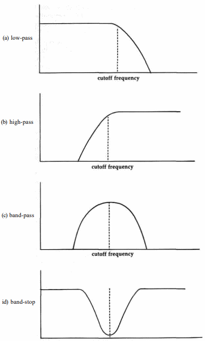

# $D400-$D41C

## 54272-54273 $D400-$D401 FRELO1 FREHI1 <a name="D400"></a>
### Frequency control registers
The value in this pair of registers determines the frequency of
the sound generated for voice 1. The higher the frequency, the
higher the pitch of the sound. For triangle, sawtooth, and
pulse waveforms, the relationship between the value in these
registers and the voice 1 sound frequency in hertz (cycles per
second) is:

<pre>
frequency = register value * clock rate / 16777216
</pre>

The first register (54272/$D400) holds the low byte of the
value and the second (54273/$D401) holds the high byte. The
clock rate depends on which video system the 128 uses. For
NTSC (North American) systems, the clock value is 1022730
Hz, while for PAL (European) systems it is 985250 Hz. Thus,
you can use the following expressions to calculate the frequency
produced by any given register setting:

<pre>
frequency = register value * 0.06096 (for NTSC systems)
frequency = register value * 0.05873 (for PAL systems)
</pre>

Since the register pair can hold values from 0-65535/
$0000-$FFFF, the range of possible output frequencies for an
NTSC system is 0-3995 Hz. A register value of zero corresponds
to no frequency, hence no sound. The upper limit of
human hearing is about 20,000 Hz, but the fact that the SID
can't generate frequencies above 4000 Hz isn't really a serious
handicap. The frequencies between 4000 and 20,000 Hz are
not often used in music. For example, the highest note on a
piano (a C four octaves above middle C) has a frequency of
4186 Hz, just slightly beyond the SID's range. The SID can
produce notes corresponding to those for any of the 88 keys
on a piano keyboard except the very rightmost one. The lower
limit of human hearing is about 20 Hz, so register values less
than about 320/$0140 should result in inaudible output regardless
of the volume setting. Actually, this is true only for
the triangle waveform. The sudden transitions in output amplitude
during sawtooth and pulse waveforms will produce a
clicking or buzzing output at these supposedly inaudible low
frequencies.

If you know the frequency (in hertz) that you wish to
generate, you can calculate the corresponding register setting
using the following formulae:

<pre>
register value = desired frequency * 16.40 (for NTSC systems)
register value = desired frequency * 17.03 (for PAL systems)
</pre>

It is permissible to change the frequency of a sound
while it is playing. The change will take effect immediately,
and will not affect the envelope. Changing the frequency of an
active sound can produce interesting effects. See the entry for
the register at [54299/$D41B](#D41B) for an example.

The noise waveform doesn't have a regularly repeating
pattern like the triangle, sawtooth, and pulse waveforms. The
output jumps erratically from one amplitude level to another,
so noise doesn't really have a frequency in the same sense
that the other waveforms do. For noise, the value in these registers
determines how rapidly the amplitude level changes.
The number of changes per second is approximately equal to
the register value. For example, a register value of 1000/$03E8
will cause the noise output level to change about 1000 times
per second, or approximately one change every 1/1000 second. The
faster the output level changes, the higher the perceived pitch
of the generated noise.
Remember that these are write-only registers; they will always
return 0/$00 when read, regardless of the values you
have stored in them.

## 54274-54275 $D402-$D403 PWLO1 PWHI1 <a name="D402"></a>
### Pulsewidth control registers
This register pair controls the waveform shape when pulse
output is selected for voice 1. The value here has no effect on
any other waveform. The pulse waveform is binary; that is, it
has two states: maximum amplitude and off (no amplitude).
Unlike the ideal sine waveform, which has a smooth transition
between maximum and minimum amplitudes, the pulse waveform switches
almost instantly. The duration of each cycle of
the waveform is controlled by the registers at
[54272-54273/$D400-$D401](#D400). What the registers here control
is how much of
each cycle the waveform spends in the zero-amplitude state.
Pulse waveforms are often described in terms of their duty
cycles, the percentage of the total waveform cycle spent in the
maximum amplitude state. A pulse waveform with a 0-percent
duty cycle is always off, while a pulse waveform with a 100-
percent duty cycle is always at maximum amplitude. A waveform with
a 50-percent duty cycle is at maximum amplitude
for half of the cycle and off for the remaining half, resulting in
a square wave. Next figure illustrates various duty cycles.


This register pair controls the duty cycle (expressed as a
percentage of the total duration of one cycle of the waveform)
according to the following formula:
<pre>
duty cycle = 100 - (register value / 40.95)
</pre>

Only 12 of the 16 bits in the register pair are used. The lower
8 bits come from the register at 54274/$D402 and the higher
4 bits come from bits 0-3 of the register at 54275/$D403. Bits
4-7 of 54275/$D403 are unused; any value written to these
bits has no effect. The available 12 bits allow register values of
0-4095/$000-$EFF, Thus, you can specify duty cycles in the
full range 0-100 percent. If you know the duty cycle you
want, you can calculate the proper register value with:
register value = (100 - desired duty cycle) * 40.95
In the expression above, the duty cycle is expressed as a
percentage. For example, the required register value for a 50-percent
duty cycle-a square wave-would be (100 - 50) * 40.95 =
2048/$0800. For this, you would store the low byte (0/$00) in
54274/$D402 and the high byte (8/$08) in 54275/$D403.
There's one phemomenon you need to be aware of when
selecting duty cycles. The relative percentage of the pulse
waveform cycle spent in each state, rather than the actual
state, determines how the resulting output will sound. Notice
in figure that both the 25-percent and 75-percent duty
cycles have waveforms that are in one state for 25 percent of
the cycle and the other state for 75 percent of the cycle. In
either case, the ratio of time spent in each state is 3 to 1. A
pulse wave with a 75-percent duty cycle will sound exactly
the same as one with a 25-percent duty cycle. For every pulse
waveform duty cycle less than 50 percent, there is a duty cycle
greater than 50 percent that will produce the same sound. For
example, a waveform with a 10-percent duty cycle (on for 10
percent of the cycle and off for the remaining 90 percent) will
sound the same as a waveform with a 90-percent duty cycle
(on for 90 percent of the cycle and off for the remaining 10
percent), since for either waveform the cycle is divided between
the two states in a 9-to-1 ratio.

The closer the register value is to 2048/$0800-the value
for a square wave (50-percent duty cycle, 1-to-1 ratio of time
in each state)-the richer the resulting output will sound. As
the register value approaches 4095 or 0, for 0- or 100-percent
duty cycles, respectively, the ratio approaches its maximum of
1 to 4095 and the resulting sound output becomes increasingly
thin. Very low or very high duty cycles result in nearly inaudible
output. Duty cycles of exactly 0 or 100 percent result in
constant output levels. Since some variation in the output is
required to produce sound, register values of 0/$000 or 4095/
$FFFF produce no audible output.
It is permissible to change the value in these registers, and
hence the width of a pulse waveform, while the voice is generating
output. This will affect only the waveform, not the envelope.
Remember that these are write-only registers; they will
always return 0/$00 when read, regardless of the values you
have stored in them.

## 54276 $D404 VCREG1 <a name="D404"></a>
### Voice 1 control register
Each bit of this register controls some aspect of the output
sound for the voice. Remember that this is a write-only register.
All of the following bits return %0 when read.

**Bit 0**: this bit, called the gate flag, is used to initiate output for
this voice and to trigger the release portion of the defined
sound envelope for the voice. Writing a %1
here starts the attack portion of the envelope. This is
sometimes referred to as gating the voice. For audible output, the
frequency registers for this voice and the overall volume register
for the chip must contain nonzero values. The attack portion of the
envelope will normally be followed by the decay
phase, after which the sound amplitude will remain at the
specified sustain level until a %0 is written to this register.
After the %0 is written, the release phase begins and the
sound output level will fade away to silence at the specified
release rate. Release does not occur unless a %0 is specifically
written to this bit.
Note that writing a %0 here triggers the release phase regardless
of the current state of the envelope. For example, if
you write a %1 here and then immediately write a %0 before
the attack phase is completed, the attack will be aborted and
release will begin from the current amplitude level. Likewise,
writing a %1 here initiates the attack phase, regardless of the
current state of the envelope. For example, if a %1 is written
here while the envelope for the voice is in the decay phase,
the decay phase will be aborted and another attack phase will
begin from the current amplitude level.

**Bit 1**: this bit, called the sync flag, controls a special effect
known as synchronization, which changes the frequency of
and adds extra harmonics to the voice 1 output. When this bit
is set to %1, the waveform of voice 1 will be synchronized
with the waveform of voice 3. That is, whenever the waveform
of voice 3 starts a new cycle, voice 1 will also start a new cycle,
regardless of its point in its current waveform. Next figure
illustrates the effect on the voice 1 waveform.


Only the frequency specified for voice 3 is significant for
synchronization. In fact, it doesn't matter whether voice 3 is
turned on or not, so long as a frequency value is stored in the
frequency control registers for the voice. Synchronization has
no effect if the frequency for the synchronizing voice is zero.
Ideally, the frequency for voice 3 should be less than that
specified for voice 1.
Synchronization also works for voices 2 and 3. Setting
this bit in the control register for voice 2 ([54283/$D40B](#D40B)) allows
voice 2 to be synchronized with voice 1, and setting this
bit in the control register for voice 3 ([54290/$D412](#D412)) allows
voice 3 to be synchronized with voice 2. It is possible to have
two or all three voices synchronized simultaneously.

**Bit 2**: this bit, called the ring mod flag, controls a special effect
known as ring modulation. When this bit is set to %1 and a
triangle waveform is selected for the voice, the triangle waveform
will be ring modulated at the frequency of voice 3. Ring
modulation works only when the triangle waveform is selected.
Ring modulation is rather difficult to explain simply.
When you ring modulate voice 1 at the frequency of voice 3,
the resulting waveform is the equivalent to the sum of two
waveforms of different frequencies. However, the resulting
frequencies are different from both the frequency of voice 1 and
that of voice 3. Next figure is an example of one observed
ring-modulated output.


The ring modulated waveform will have a complex mix of
harmonics. This is useful for simulating the sounds of bells,
gongs, and similar instruments whose waveforms don't closely
resemble the triangle, sawtooth, or pulse.
Only the frequency specified for voice 3 is significant for
ring modulation. Voice 1 must be set for a triangle waveform,
but the waveform of voice 3 is irrelevant. It doesn't even matter
whether voice 3 is turned on or not, as long as a frequency
value is stored in the frequency control registers for the voice.
Ring modulation has no audible effect if the frequency for the
modulating voice is zero.
Ring modulation also works for voices 2 and 3. Setting
this bit in the control register for voice 2 ([54283/$D40B](#D40B)) allows
voice 2 to be ring modulated by voice 1. Voice 2 must
be set for a triangle waveform. Setting this bit in the control
register for voice 3 ([54290/$D412](#D412)) allows voice 3 to be ring
modulated by voice 2. Voice 3 must be set for a triangle
waveform. It is possible for two or all three voices to be
simultaneously ring modulated.

**Bit 3**: this bit, called the test flag, can be used to reset
the internal oscillator for the voice. When this bit is set to %1, the
internal-oscillator register is reset to zero, halting sound output
for the voice. The oscillator remains stopped until a %0 is
written to this bit. You can use this bit to precisely control
when the voice oscillator turns off or on. You must also use
this bit to unfreeze the noise output if you accidentally turn on
noise while another waveform is active.

**Bits 4-7**: these bits control the behavior of the internal
oscillator for the voice, and hence the resulting waveform of the
sound output for the voice. Each bit controls
one of the standard waveforms, as follows:

|Bit|Value|Waveform|
|-|-|-|
|4|16/$10|triangle|
|5|32/$20|sawtooth|
|6|64/$40|pulse|
|7|128/$80|noise|

Setting one of these bits to %1 tells the oscillator to produce
the corresponding waveform. Setting the bit to %0 turns off
that waveform. One of the waveforms must be selected for the
voice to produce any output.

Since the waveforms can be independently selected, you
might be tempted to simultaneously enable more than one
waveform for the voice. This won't hurt the SID chip, but
you'll probably be disappointed with the results. When you
select more than one waveform, the resulting output is not the
simple combination of the selected waveforms. Commodore
literature continues to claim that the result will be a logical
ANDing of the selected waveforms, but the SID's designer has
stated that this is not the case. In any event, mixed waveforms
tend to produce a rather erratic sound, so the technique isn't
really useful. Furthermore, you'll cause a problem if one of the
waveforms in the combination is noise. When the noise waveform is
selected while any other waveform is also selected, the
noise generator for the voice will cease to function. To restart
it you'll have to write a %1 and then a %0 to the TEST flag
(bit 3 of this register) or reset the computer.

## 54277 $D405 ATDCY1 <a name="D405"></a>
### Attack and decay control register
This register controls the behavior of the attack and decay
phases of the envelope for the voice.

**Bits 0-3**: these bits control the decay rate, the amount of time
required for the voice to drop from the peak amplitude attained
during the attack phase to the specified sustain level.
For decay to have any audible effect, the sustain level must be
less than %1111/$F. There is no simple formula relating the
bit value to the corresponding time. The following table shows
the relationship:

|Bits 3 2 1 0|Value|Time required for decay phase (in seconds)|
|-|-|-|
|0000|0/$00|0.006|
|0001|1/$01|0.024|
|0010|2/$02|0.048|
|0011|3/$03|0.072|
|0100|4/$04|0.114|
|0101|5/$05|0.168|
|0110|6/$06|0.204|
|0111|7/$07|0.240|
|1000|8/$08|0.300|
|1001|9/$09|0.750|
|1010|10/$0A|1.5|
|1011|11/$0B|2.4|
|1100|12/$0C|3.0|
|1101|13/$0D|9.0|
|1110|14/$0E|15.0|
|1111|15/$0F|24.0|

You can change the decay rate while a sound is being played.
However, unless the envelope is currently in the attack or decay
phase, the change won't have any effect until the next
time the envelope is started by writing a %1 to the gate bit for
the voice (bit 0 of the control register).

**Bits 4-7**: These bits control the attack rate, the amount of time
required for the sound output of the voice to rise from silence
(zero amplitude) to peak amplitude. The attack phase begins
when a %1 is written to the gate bit for the voice (bit 0 of the
control register). There is no simple formula relating bit values
to the corresponding attack rates. The following table shows
the relationship. Note that attack rates are three times faster
than corresponding decay or release rates. This is because the
attack phase tends to be shorter than decay or release for most
naturally occurring sounds.

|Bits 7 6 5 4|Value|Time required for attack phase (in seconds)|
|-|-|-|
|0000|0/$00|0.002|
|0001|1/$01|0.008|
|0010|2/$02|0.016|
|0011|3/$03|0.024|
|0100|4/$04|0.038|
|0101|5/$05|0.056|
|0110|6/$06|0.068|
|0111|7/$07|0.080|
|1000|8/$08|0.100|
|1001|9/$09|0.250|
|1010|10/$0A|0.5|
|1011|11/$0B|0.8|
|1100|12/$0C|1.0|
|1101|13/$0D|3.0|
|1110|14/$0E|5.0|
|1111|15/$0F|8.0|

You can change attack rate while a sound is being played. However,
unless the envelope is currently in the attack phase, the change
won't have any effect until the next time the gate bit for the
voice (bit 0 of the control register) is set to %1 to restart
the envelope.

## 54278 $D406 SUREL1 <a name="D406"></a>
### Sustain and release control register
This register controls the behavior of the sustain and release
phases of the envelope.

**Bits 0-3**: the value in these bits determines the amount of
time required for the volume level for the voice to drop to
zero (silence) during the release phase of the envelope. The
release phase doesn't begin until it is triggered by writing a %0
to bit 0 of the control register for the voice. Note that release
will have no audible effect if the specified sustain level is zero.
There's no simple formula relating the value in these bits to
the corresponding release times. The following table lists the
relationships:

|Bits 3 2 1 0|Value|Time required for release phase (in seconds)|
|-|-|-|
|0000|0/$00|0.006|
|0001|1/$01|0.024|
|0010|2/$02|0.048|
|0011|3/$03|0.072|
|0100|4/$04|0.114|
|0101|5/$05|0.168|
|0110|6/$06|0.204|
|0111|7/$07|0.240|
|1000|8/$08|0.300|
|1001|9/$09|0.750|
|1010|10/$0A|1.5|
|1011|11/$0B|2.4|
|1100|12/$0C|3.0|
|1101|13/$0D|9.0|
|1110|14/$0E|15.0|
|1111|15/$0F|24.0|

It is possible to change the release rate while a sound is
being played. The new rate will supersede the old one, even if
the envelope is currently in the release phase.

**Bits 4-7**: These registers specify the volume level at which the
voice output will be maintained during the sustain level of the
envelope. Note that this is different from the attack, decay,
and release values, which specify periods of time instead of
levels. Once the attack and decay phases are completed, the
voice will remain at the level specified here until the release
phase is specifically triggered by writing a %0 to the control
register for the voice. The sustain level can be considered a
percentage of the peak volume level of the output, as shown
in the following table. The overall peak output level is
controlled by bits 0-3 of the register at [54296/$D418](#D418).
If 0 is specified for the sustain level, the voice will die
away to silence at the end of the decay period. You can
change the value in these bits to reduce the sustain level (and
hence the output volume) while a sound is being played.
However, if you try to increase the sustain level above its current
value while a voice is in the sustain phase, the voice will
be turned off.

|Bits 7 6 5 4|Value|Percentage of peak output|
|-|-|-|
|0000|0/$00|0 (no output)|
|0001|1/$01|7|
|0010|2/$02|13|
|0011|3/$03|20|
|0100|4/$04|27|
|0101|5/$05|33|
|0110|6/$06|40|
|0111|7/$07|47|
|1000|8/$08|53|
|1001|9/$09|60|
|1010|10/$0A|67|
|1011|11/$0B|73|
|1100|12/$0C|80|
|1101|13/$0D|87|
|1110|14/$0E|93|
|1111|15/$0F|100 (peak output)|

## Voice 2 Control Registers
The following seven registers (54279-54285/$D407-$D40D)
provide the same control functions for voice 2 that the registers
at 54272-54278/$D400-$D406 provide for voice 1. Refer
to the entries for the voice 1 registers for details of how these
registers are used.

### 54279 $D407 FRELO2 <a name="D407"></a>
### 54280 $D408 FREHI2 <a name="D408"></a>
Frequency control registers

### 54281 $D409 PWLO2 <a name="D409"></a>
### 54282 $D40A PWHI2 <a name="D40A"></a>
Pulsewidth control registers

### 54283 $D40B VCREG2 <a name="D40B"></a>
Waveform control register

### 54284 $D40C ATDCY2 <a name="D40C"></a>
Attack and decay control register

### 54285 $D40D SUREL2 <a name="D40D"></a>
Sustain and release control register

## Voice 3 Control Registers
The following seven registers (54286-54292/$D40E-$D414)
provide the same control functions for voice 3 that the registers
at 54272-54278/$D400-$D406 provide for voice 1. Refer
to the entries for the voice 1 registers for details of how these
registers are used.

### 54286 $D40E FRELO3 <a name="D40E"></a>
### 54287 $D40F FREHI3 <a name="D40F"></a>
Frequency control registers

### 54288 $D410 PWLO3 <a name="D410"></a>
### 54289 $D411 PWHI3 <a name="D411"></a>
Pulsewidth control registers

### 54290 $D412 VCREG3 <a name="D412"></a>
Waveform control register

### 54291 $D413 ATDCY3 <a name="D413"></a>
Attack and decay control register

### 54292 $D414 SUREL3 <a name="D414"></a>
Sustain and release control register

## 54293-54294 $D415-$D416 FCLO-FCHI  <a name="D415"></a><a name="D416"></a>
### Filter cutoff frequency registers
The value in these registers specifies the cutoff frequency for
the filter. See the entry for bits 4-6 of the register at
[54296/$D418](#D418) for more information on the effect of filtering.
Only 11 of the 16 bits in this register pair are used. The lower
3 bits of the value come from bits 0-2 of the register at
54293/$D415 and the upper 8 bits come from the register at
54294/$D416. Bits 3-7 of 54293/$D415 are not used, and
writing to those bits has no effect. Remember that these are
write-only registers; they will always return 0/$00 when read,
regardless of the values you have stored in them.
The available 11 bits allow you to specify values in the
range 0-2047/$0000-$07FF. However, there is a great deal of
confusion about the exact relationship between the value in
these registers and the corresponding cutoff frequency.
Supposedly, the value here specifies the cutoff frequency in linear
steps between a minimum of about 30 Hz and a maximum determined
by two external capacitors connected to the SID chip.
Commodore's formal specifications for the SID chip state that
the equation for maximum cutoff frequency is:
<pre>
frequency = 2.6 X 10<sup>5</sup> / capacitance
</pre>
Other official literature, including the 128 Programmer's
Reference Guide, states that the maximum cutoff frequency is about
12,000 Hz, a calculation based on filtering capacitors of 2200
picofarads (2200 X 10<sup>-12</sup>). There are a number of problems
here. First of all, the capacitors used in the 128 (and, by the
way, also in later versions of the Commodore 64) are instead
actually 470 picofarads, not 2200, If the stated equations were
correct, this would give a maximum cutoff value of over
55,000 Hz, implying that the majority of register values would
produce cutoff frequencies beyond the audible range. Simple
experimentation shows that this is not the case. This isn't
surprising, since the SID's designer, Bob Yannes, stated in an
interview in the March 1985 issue of IEEE Spectrum magazine
that filtering doesn't work according to the specified equation
anyway.

So how do you go about selecting a cutoff frequency? Our
experience suggests that, while filtering does work after a
fashion for any given 128, a value that produces a particular
cutoff frequency on one computer may produce a slightly different
cutoff frequency on another system. Although it's not a
particularly scientific approach, the best way to discover the
proper register value for a given cutoff frequency is simply to
try different values until the desired effect is achieved.

## 54295 $D417 RES/FILT <a name="D417"></a>
### Filter selection and resonance control register
The bits of this chip select whether the various audio sources
in the SID will be passed directly to the chip output or routed
through the filter stage. This register also controls a special
filtering effect known as resonance. Remember that this register
is write-only; all bits will return %0 when read, regardless of
the values you write to them.

**Bit 0**: this bit controls whether or not the output for voice 1
passes through the SID's filter stage. When the bit is %0, the
filter is bypassed and voice 1 output is routed directly to the
combined SID output. When the bit is %1, voice 1 output is
routed through the filter before being passed to the chip output.
The filter will modify the voice 1 output according to the
filter parameters specified in the registers at
[54293-54294/$D415-$D416](#D415) and [54296/$D418](#D418).

**Bit 1**: this bit provides the same filter control function for
voice 2 that bit 0 provides for voice 1.

**Bit 2**: this bit provides the same filter control function for
voice 3 that bit 0 provides for voice 1.

**Bit 3**: this bit controls the handling of any external audio
input to the SID. As with bits 0-3, setting this bit to %0 connects
the external input directly to the combined output, while
setting the bit to %1 routes the external input through the filter
before output. These two functions-adding directly to the
output or adding to the filtered output-are the only processing
the SID can perform on the input signal from an external
source. The SID's external input line is connected to pin 5 of
the composite (40-column) video port. To avoid damage to the
SID, you should not use highly amplified signals such as the
final output of a home stereo system for the external input
source.

**Bits 4-7**: these bits control an effect of filtering known
as resonance. The four bits provide for 16 evenly spaced steps from
no resonance (%0000) to full resonance (%1111). Resonance
accentuates frequencies near the cutoff frequency for the filter.
The higher the resonance, the more pronounced the effect of
the selected filter.

## 54296 $D418 SIGVOL <a name="D418"></a>
### Volume and filter mode control register

This register controls the overall volume of the SID output, as
well as the type of frequency attenuation provided by the filter.
Remember that this register is write-only; reading any of
the following bits will return %0, regardless of the values you
write to the bits.

**Bits 0-3**: these bits specify the peak volume for the combined
output of all three voices plus any external input. The four bits
allow for 16 evenly spaced steps between no output (%0000)
and maximum output (%1111). Expressed as a percentage of
maximum possible output volume, the effects of the settings
are roughly as follows:

|Bits 3 2 1 0|Value|Percentage of maximum output|
|-|-|-|
|0000|0/$00|0 (no output)|
|0001|1/$01|7|
|0010|2/$02|13|
|0011|3/$03|20|
|0100|4/$04|27|
|0101|5/$05|33|
|0110|6/$06|40|
|0111|7/$07|47|
|1000|8/$08|53|
|1001|9/$09|60|
|1010|10/$0A|67|
|1011|11/$0B|73|
|1100|12/$0C|80|
|1101|13/$0D|87|
|1110|14/$0E|93|
|1111|15/$0F|100 (peak output)|

These bits must be set to some value greater than zero for the
SID to produce any audible output. There's only one volume
control for the chip, but the relative output volume level of
each voice can be controlled by adjusting the sustain level of
the voice's envelope.

**Bits 4-6**: these bits control the operation of the SID's filter
stage. The SID has only one filter for all three voices (plus the
external input), so the filtering selections affect any source
passed through the filter. Any of the voices can also bypass the
filter and connect directly to the output. Bits 0-3 of the register
at [54295/$D417](#D417) control which voices are routed through the filter.
Bits 4-7 of that register control resonance, which can be used to
emphasize the effects of filtering. The SID provides three basic
types of filtering, as illustrated in next figure (a-c). The
first type, called a low-pass filter, allows frequencies below a
specified cutoff frequency to pass virtually unchanged, but
sharply reduces (attenuates) the volume of frequencies higher than
the cutoff.

The high-pass filter provides the opposite effect, allowing
frequencies above the specified cutoff to pass while attenuating
frequencies lower than the cutoff. The third selection, the band-pass
filter, allows frequencies near the specified cutoff to pass while
blocking frequencies that are much above or below the cutoff. The
filtering types can also be combined. For example, selecting
low-pass and high-pass filters simultaneously provides a fourth
type of filter known as the band-stop, or notch, filter (next figure d).
In this case, frequencies well above and below the
cutoff are passed with little change, while frequencies near the
cutoff are attenuated. The cutoff frequency is specified in the
registers at [54293-54294/$D415-$D416](#D415).



Bit 4 controls the low-pass filter, which is enabled when
the bit is %1 and disabled when the bit is %0. Bits 5 and 6
provide the control for the high-pass and band-pass filters,
respectively, in the same manner. Thus, standard filter selections
are as follows:

|Bits 6 5 4|Value|Filter type|
|-|-|-|
|0 0 1|16/$10|Low-pass|
|0 1 0|32/$20|Band-pass|
|1 0 0|64/$40|High-pass|
|1 0 1|80/$50|Band-stop|

**Bit 7**: this bit controls whether or not voice 3 can be
connected directly to the combined output of the SID chip. While
the bit is %0, the voice 3 output will be added to the combined
output unless it is routed through the filter. Setting this
bit to %1 will prevent the direct connection of voice 3 to the
combined output. However, even when voice 3 is blocked
from direct connection to the combined output, it's still possible
to route voice 3 output through the filter and hence to the
combined output. To prevent this and completely disconnect
voice 3, make sure that bit 2 of the register at 54295/$D417 is
set to %0.

Voice 3 is often used in conjunction with one of the other
voices to generate special audio effects, since the oscillator and
envelope generator output values for this voice can be read
from registers [54299/$D41B](#D41B) and [54300/$D41C](#D41C), respectively.
While voice 3 is used to generate special envelopes or as a
random-number generator, it's desirable to insure that the
specified frequency and envelope for voice 3 don't cause any
disruption of the other voices. This bit provides that feature.
Voice 3 is the only voice which can be disconnected.

## 54297-54298 $D419-$D41A POTX POTY <a name="D419"></a><a name="D41A"></a>
### Potentiometer (paddle) reading registers

The SID chip has two special input lines, designated POTX
and POTY, which are connected to a pair of internal devices
called analog-to-digital (A/D) converters. The A/D converters
generate a one-byte value based on the input voltage. These
read-only registers return the values generated by the converters;
writing to these locations has no effect. As connected in
the 128, the converters measure the voltage across capacitors
at the input pins. When a variable resistor (also called a
potentiometer) is connected between a constant voltage source and
the capacitor, the converters can be used to read the input resistance.
The output values will be in the range 0-255, according to the
resistor value. Minimum resistance (or a closed
circuit) produces a reading of 0/$00 and maximum resistance
(or an open circuit, as when nothing is connected to the lines)
results in a reading of 255/$FF. The official SID chip specifications
state that the relationship between the installed capacitor
values and the resistance for maximum output value is:

<pre>
resistor value = 4.7 X 10<sup>4</sup> / capacitor value
</pre>

The capacitors in the 128 are 1800 picofarads (1800 X 10<sup>12</sup>),
so any resistance greater than about 4.7 X 10O<sup>4</sup> / 1800 X
IO-12 = 261 X 10<sup>3</sup>
 ohms (261 KΩ) will result in a register
value of 255/$FF. Actually, our experience indicates that a
slightly higher value, 270-280 KQ or so, may be required.

The SID input lines can be connected to either of the two
control ports on the right side of the 128. Bits 6-7 of the CIA
#1 port A register at [56320/$DC00](DC00#DC00) determine which control
port is currently connected (for details, see the section on the
CIA chip later in this chapter). The default setting connects
control port 1, the front one. For either port, the SID register
lines are connected to port pins 5 and 9. Location 54297/
$D419 will read the level at pin 9 and location 54298/$D41A
will read the level at pin 5. From BASIC, the POT function
can be used to read these registers. POT(l) reads the register
at 54297/$D419 connected to pin 9 of port 1 and POT(2)
reads the register at 54298/$D41A connected to pin 5 of port 1.
POT(3) and POT(4) read the same registers when connected,
respectively, to pins 9 and 5 of port 2.

The device most commonly connected to these inputs is
the game paddle controller. A paddle is an extremely simple
device, consisting of a variable resistor connected between a
+ 5 volt source (pin 7 of the control port) and the SID A/D
converter input line. Turning the paddle knob changes the resistance,
and hence the register value. The paddle tends to be
more efficient than the joystick for games that require only
horizontal or only vertical movement, such as Pong-type
games for which the paddle was originally developed. Since
the steps between output levels are so small (only about one
ohm), consecutive readings of the same paddle position can
vary by one or two register values. This "jitter" can be annoying.
The recommended solution is to read the paddle several
times, then calculate the average of the readings and use that
value.

One thing you should be aware of is that Commodore has
changed the values of the capacitors used with the converters
since the Commodore 64 was first introduced. The original 64
used 1000 picofarad capacitors, so a resistance of about 470
KX2 was required for a maximum register value. Thus, most
paddles currently available for Commodore computers use
potentiometers with a top resistance of 470 KΩ or 500 KΩ.
Such paddles can be used with the 128, but they will swing
the full range of register values (0-255) in about the first half
of the paddle's full turn. Thus, you probably won't be able to
select fine increments of intermediate values. Furthermore,
paddles for Atari computers, which are much more widely
available than Commodore paddles, use 1 MΩ (1 million ohm)
potentiometers. Again, these can be used with the 128, but in
this case you'll see the full register value swing (0-255) in
about the first quarter of the paddle's ful] turn. Thus, Atari
paddles will give you only very coarse control of the resulting
register values.
Most paddle controllers also have fire buttons like joysticks.
However, since paddles almost always come in pairs,
and since there is only one fire button line per control port,
the paddle fire buttons are connected to the lines normally
used for joystick direction. Standard Commodore paddles use
the lines connected to bits 2 and 3 of each CIA #1 data port
(locations [56320-56321/$DC00-$DC01](DC00#DC00)), the lines for joystick
left and right.

These A/D converters can also be used for other interfacing
projects. Any device which provides a variable resistance
can be connected to the appropriate control port lines and
read via these registers. For example, most graphics tablets
such as the popular KoalaPad effectively function as paddles,
with one resistance for the horizontal coordinate of the stylus
position and another for the vertical coordinate. You could
also rig an interface for an Apple/IBM-style joystick, which
consists of two variable resistors—one on the horizontal axis
and one on the vertical axis.

## 54299 $D41B OSC3 <a name="D41B"></a>
### Voice 3 oscillator output register

This register reflects the upper eight bits of the internal-oscillator
register for voice 3. This is a read-only register; storing values
here has no effect. The output signal for each voice is generated by
converting the digital bit pattern from the voice's oscillator
register into an analog voltage level, so the output
signal for the voice is directly proportional to the value in its
oscillator. However, voice 3 is the only voice for which the
oscillator contents can be read.
For triangle and sawtooth waveforms, the oscillator acts
as a repeating counter. For the triangle waveform, the oscillator
count starts at zero and increments upward to its maximum count,
then decrements downward to zero again. Once
the count reaches zero, it immediately begins incrementing
again, and the process repeats over and over. The counting
rate depends on the value in the frequency control registers
for the voice. For all but the lowest frequencies, the count
sweeps up and down so quickly that you won't read every intermediate
value between 0/$00 and 255/$FF in this register.
For the sawtooth waveform, the count also starts at zero and
increments upward to maximum count, but in this case the
count then returns immediately to zero and begins incrementing again.

Unlike the triangle and sawtooth waveforms, the pulse
waveform doesn't sweep smoothly from one output level to
the next. Instead, the it jumps back and forth between two
discrete levels. When the pulse waveform is selected for voice
3, this register will contain one of two values: 0/$00 when the
waveform is at minimum (zero) amplitude and 255/$FF when
the waveform is at maximum amplitude. The portion of the
cycle spent in the zero-amplitude state is determined by the
value in the pulsewidth registers for the voice, and the rate at
which the off/on switching repeats is determined by the value
in the frequency control registers for the voice.
The noise waveform is different from the others in that it
exhibits no regularly repeating pattern. Rather, the oscillator
will contain a series of random values. The rate at which the
value in the oscillator changes—and hence the rate at which
the value in this register changes-is determined by the value
in the frequency control registers for the voice. This feature
can be used to provide a random-number generator. If your
program needs random numbers in the range 0-255/$00-$FF,
simply set the voice 3 frequency registers 
([54286-54287/$D40E-$D40F](#D40E)) for a high frequency; then set bits 0 and 7 of
the voice 3 control register ([54290/$D412](#D412)) to %1 to start the
noise waveform. After that, just read this register whenever
you need a random value.
In addition to its use as a random-number generator, this
register can be used for a number of special audio effects. The
changing output of the oscillator can be used to modify the
frequency or pulsewidth of a voice or the filter parameters in
realtime. The following is a simple example:

``` Assembly
1B00 LDA #$F0 ;set sustain to maximum level
1B02 STA $D406
1B05 LDA #$8F ;set maximum volume; disconnect voice 3
1B07 STA $D418
1B0A LDA #$01 ;set frequency (high byte) for voice 3
1B0C STA $D40F
1B0F LDA #$21 ;start sawtooth waveform on voice 3
1B11 STA $D412
1B14 LDA #$11 ;start triangle waveform on voice 1
1B16 STA $D404
1B19 LDA $D41B ;change voice 1 frequency according to
1B1C STA $D401 ;voice 3 oscillator output
1B1F JMP $1B19
```

Whenever voice 3 is used for special effects such as
random-number generation, it should be disconnected from
the combined SID output so that it doesn't distort any sounds
produced by the other voices. To disconnect voice 3, set bit 7
to %1 in the register at [54296/$D418](#D418). Also, make sure that bit
2 of the register at [54295/$D417](#D417) is %0. This will insure that
voice 3 output is not routed through the filter.

## 54300 $D41C ENV3 <a name="D41C"></a>
### Envelope generator 3 output register

The value in this register reflects the contents of the internal
envelope generator for voice 3, This is a read-only register;
storing values here has no effect. Each voice has its own envelope
generator which controls the peak amplitude of the output for that
voice. However, voice 3 is the only one for which
the envelope-generator register contents can be read.

The envelope generator regulates the amplitude (volume)
of the output for the voice. When voice 3 is silent or turned
off, this register will contain 0/$00, indicating no output.
When the gate bit for the voice (bit 0 in the register at
[54290/$D412](#D412)) is set to %1, the value here will begin incrementing to
255/$FF, indicating peak output amplitude. This
peak amplitude for the voice will be relative to the overall
peak volume level specified in bits 0-3 of the register at
54296/$D418.
The rate at which the register increments depends on the
attack rate specified in bits 4-7 of the register at [54291/$D413](#D413).
Once the register reaches 255/$FF, it immediately begins
decrementing to the sustain level specified in bits 4-7 of the
register at [54292/$D414](#D414) (unless the specified sustain level is
15/$F-in that case, the register value remains at 255/$FF following
the attack phase).

The rate at which the amplitude drops to the sustain level
depends on the decay rate specified in bits 0-3 of the register
[54291/$D413](#D413). The register value while the voice is in the sustain
phase will be equal to the specified sustain-level value repeated
in both nybbles. For example, if the sustain level is
%1001 = $9, then the value in this register while the voice is
in the sustain phase of the envelope will be $99/153. Once
the gate bit for the voice is set to %0, the value in this register
will decrease from the sustain level to 0/$00. The rate at
which the register value decrements is determined by the release
rate specified in bits 0-3 of the register at [54292/$D414](#D414).
The value in this register can be used to modify other SID
parameters, such as the contents of one of the write-only registers,
in realtime. For example, you could try continuously
storing the value from this register in the filter cutoff-frequency
register at [54294/$D416](#D416). This would cause the cutoff frequency to rise
and fall in conjunction with the voice 3 envelope. If you use the
voice 3 envelope generator for special
effects, you may want to disconnect voice 3 from the combined SID
output so that it doesn't distort any sounds produced by the
other voices. To disconnect voice 3, set bit 7 to
%1 in the register at [54296/$D418](#D418). Also, make sure that bit 2
of the register at [54295/$D417](#D417) is %0. This will insure that
voice 3 output is not routed through the filter.

## 54301-54303 $D41D-$D41F Unused <a name="D41D"></a><a name="D41F"></a>

These unused register locations always return the value 0/$00
when read. Writing to these locations has no effect.

## 54304-54527 $D420-$D4FF <a name="D420"></a>
### SID register images
Due to incomplete address decoding, images of the SID chip
registers appear repeatedly every 32 locations throughout the
remainder of this page of memory. That is, storing a value in
any location with an address which is an exact multiple of 32
greater than one of the base address locations listed above has
the same effect as storing a value in the corresponding base
register. For example, storing a value in 54328/$D438 or
54520/$D4F8 has the same effect as storing that same value
in 54296/$D418. However, it's better programming practice to
use the officially designated register addresses.

## See also

* [SID (Sound Interface Device)](Sid)
