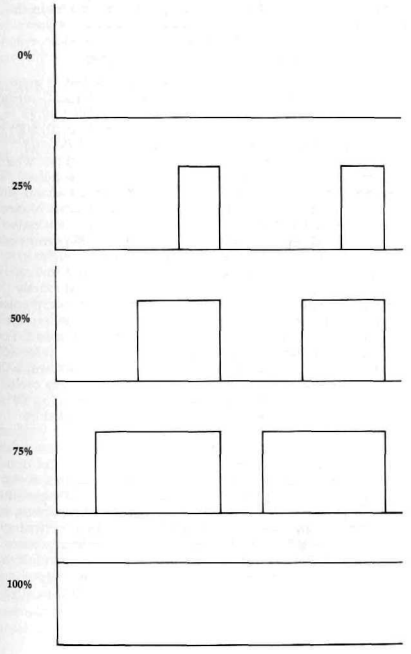
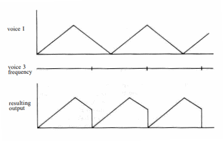
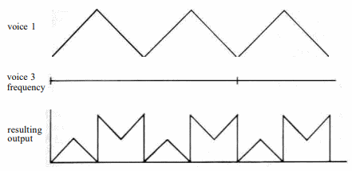

# $D400-$D41C

## 54272-54273 $D400-$D401 FRELO1 FREHI1 
### Frequency control registers
The value in this pair of registers determines the frequency of
the sound generated for voice 1. The higher the frequency, the
higher the pitch of the sound. For triangle, sawtooth, and
pulse waveforms, the relationship between the value in these
registers and the voice 1 sound frequency in hertz (cycles per
second) is:

<pre>
frequency = register value * clock rate / 16777216
</pre>

The first register (54272/$D400) holds the low byte of the
value and the second (54273/$D401) holds the high byte. The
clock rate depends on which video system the 128 uses. For
NTSC (North American) systems, the clock value is 1022730
Hz, while for PAL (European) systems it is 985250 Hz. Thus,
you can use the following expressions to calculate the frequency
produced by any given register setting:

<pre>
frequency = register value * 0.06096 (for NTSC systems)
frequency = register value * 0.05873 (for PAL systems)
</pre>

Since the register pair can hold values from 0-65535/
$0000-$FFFF, the range of possible output frequencies for an
NTSC system is 0-3995 Hz. A register value of zero corresponds
to no frequency, hence no sound. The upper limit of
human hearing is about 20,000 Hz, but the fact that the SID
can't generate frequencies above 4000 Hz isn't really a serious
handicap. The frequencies between 4000 and 20,000 Hz are
not often used in music. For example, the highest note on a
piano (a C four octaves above middle C) has a frequency of
4186 Hz, just slightly beyond the SID's range. The SID can
produce notes corresponding to those for any of the 88 keys
on a piano keyboard except the very rightmost one. The lower
limit of human hearing is about 20 Hz, so register values less
than about 320/$0140 should result in inaudible output regardless
of the volume setting. Actually, this is true only for
the triangle waveform. The sudden transitions in output amplitude
during sawtooth and pulse waveforms will produce a
clicking or buzzing output at these supposedly inaudible low
frequencies.

If you know the frequency (in hertz) that you wish to
generate, you can calculate the corresponding register setting
using the following formulae:

<pre>
register value = desired frequency * 16.40 (for NTSC systems)
register value = desired frequency * 17.03 (for PAL systems)
</pre>

It is permissible to change the frequency of a sound
while it is playing. The change will take effect immediately,
and will not affect the envelope. Changing the frequency of an
active sound can produce interesting effects. See the entry for
the register at [54299/$D41B](#D41B) for an example.

The noise waveform doesn't have a regularly repeating
pattern like the triangle, sawtooth, and pulse waveforms. The
output jumps erratically from one amplitude level to another,
so noise doesn't really have a frequency in the same sense
that the other waveforms do. For noise, the value in these registers
determines how rapidly the amplitude level changes.
The number of changes per second is approximately equal to
the register value. For example, a register value of 1000/$03E8
will cause the noise output level to change about 1000 times
per second, or approximately one change every 1/1000 second. The
faster the output level changes, the higher the perceived pitch
of the generated noise.
Remember that these are write-only registers; they will always
return 0/$00 when read, regardless of the values you
have stored in them.

## 54274-54275 $D402-$D403 PWLO1 PWHI1 
### Pulsewidth control registers
This register pair controls the waveform shape when pulse
output is selected for voice 1. The value here has no effect on
any other waveform. The pulse waveform is binary; that is, it
has two states: maximum amplitude and off ({)no amplitude).
Unlike the ideal sine waveform, which has a smooth transition
between maximum and minimum amplitudes, the pulse waveform switches
almost instantly. The duration of each cycle of
the waveform is controlled by the registers at 54272-54273/
$D400-$D401. What the registers here control is how much of
each cycle the waveform spends in the zero-amplitude state.
Pulse waveforms are often described in terms of their duty
cycles, the percentage of the total waveform cycle spent in the
maximum amplitude state. A pulse waveform with a 0-percent
duty cycle is always off, while a pulse waveform with a 100-
percent duty cycle is always at maximum amplitude. A waveform with
a 50-percent duty cycle is at maximum amplitude
for half of the cycle and off for the remaining half, resulting in
a square wave. Next figure illustrates various duty cycles.

This register pair controls the duty cycle (expressed as a
percentage of the total duration of one cycle of the waveform)
according to the following formula:
<pre>
duty cycle = 100 - (register value / 40.95)
</pre>

Only 12 of the 16 bits in the register pair are used. The lower
8 bits come from the register at 54274/$D402 and the higher
4 bits come from bits 0-3 of the register at 54275/$D403. Bits
4-7 of 54275/$D403 are unused; any value written to these
bits has no effect. The available 12 bits allow register values of
0-4095/$000-$EFF, Thus, you can specify duty cycles in the
full range 0-100 percent. If you know the duty cycle you
want, you can calculate the proper register value with:
register value = (100 - desired duty cycle) * 40.95
In the expression above, the duty cycle is expressed as a
percentage. For example, the required register value for a 50-percent
duty cycle-a square wave-would be (100 - 50) * 40.95 =
2048/$0800. For this, you would store the low byte (0/$00) in
54274/$D402 and the high byte (8/$08) in 54275/$D403.
There's one phemomenon you need to be aware of when
selecting duty cycles. The relative percentage of the pulse
waveform cycle spent in each state, rather than the actual
state, determines how the resulting output will sound. Notice
in figure that both the 25-percent and 75-percent duty
cycles have waveforms that are in one state for 25 percent of
the cycle and the other state for 75 percent of the cycle. In
either case, the ratio of time spent in each state is 3 to 1. A
pulse wave with a 75-percent duty cycle will sound exactly
the same as one with a 25-percent duty cycle. For every pulse
waveform duty cycle less than 50 percent, there is a duty cycle
greater than 50 percent that will produce the same sound. For
example, a waveform with a 10-percent duty cycle (on for 10
percent of the cycle and off for the remaining 90 percent) will
sound the same as a waveform with a 90-percent duty cycle
(on for 90 percent of the cycle and off for the remaining 10
percent), since for either waveform the cycle is divided between
the two states in a 9-to-1 ratio.

The closer the register value is to 2048/$0800-the value
for a square wave (50-percent duty cycle, 1-to-1 ratio of time
in each state)-the richer the resulting output will sound. As
the register value approaches 4095 or 0, for 0- or 100-percent
duty cycles, respectively, the ratio approaches its maximum of
1 to 4095 and the resulting sound output becomes increasingly
thin. Very low or very high duty cycles result in nearly inaudible
output. Duty cycles of exactly 0 or 100 percent result in
constant output levels. Since some variation in the output is
required to produce sound, register values of 0/$000 or 4095/
$FFFF produce no audible output.
It is permissible to change the value in these registers, and
hence the width of a pulse waveform, while the voice is generating
output. This will affect only the waveform, not the envelope.
Remember that these are write-only registers; they will
always return 0/$00 when read, regardless of the values you
have stored in them.

## 54276 $D404 VCREG1 
### Voice 1 control register
Each bit of this register controls some aspect of the output
sound for the voice. Remember that this is a write-only register.
All of the following bits return %0 when read.

**Bit 0**: this bit, called the gate flag, is used to initiate output for
this voice and to trigger the release portion of the defined
sound envelope for the voice. Writing a %1
here starts the attack portion of the envelope. This is
sometimes referred to as gating the voice. For audible output, the
frequency registers for this voice and the overall volume register
for the chip must contain nonzero values. The attack portion of the
envelope will normally be followed by the decay
phase, after which the sound amplitude will remain at the
specified sustain level until a %0 is written to this register.
After the %0 is written, the release phase begins and the
sound output level will fade away to silence at the specified
release rate. Release does not occur unless a %0 is specifically
written to this bit.
Note that writing a %0 here triggers the release phase regardless
of the current state of the envelope. For example, if
you write a %1 here and then immediately write a %0 before
the attack phase is completed, the attack will be aborted and
release will begin from the current amplitude level. Likewise,
writing a %1 here initiates the attack phase, regardless of the
current state of the envelope. For example, if a %1 is written
here while the envelope for the voice is in the decay phase,
the decay phase will be aborted and another attack phase will
begin from the current amplitude level.

**Bit 1**: this bit, called the sync flag, controls a special effect
known as synchronization, which changes the frequency of
and adds extra harmonics to the voice 1 output. When this bit
is set to %1, the waveform of voice 1 will be synchronized
with the waveform of voice 3. That is, whenever the waveform
of voice 3 starts a new cycle, voice 1 will also start a new cycle,
regardless of its point in its current waveform. Next figure
illustrates the effect on the voice 1 waveform.

Only the frequency specified for voice 3 is significant for
synchronization. In fact, it doesn't matter whether voice 3 is
turned on or not, so long as a frequency value is stored in the
frequency control registers for the voice. Synchronization has
no effect if the frequency for the synchronizing voice is zero.
Ideally, the frequency for voice 3 should be less than that
specified for voice 1.
Synchronization also works for voices 2 and 3. Setting
this bit in the control register for voice 2 (54283/$D40B) allows
voice 2 to be synchronized with voice 1, and setting this
bit in the control register for voice 3 (54290/$D412) allows
voice 3 to be synchronized with voice 2. It is possible to have
two or all three voices synchronized simultaneously.

**Bit 2**: this bit, called the ring mod flag, controls a special effect
known as ring modulation. When this bit is set to %1 and a
triangle waveform is selected for the voice, the triangle waveform
will be ring modulated at the frequency of voice 3. Ring
modulation works only when the triangle waveform is selected.
Ring modulation is rather difficult to explain simply.
When you ring modulate voice 1 at the frequency of voice 3,
the resulting waveform is the equivalent to the sum of two
waveforms of different frequencies. However, the resulting
frequencies are different from both the frequency of voice 1 and
that of voice 3. Next figure is an example of one observed
ring-modulated output.

The ring modulated waveform will have a complex mix of
harmonics. This is useful for simulating the sounds of bells,
gongs, and similar instruments whose waveforms don't closely
resemble the triangle, sawtooth, or pulse.
Only the frequency specified for voice 3 is significant for
ring modulation. Voice 1 must be set for a triangle waveform,
but the waveform of voice 3 is irrelevant. It doesn't even matter
whether voice 3 is turned on or not, as long as a frequency
value is stored in the frequency control registers for the voice.
Ring modulation has no audible effect if the frequency for the
modulating voice is zero.
Ring modulation also works for voices 2 and 3. Setting
this bit in the control register for voice 2 (54283/$D40B) allows
voice 2 to be ring modulated by voice 1. (Voice 2 must
be set for a triangle waveform.) Setting this bit in the control
register for voice 3 (54290/$D412) allows voice 3 to be ring
modulated by voice 2. Voice 3 must be set for a triangle
waveform. It is possible for two or all three voices to be
simultaneously ring modulated.

**Bit 3**: this bit, called the test flag, can be used to reset
the internal oscillator for the voice. When this bit is set to %1, the
internal-oscillator register is reset to zero, halting sound output
for the voice. The oscillator remains stopped until a %0 is
written to this bit. You can use this bit to precisely control
when the voice oscillator turns off or on. You must also use
this bit to unfreeze the noise output if you accidentally turn on
noise while another waveform is active.

**Bits 4-7**: these bits control the behavior of the internal
oscillator for the voice, and hence the resulting waveform of the
sound output for the voice. Each bit controls
one of the standard waveforms, as follows:

|Bit|Value|Waveform|
|-|-|-|
|4|16/$10|triangle
|5|32/$20|sawtooth
|6|64/$40|pulse
|7|128/$80|noise

Setting one of these bits to %1 tells the oscillator to produce
the corresponding waveform. Setting the bit to %0 turns off
that waveform. One of the waveforms must be selected for the
voice to produce any output.

Since the waveforms can be independently selected, you
might be tempted to simultaneously enable more than one
waveform for the voice. This won't hurt the SID chip, but
you'll probably be disappointed with the results. When you
select more than one waveform, the resulting output is not the
simple combination of the selected waveforms. Commodore
literature continues to claim that the result will be a logical
ANDing of the selected waveforms, but the SID's designer has
stated that this is not the case. In any event, mixed waveforms
tend to produce a rather erratic sound, so the technique isn't
really useful. Furthermore, you'll cause a problem if one of the
waveforms in the combination is noise. When the noise waveform is
selected while any other waveform is also selected, the
noise generator for the voice will cease to function. To restart
it you'll have to write a %1 and then a %0 to the TEST flag
(bit 3 of this register) or reset the computer.

## 54277 $D405 ATDCY1 
### Attack and decay control register
This register controls the behavior of the attack and decay
phases of the envelope for the voice.

**Bits 0-3**: these bits control the decay rate, the amount of time
required for the voice to drop from the peak amplitude attained
during the attack phase to the specified sustain level.
For decay to have any audible effect, the sustain level must be
less than %1111/$F. There is no simple formula relating the
bit value to the corresponding time. The following table shows
the relationship:

|Bits 3 2 1 0|Value|Time required for decay phase (in seconds)
|-|-|-|
|0000|0/$00|0.006|
|0001|1/$01|0.024|
|0010|2/$02|0.048|
|0011|3/$03|0.072|
|0100|4/$04|0.114|
|0101|5/$05|0.168|
|0110|6/$06|0.204|
|0111|7/$07|0.240|
|1000|8/$08|0.300|
|1001|9/$09|0.750|
|1010|10/$0A|1.5|
|1011|11/$0B|2.4|
|1100|12/$0C|3.0|
|1101|13/$0D|9.0|
|1110|14/$0E|15.0|
|1111|15/$0F|24.0|

You can change the decay rate while a sound is being played.
However, unless the envelope is currently in the attack or decay
phase, the change won't have any effect until the next
time the envelope is started by writing a %1 to the gate bit for
the voice (bit 0 of the control register).

**Bits 4-7**: These bits control the attack rate, the amount of time
required for the sound output of the voice to rise from silence
(zero amplitude) to peak amplitude. The attack phase begins
when a %1 is written to the gate bit for the voice (bit 0 of the
control register). There is no simple formula relating bit values
to the corresponding attack rates. The following table shows
the relationship. Note that attack rates are three times faster
than corresponding decay or release rates. This is because the
attack phase tends to be shorter than decay or release for most
naturally occurring sounds.

|Bits 7 6 5 4|Value|Time required for attack phase (in seconds)
|-|-|-|
|0000|0/$00|0.002|
|0001|1/$01|0.008|
|0010|2/$02|0.016|
|0011|3/$03|0.024|
|0100|4/$04|0.038|
|0101|5/$05|0.056|
|0110|6/$06|0.068|
|0111|7/$07|0.080|
|1000|8/$08|0.100|
|1001|9/$09|0.250|
|1010|10/$0A|0.5|
|1011|11/$0B|0.8|
|1100|12/$0C|1.0|
|1101|13/$0D|3.0|
|1110|14/$0E|5.0|
|1111|15/$0F|8.0|

You can change attack rate while a sound is being played. However,
unless the envelope is currently in the attack phase, the change
won't have any effect until the next time the gate bit for the
voice (bit 0 of the control register) is set to %1 to restart
the envelope.

