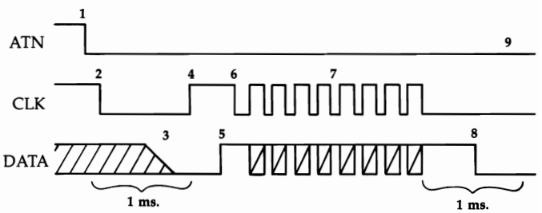
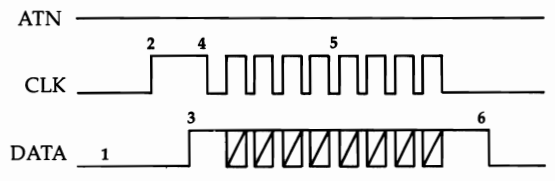
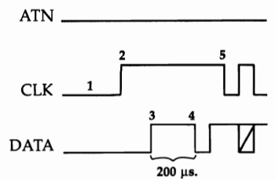
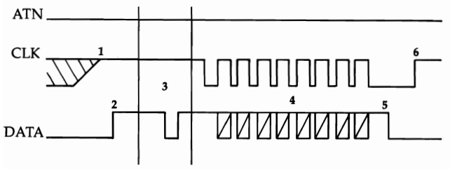
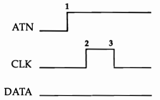

# $E000-$FFFF - Kernal Rom, Standard Commodore Jump Table

# Kernal ROM

In software engineering jargon, the collection of subroutines
that perform basic input and output functions for a computer
is referred to as the operating system kernel. The developers
of the kernel for the original Commodore PET spelled (or misspelled)
the term as kernal, and Commodore operating systems
have been referred to as the Kernal ever since. There are both
similarities and significant differences between the 128 Kernal
and the Kernals of earlier models.

The Kernal handles input from or output to five basic
sources: the keyboard, the video screen, the tape drive (Datassette),
the RS-232 port, and the serial bus (to which disk
drives and printers are connected). In the 128 Kernal, all keyboard
and video functions have been transferred to a separate
block of ROM, the screen editor, at [$C000](C000#C000).

Significant enhancements include the addition of an 80-
column screen, ESC-key screen-editing sequences, and keyboard table
pointers in RAM that make it easy to customize
the keyboard. Tape and RS-232 support is largely unchanged
from that provided in the Commodore 64 Kernal. Serial bus
operation is significantly enhanced by the addition of a new
fast serial mode which can transfer data much more quickly
than the old system, now fittingly referred to as slow serial
mode.

Additional new features of the 128 Kernal include routines
to handle the storage, retrieval, and comparison of data from
the various memory banks supported by the system, and support for DMA
(Direct Memory Access) transfer operations to
and from the 1700 and 1750 Memory Expansion Modules.

The heart of the Kernal is the collection of routines called
by the Kernal jump table at 65409-65525/$FF81-$FFF5. The
routines called from that table, and their supporting subroutines,
make up the bulk of the Kernal and provide access to
the majority of the 128's input/output (I/O) capabilities.
Almost any I/O operation can (and should) be performed
through the appropriate jump table entry. The Kernal jump
table has been a feature of all Commodore operating systems.

The 128 adds an additional jump table with 19 new entries at
65351-65407/$FF47-$FF7F. These entries provide access to
most of the 128 Kernal's new or enhanced features.

## 57344 $E000 RESET 
### Performs main system initialization sequence
Resets the processor stack pointer to the top of the stack,
disables IRQ interrupts, and insures that the processor is not in
decimal mode; then sets the MMU configuration register for
bank 15. Other MMU registers are initialized from the table at
57419/$E04B. Next, the initialization status flag ([$0A04](0A00#0A04))
is reset to 0/$00 to indicate that all variables and vectors need
to be initialized. The interrupt and reset handling routines at
65285-65348/$FF05-$FF44 in Kernal ROM are copied to that
same area in all RAM banks, and the INDFET, INDSTA,
INDCMP, JSRFAR, JMPFAR, and DMA-CALL routines are
copied from the table at 63488/$F800 into bank 0 RAM.

Locations 65525-65527/$FFF5-$FFF7 in bank 1 are then
examined to see if they contain the character codes for the letters
CBM. If not, those locations are initialized with that character
pattern, and the soft reset vector at 65528/$FFF8 in bank
1 is initialized. However, if the test pattern is found (indicating
that RESET has already been performed at least once), the
routine jumps to the address in the vector. Normally, the vector
points to the routine at 57892/$E224, which simply
reinitializes the test pattern and vector. You can change the
address to add your own extra steps to the reset sequence.

The subroutine at 57922/$E242 is called to check for the
presence of a Commodore 64 cartridge. If one is detected, the
system is switched to 64 mode and the computer becomes a
Commodore 64. (You must press the RESET button or turn
the computer off and back on to return to 128 mode.) Otherwise,
the subroutine records the presence of any 128 function
ROMs in the table at 2753-2756/$0AC1-$0AC4. If a logged
function ROM is autostarting, its cold start routine is called. It
is possible that an autostarting ROM will retain control of the
system and will not return to complete the reset sequence.

Next, the IOINIT routine [$E109](#E109) is called to initialize the
video, CIA, and SID chip registers. The keyboard column
which includes the RUN/STOP and Commodore keys is
scanned. If RUN/STOP has been pressed, the Kernal memory
initialization flag (2562/$0A02) is checked. If the flag contains
a nonzero value, the following memory initialization step is
skipped. Since the flag is given the value 165/$A5 after the
first call to RAMTAS [$E093](#E093), zero-page values and memory
pointers are preserved if RUN/STOP is held down during a
subsequent reset. Otherwise, RAMTAS [$E093](#E093) is called to
clear all zero-page RAM locations and reestablish Kernal
pointers.

RESTOR [$E056](#E056) is called to load default Kernal indirect
vectors into 788-819/$0314-$0333. CINT [$C000](C000#C000) is called to
initialize the screen editor, after which IRQ interrupts are once
again allowed. If the RUN/STOP key has been pressed, the
monitor is entered through its cold start entry point [$B000](B000#B000). If
the Commodore key has been held down, 64 mode is entered
using the C64-MODE routine [$E24B](#E24B). Otherwise, BASIC 7.0
is entered via the restart vector at 2560/$0A00. If the
RAMTAS step has been performed, the restart vector will
point to BASIC's cold start entry point [$4000](4000#4000).

It is possible to perform most of the reset sequence without losing
the BASIC program currently in memory. Simply
hold down RUN/STOP while pressing the RESET button.
This will skip the RAMTAS step, which would wipe out important
program pointers. You will land in the monitor after
the reset; type X to exit to BASIC, where the current program
should still be intact.

Note that the reset routine does not explicitly attempt to
boot a disk or to initialize function ROMs that are not
autostarting. These tasks are performed by the Kernal PHOENIX routine
[$F867](#F867). In 128 ROM, PHOENIX is called only
during the BASIC cold start routine [$4023](4000#4023). However, as long
as the RUN/STOP or Commodore key is not held down, the
reset routine ends by jumping to the BASIC cold start routine,
so those actions are implicitly part of the normal reset
sequence.

## 57419 $E04B 
### Table of default MMU register settings
The 11 values in this table are copied into the MMU chip registers at
[$D500-$D50A](D500#D500) by the system reset routine [$E000](#E000).

## 57430 $E056 RESTOR 
### Restores Kernal indirect vectors to their default values
This routine has a Kernal jump table entry at [$FF8A](#FF8A)

Loads the X and Y registers with the value [$E073](#E073), the
address of the default vector table, then clears the status register
carry bit, and falls through into the following routine to
load default vector values.

## 57435 $E05B VECTOR 
### Loads or copies Kernal indirect vector values
This routine has a Kernal jump table entry at [$FF8D](#FF8D)

Transfers the address value in the X and Y registers upon entry into a working
pointer (195-196/$C3-$C4). If the carry bit
is clear, 32 bytes starting at the specified address are copied to
the Kernal indirect vectors at 788-819/$0314-$0333. If carry
is set, the contents of the indirect vectors are copied to 32 locations starting
at the specified address. In either case, the target address must be visible
in bank 15.

## 57459 $E073 
### Table of default Kernal indirect vector values
The 16 two-byte values in this table are copied to the Kernal
indirect vectors (788-819/$0314-0$333) by the RESTOR routine [$E056](#E056),
part of the reset sequence.

## 57491 $E093 RAMTAS 
### Initializes zero page and Kernal pointers
This routine has a Kernal jump table entry at [$FF87](#FF87)

Sets all zero page RAM locations (2-255/$02-$FF) to 0/$00,
then initializes the cassette buffer pointer ([$B2-$B3](0000#B2))
to $0B00, the RS-232 input buffer pointer ([$C8-$C9](0000#C8))
to $0C00, and the RS-232 output buffer
pointer (202-203/$CA-$CB) to 3328/$0D00. The MEMSIZ
pointer (2567-2568/$0A07-$0A08) is set to 65280/$FF00
to mark the top of free RAM, and the MEMSTR pointer
(2565-2566/$0A05-$0A06) is set to 7168/$1C00 to mark the
bottom of free RAM in bank 0. The BASIC restart indirect vector
(2560-2561/$0A00-$0A01) is loaded with 16384/$4000,
the address of BASIC's cold start entry point. Finally, the
Kernal memory initialization flag ([$0A02](0A00#0A02)) is set to
165/$A5 to indicate that this routine has been performed.

## 57549 $E0CD 
### Initializes all RAM-resident Kernal routines
Copies the interrupt- and reset-handling routines at
65285-65348/$FF05-$FF44 in Kernal ROM into the same addresses
in both RAM banks. These routines redirect interrupts
and reset to the proper handling routine in Kernal ROM (bank
15). It's necessary to have a copy in each bank, because an interrupt
or reset can occur while the system is configured for
any bank. The routines are actually copied into banks 0-3,
even though there isn't unique RAM in banks 2 and 3 in the
current 128.

Next, the code for the RAM-resident portions of vital indirect access
routines-INDFET [$02A2](0200#02A2), INDSTA [$02AF](0200#02AF),
INDCMP [$02BE](0200#02BE), JSRFAR [$02CD](0200#02CD), and JMPFAR [$02E3](0200#02E3)-is
copied from the table at 63488/$F800 into page 2 of the common area of
RAM. Finally, the code for the DMA-CALL execution routine [$03F0](0300#03F0)
is copied from [$F85A](#F85A) into page
3 of the common area of RAM.

## 57609 $E109 IOINIT 
### Initializes I/O chip registers
This routine has a Kernal jump table entry at [$FF84](#FF84)

Begins by disabling all interrupt sources on both CIA chips
and halting all CIA timers. All lines from the four CIA I/O
ports (ports A and B on both chips) are assigned their default
directions, input or output. Output lines are also assigned their
default states, high or low.
The direction and status of lines connected to the processor's
built-in I/O port are also established.

The VIC-II video chip's raster compare register is tested to
determine whether the raster line count ever reaches the value
264/$108. This indicates which video system, NTSC (North
American) or PAL (European), is being used. The video system depends
on the VIC-II chip currently installed. There are
separate versions for NTSC and PAL. The highest possible
raster line for an NTSC system is 263, so a value of 264 here
means that the system is using PAL. The NTSC/PAL flag
(2563/$0A03) is set accordingly-to 0/$00 for NTSC or
255/$FF for PAL. By designing the Kernal to adjust itself for
either system, Commodore's engineers avoided the need for
separate versions of the Kernal for North American and European 128s.

Next, a number of Kernal I/O flags are cleared: clock
mode storage ([$0A37](#0A37)), IRQ vector storage ([$0A0A](#0A0A)),
custom mode setting ([$0A3A](#0A3A)), and jiffy count compensation
(2614/$0A36). The keyboard (device 0) is made the
current input device (153/$99), and the screen (device 3) is
made the current output device (154/$9A).

VIC-II chip registers (53248-53296/$D000-$D030) are
initialized from the table at 58055/$E2C7, and 8563 video
chip registers are initialized using the subroutine at
57820/$E1DC. If the version number of the 8563 chip (bits
0-2 of the register at 54784/$D600) indicates that one of the
newer revisions of that chip is installed, the subroutine is
called again to adjust the horizontal scrolling register (R25). If
the PAL video system is in use, the subroutine is called yet
again to adjust vertical display registers (R4 and R7). Bit 7 of
the initialization status flag ([$0A04](0A00#0A04)) is tested. If the bit is
set to %1, IOINIT has been called at least once before, so the
following step, which sets up the 80-column character set, is
skipped. If the bit is %0 (as will normally be the case when
this routine is called as part of the reset sequence), the screen
editor INIT80 routine [$C027](C000#C027) is called to copy the ROM character
definitions into 8563 RAM. Then bit 7 of the initialization status
flag will be set to %1 to indicate that the step has
been performed.

All registers for the SID sound chip (54272-54296/
$D400-$D418) are cleared to zero to disable any sound output; then
VIC-II raster interrupts are enabled. The raster interrupt (set by
the default table value to occur at scan line 255) is
the normal source of jiffy IRQ interrupts for the 128. The fast
serial flag (2588/$0A1C) and RS-232 activity flag ($0A0F) are cleared
to zero. Timer B of CIA #1 is loaded with
65535/$FFFF and started counting continuously. Finally, a fast
serial mode setup sequence is performed.

## 57820 $E1DC 
### Initializes 80-column video chip registers
Retrieves a byte from the position in the table at 58104/$E2F8
specified in the X register. The value is used as a register number
and the next value in the table is written to that 8563 register.
Once called, the routine repeatedly reads register
numbers and initializes registers until a value greater than
127/$7F is read for the register number. Normal X register
values upon entry are 0/$00 (to initialize the 8563), 59/$3B
(to adjust horizontal scrolling for different versions of the 8563
chip), or 62/$3E (to adjust register settings for a PAL video
system).

## 57840 $E1F0 
### Initializes or jumps through the soft reset vector
Examines the contents of locations 65525-65527/$FFF5-$FFF7
in bank 1 to determine whether those locations contain the
character codes for the letters CBM. If not, a branch is taken to
the following routine to initialize the test pattern and vector. If
the pattern is found, the reset vector has already been initialized,
so the address in the vector at 65528-65529/$FFF8-$FFF9
in bank 1 is loaded into locations 2-3/$02-$03. The routine
then takes an indirect jump to the specified address. (The system
will still be configured for bank 15, so the target routine
must in that bank.)

## 57892 $E224 
### Initializes the soft reset vector
Loads the system soft reset vector, locations 65528-65529/
$FFF8-$FFF9 in bank I, with the value 57892/$E224, the address
of this routine. Next, the character codes for the letters
CBM are copied to locations 65525-65527/$FFF5-$FFF7 in
bank 1 to indicate that the vector has been initialized.

## 57922 $E242 
### Checks for the presence of 64 cartridges or 128 function ROMs
Tests the GAME and EXROM lines from the memory expansion port
(reflected by bits 4 and 5 of the MMU mode configuration register at
54533/$D505). If either of the lines is
grounded, the routine falls through to enter 64 mode. Otherwise, a
branch is taken to the routine at 57963/$E26B to
check for 128 function ROMs.

## 57931 $E24B C64-MODE 
### Switches the system into 64 mode
This routine has a Kernal jump table entry at [$FF4D](#FF4D)

Loads the processor data direction and I/O port registers
(locations 0-1/$00-$01) with their standard Commodore
64 settings, copies the reset routine from 57955-57962/
$E263-$E26A to 2-9/$02-$09, stores a zero in the clock rate
register (53296/$D030) to insure that the system is in slow (1
MHz) mode, then jumps to the reset-to-64 routine at 2/$02.
The short routine copied there stores the value 247/$F7 in the
MMU mode configuration register. Compared to the default
setting, that value clears bit 3 (prohibiting fast serial output)
and sets bit 6 (making 64 ROM visible while making 128
ROM and the MMU chip registers invisible). The routine then
initializes 64 mode by jumping through the hardware reset
vector (65532/$FFFC) in the now-visible Commodore 64 ROM.

## 57963 $E26B 
### Logs 128 function ROMs
Clears the function ROM ID table (2753-2756/$OACI-$OAC4),
then checks the seventh through ninth bytes beyond the starting
address in each of the four possible memory slots for function ROM:
32768/$8000 and 49152/$C000 in bank 8 for
external (cartridge) ROM, and 32768/$8000 and 49152/$C000
in bank 4 for internal ROM (in the free socket on the 128's
main circuit board). If the bytes are the character codes for the
letters CBM, a valid function ROM is present in the slot, and
the sixth byte beyond the starting address (the cartridge ID) is
retrieved and stored in the ID table. If the ID value is I, indicating an autostarting ROM, the starting address of the ROM
is loaded into the JSRFAR pointer (3-4/$03-$04), and JSRFAR
[$02CD] is used to call the ROM's cold start routine. (It is possible that the auto starting ROM will retain control of the system and not return.) ROMs that don't autostart are initialized
during the PHOENIX routine [$F867](#F867).

## 58052 $E2C4 
### Initialization test pattern
These three bytes are the character codes for the letters CBM,
used as a test pattern in various operations: testing whether
the soft reset vector has been initialized [$E1F0](#E1F0), checking for
128 function ROM [$E26B](#E26B), and checking for boot disks
[$F890](#F890).

## 58055 $E2C7 
### Table of default VIC chip register values
The 49 values in this table are copied to the VIC-II 40-column
video chip registers during the IOINIT routine [$E109](#E109) to establish
default register settings.

## 58104 $E2F8 
### Table of default 8563 chip register values
The first value in each two-byte table entry is the number of
the 8563 80-column video chip register into which the second
value is to be copied. The register settings are initialized by
the routine at 57820/$E1DC.

## 58171 $E33B TALK 
### Sends TALK command to a serial device
This routine has a Kernal jump table entry at [$FFB4](#FFB4)
Sets bit 6 of the device number value in the accumulator to
%1 (the serial bus TALK command has the format %010nnnnn,
where %nnnnn is the number of the device being commanded
to talk). A BIT opcode is used to fall through into the next
routine to send the byte as a serial bus command.

## 58174 $E33E LISTEN 
### Sends LISTEN command to a serial device
This routine has a Kernal jump table entry at [$FFB1](#FFB1)

Sets bit 5 of the device number value in the accumulator to %1
(the serial bus LISTEN command has the format %001nnnnn,
where %nnnnn is the number of the device being commanded
to listen). RS-232 activity is disabled. If a serial byte is awaiting
transmission in the buffer at 149/$95, it is sent with an
EOI (end-or-identify) handshake; then the command byte is
placed in the buffer.

The subroutine at [$E573](#E573) is used to disable IRQ interrupts and
standardize timing. Then the serial bus DATA
line is allowed to go high. If the serial bus ATN line is not
currently low, the routine attempts to establish fast serial
mode. It does this by setting the serial port for fast serial output
and sending out the value 255/$FF (eight %1 bits) using
the fast serial hardware. The port is then set for fast serial input
mode, and a short delay loop is executed. If a serial device
capable of fast serial communications is present, it should respond by
sending back a byte. This will cause a serial register
interrupt on CIA #1, which will be detected later to determine
that fast serial mode is available.

1. 128 pulls ATN line low.
2. 128 pulls CLK line low and allows the DATA line to go high.
3. The external device must respond by holding the DATA line low.
If the DATA line is still high after approximately one millisecond,
it is assumed that the device is not present.
4. If the external device responded, the 128 allows the CLK line to
go high.
5. The external device must now allow DATA to go high again. (The
128 will wait indefinitely for this to happen.)
6. Once DATA goes high, the 128 responds by pulling the CLK line
low.
7. The command byte is then sent one bit at a time, starting with the
least significant bit (bit 0). Command bytes are always sent in
slow serial mode. To send a bit, the DATA line is set either low or
high, depending on whether the bit being sent is %0 or % 1. Then
the CLK is allowed to go high briefly to signal that a valid bit can
be read on the DATA line.
8. After the last data bit is sent, the 128 checks the DATA line. The
external device must pull that line low within approximately one
millisecond or a write-timeout error will be indicated.
9. The status of the ATN line after a command is sent depends on
the command. If it is TALK or LISTEN, ATN remains high so that
the secondary address can be sent as a command as well. However, ATN
is immediately pulled low following UNTALK and
UNLISTEN commands.

Next, the serial bus ATN line is pulled low to indicate
that the following byte will be a command. The serial bus
CLK line is pulled low, and the DATA line is allowed to go
high. A delay loop of approximately one millisecond is executed,
and the routine falls through into the following routine
to send the command byte.

Note that there is no corresponding routine for the 128
to receive a serial bus command. The 128 has no ATN input
line, so it cannot be commanded to listen (it only listens "voluntarily").
It must always be the only master device on the serial bus.

## 58252 $E38C 
### Sends buffered byte to a serial device
Begins by calling the subroutine at 58739/$E573 to disable
IRQ interrupts and standardize timing. If the system is set for
the fast (2 MHz) clock mode, it will be temporarily reset to the
normal (1 MHz) mode, which explains why serial communications are not
significantly affected by the clock mode.

The routine makes sure that the serial bus DATA line is
free to go high, then tests the state of the line. If the external
device is not holding DATA low, the device is considered not
present, so bit 7 of the serial status flag (144/$90) will be set
to %1, the ATN and CLK lines will be allowed to go high, and
the routine will exit. Otherwise, the routine will allow the CLK
line to go high. If bit 7 of the EOI flag (163/$A3) is set to %1,
the routine performs the EOI (end-or-identify) handshake by
waiting for the external device to set the DATA line high and
then low. Next, the routine waits for the external device to release
the DATA line to a high state. While it's waiting, the
routine checks whether a CIA #1 serial register interrupt has
occurred, indicating that a byte has been received via the fast
serial hardware. If so, the external device can accept fast serial
input, and the fast serial flag (2588/$OA1C) is set to 192/$C0
to indicate this.

Once the DATA line goes high, the routine immediately
pulls the CLK line low and proceeds to send the byte of data.
If fast serial mode is available, the process is simple: The serial
port is set for fast serial output, and the buffered byte from
149/$95 is stored in the CIA #1 serial data register ($DC0C).
After that, the transfer is automatic, handled by the
CIA chip hardware. The routine simply waits until a serial register
interrupt indicates that the byte has been completely sent,
then resets the port for fast serial input (its default state).

The process for sending a byte in standard (slow) serial
mode is more complicated because it is handled in software.
Bits are pulled from the buffered byte (149/$95), one at a
time, starting with the least significant bit (bit 0). For each bit,
the serial bus DATA output line is set either high or low, depending
on whether the bit to be sent is %0 or %1. Then the
CLK line is allowed to go high to signal to the external device
that a valid data bit can be read from the DATA line. After a
brief delay, the CLK line is pulled low, and the DATA line is
allowed to go high again. If the external device holds the
DATA line low between bits, a write-timeout occurs (the routine sets
bits 0 and 1 in the serial status flag to % 1, allows the
ATN and CLK lines to go high, and exits).

1. The 128 allows the DATA line to go high. If the external device
does not continue to hold the line low, it is assumed that the
device is not present.
2. The 128 allows the eLK line to go high.
3. The external device must now allow DATA to go high. (The 128
will wait indefinitely for this to happen.)
4. Once DATA goes high, the 128 responds by pulling the eLK line
low.
5. The data byte is sent one bit at a time using either fast or slow
serial mode. To send a bit in slow serial mode (illustrated above),
the DATA line is set either low or high, depending on whether the
bit being sent is %0 or % 1. Then the eLK line is allowed to go
high briefly to signal that a valid bit can be read on the DATA
line. Fast serial mode works in a similar manner, except the transfer
is managed by CIA chip hardware rather than ROM software,
and the bits are clocked by pulses on the SRQ line rather than on
the eLK line.
6. After all of the byte is sent, the 128 checks the DATA line. The
external device must pull that line low within approximately one
millisecond, or a write-timeout error will be indicated.

After the byte has been sent (in either mode), the routine
waits for the external device to pull the DATA line low. If this
does not happen within approximately one millisecond, a
write-timeout occurs, and the routine sets bits 0 and 1 in the
serial status flag to %1, allows the ATN and CLK lines to go
high, and exits. Otherwise, the routine at [$E59F](#E59F) is used
to restore interrupts and the clock mode setting, then exits
with the status register carry bit clear. The Y register is unused
during the routine, and the X register value is preserved.

1. As in a normal byte transfer, the external device must hold the
DATA line low or it will be assumed that the device is not
present.
2. The 128 allows the eLK line to go high.
3. The external device should then allow the DATA line to go high.
(The 128 will wait indefinitely for this to happen.)
4. When the 128 does not respond by pulling the eLK line low
within 200 microseconds, the external device should recognize
that an EOI handshake is being performed and should respond by
pulling DATA low again. (The 128 will wait indefinitely for DATA
to go low.)
5. The external device should then release DATA high again. The
128 will respond by pulling eLK low, and the final byte of the file
is then sent in the usual manner. (See steps 5-6 of Sending a Serial Data Byte)

## 58430 $E43E ACPTR 
### Reads a byte from a serial device
This routine has a Kernal jump table entry at [$FFA5](#FFA5)
Begins by calling the subroutine at 58739/$E573 to disable
IRQ interrupts and standardize timing. If the system is set for
the fast (2 MHz) clock mode, it will be temporarily reset to the
normal (1 MHz) mode, which explains why serial communications are not
significantly affected by the clock mode. The routine insures that the
serial bus CLK line is free to go high,
then tests the state of the line and waits in a loop until it goes
high. Next, a delay counter is initialized, and the DATA line is
allowed to go high. If the external device responds by pulling
the CLK line low before the delay count expires, the routine
begins to process the incoming data bits. Otherwise, it assumes
that the external device is requesting an EOI (end-or-identify)
handshake. So the EOI bit (bit 6) of the serial status flag
(144/$90) is set to %1, and the DATA line is pulled low, then
allowed to go high again. The external device must acknowledge
the EOI handshake by pulling the CLK line low before
another delay period expires. If it doesn't, a read-timeout occurs,
and the routine sets bit 1 in the serial status flag to %1,
allows the ATN and CLK lines to go high, and exits.

If a serial register interrupt has occurred on CIA #1, a
byte has been received via the fast serial hardware. In this
case, the byte is retrieved from the serial data register
(56332/$DC0C) and stored in 164/$A4; then the fast serial
flag (2588/$0A1C) is reset to 192/$C0.

The process for receiving a byte in standard (slow) serial
mode is more complicated because it is handled in software.
The routine waits for the data line to go high and then for the
CLK line to go low. Then, when CLK goes high again, a bit is
read from the DATA line and shifted into the working byte
(164/$A4). The routine waits until CLK goes low before attempting
to read the next bit, and the process is repeated for
each of the eight bits of the byte.

After a byte has been received, the DATA line is pulled
low to mark the end of the frame. If the EOI handshake has
been performed, the CLK line is allowed to go high. The routine at
[$E59F](#E59F) is used to restore interrupts and the clock
mode setting. The routine exits with the status register carry
bit clear and with the received byte in the accumulator. The Y
register is unused during the routine, and the X register value
is preserved.

1. The 128 allows the CLK line to go high and waits for it to go high
if the external device is holding it low.
2. Once the CLK line goes high, the 128 allows the DATA line to go
high.
3. The 128 waits for the external device to respond by pulling the
CLK line low. If this hasn't happened after a delay of approximately 260 microseconds, the 128 assumes that an EOI handshake
is requested and briefly pulls the DATA line low. The external
device must respond by pulling CLK low before another 260-
microsecond delay expires; otherwise, a read-timeout error will
occur.
4. Once the CLK line goes low, the 128 prepares to read data. To receive
a bit in slow serial mode (illustrated above), the 128 waits
until the CLK line goes high, reads the CIA port bit connected to
the DATA input line, then waits for the CLK line to go low again.
Fast serial mode works in a similar manner, except the transfer is
managed by CIA chip hardware rather than ROM software, and
the bits are clocked by pulses on the SRQ line rather than the
CLK line.
5. After the byte is received, the 128 pulls the DATA line low to
indicate the end of the byte frame.
6. If the EOI handshake is performed, the CLK line is allowed to go
high after the byte is received.

## 58578 $E4D2 SECOND 
### Sends secondary address after LISTEN
This routine has a Kernal jump table entry at [$FF93](#FF93)

Stores the secondary address value from the accumulator into
the serial byte buffer at 149/$95, sends the buffered byte as a
command (the ATN line should still be high from the previous
LISTEN command), then falls through into the next routine to
allow the ATN line to go high again so that following bytes
will be seen as data instead of commands.

## 58583 $E4D7 
### Allows the serial bus ATN output line to go high
Forces bit 3 of CIA #1 port A to %0. Since that bit is connected
to the serial bus ATN output line via an inverter, this
will set the ATN output line to a high state (+5 volts).

## 58592 $E4E0 TKSA 
### Sends secondary address after TALK
This routine has a Kernal jump table entry at [$FF96](#FF96)

Stores the secondary address value from the accumulator into
the serial byte buffer at 149/$95, then sends the buffered byte
as a command (the ATN line should still be high from the
previous TALK command). If the device is not present, the
routine exits (after allowing the ATN and CLK lines to go high
again). Otherwise, the routine falls through into the next one
to make the 128 the listener and recognize the external device
as the talker.

## 58601 $E4E9 
### Performs talk-listen turnaround
Begins by calling the subroutine at 58739/$E573 to disable
IRQ interrupts and standardize timing. The DATA line is held
low, and the ATN line is allowed to go high (signaling the
end of the command). The CLK line is then allowed to go
high. The device which is commanded to talk should respond
by pulling CLK low. The routine waits for this to happen, then
jumps to the routine at 58783/$E59F to restore interrupts and
the clock mode.

1. The 128 holds the DATA line low and allows the ATN line to go
high.
2. The 128 allows the eLK line to go high.
3. The external device must respond by pulling eLK low. (The 128
will wait indefinitely for this to happen.) The external device is
now the talker and the 128 is the listener.

## 58627 $E503 CIOUT 
### Sends a byte to a serial device
This routine has a Kernal jump table entry at [$FFA8](#FFA8)

Tests bit 7 of the serial buffer flag (148/$94). If the bit is %0,
indicating that the one-byte serial buffer (149/$95) is empty,
the byte in the accumulator is simply stored in the buffer and
the flag bit is set to % 1 before exiting. However, if the flag bit
is already %1, a character is currently waiting in the buffer. In
this case, the routine at 58252/$E38C is used to send the previously
buffered character before the new character is added to
the buffer. Carry will always be clear upon exit, and the byte
value will still be in the accumulator. The X and Y register values
are also preserved. The success of the operation can be determined from the
value in the serial status flag (144/$90).
The purpose of the buffering scheme is to make it possible to
perform the EOI (end-or-identify) handshake with the final
character of a file.

## 58645 $E515 UNTLK 
### Sends UNTALK command to a serial device
This routine has a Kernal jump table entry at [$FFAB](#FFAB)

Begins by calling the subroutine at [$E573](#E573) to disable
IRQ interrupts and standardize timing. The CLK line is pulled
low; then ATN is pulled low as well to indicate that the byte
will be a command. The accumulator is loaded with the UNTALK command value,
95/$5F. Then a BIT opcode is used to
fall through into the next routine to send the byte as a command. Unlike
TALK, which affects only a specified serial device, UNTALK affects all
serial devices. However, this shouldn't
cause problems because the 128 serial bus allows only one active talker
at any given time.

## 58662 $E526 UNLSN 
### Sends UNLISTEN command to a serial device
This routine has a Kernal jump table entry at [$FFAE](#FFAE)

Loads the accumulator with the UNLISTEN command value,
63/$3F, then clears bit 7 of the serial mode flag ([$0A1C](#0A1C))
to disable fast serial mode, and sends the byte in the accumulator
as a command on the serial bus. Afterward, the ATN line
is allowed to go high (signaling the end of the command), and,
after a short delay, the CLK and DATA lines are allowed to go
high as well. Unlike LISTEN, which affects only a specified serial
device, UNLISTEN affects all serial devices. However, this
shouldn't cause problems because the 128 serial bus normally
has only one listener at any given time.

## 58693 $E545 
### Allows serial bus CLK output line to go high

Sets bit 4 of CIA #2 port A to %0. Since the output line for
that port bit is connected to the serial bus CLK output line via
an inverter, this will set the output line to a high state (+5
volts).

## 58702 $E54E 
### Pulls serial bus CLK output line low

Sets bit 4 of CIA #2 port A to %1. Since the output line for
that port bit is connected to the serial bus CLK output line via
an inverter, this will set the output line to a low state (0 volts).

## 58711 $E557 
### Allows serial bus DATA output line to go high

Sets bit 5 of CIA #2 port A to %0. Since the output line for
that port bit is connected to the serial bus DATA output line
via an inverter, this will set the output line to a high state
(+5 volts).

## 58720 $E560 
### Pulls serial bus DATA output line low
Sets bit 5 of CIA #2 port A to %1. Since the output line for
that port bit is connected to the serial bus DATA output line
via an inverter, this will set the output line to a low state (0
volts).

## 58729 $E569 
### Reads the serial bus DATA and eLK input lines
Reads the value at port A of CIA #2, then shifts the value of
bit 7, connected to the serial bus DATA input line, into the
status register carry bit. This will also shift the value of bit 6,
connected to the CLK input line, into bit 7. Upon return, the
DATA bit can be tested with BCC/BCS or shifted into a working byte,
and the CLK bit can be tested with BPL/BMI.

## 58739 $E573 
### Disables IRQ interrupts and standardizes timing during I/O operations
Begins by disabling IRQ interrupts. Next (at [$E574](#E574)), the
custom mode flag (2618/$0A3A) is checked. If bit 7 of this
flag is set to %1, the routine exits without changing the clock
mode setting or disabling sprites. The 128 sets this flag to zero
during the 10INIT routine (part of both the reset and
RUN/STOP-RESTORE sequences) and does not normally
change the value. You can set bit 7 of the flag if for some reason
you want to retain fast clock mode or sprites during an
I/O operation. The clock mode storage flag (2615/$0A37) is
then checked. The routine exits if bit 7 of this flag is set to
%1, indicating that a clock mode has already been stored (bits
2-7 of $D030 are always %1). Otherwise, the value in the
VIC-II register at 53296/$D030, which determines the system
clock frequency, is stored in the clock mode flag, and the
value in the register at 53269/$0015, which determines which
sprites are currently enabled, is stored in 2616/$OA38. Both
registers are then reset to zero, which disables all sprites and
sets the system to normal (1 MHz) clock speed. This is done to
standardize system timing. Tape and serial data transfers rely
on software delay loops for critical timing functions, so the
system must be in a standard mode for the loops to provide
the correct delay. If any sprites have previously been enabled,
a delay loop is executed before the routine exits.

## 58783 $E59F 
### Reenables interrupts and restores clock mode after I/O operations
Begins by checking the custom mode flag (2618/$0A3A). If bit
7 of this flag is set to % 1, the routine skips ahead to reenable
interrupts and exit. The 128 sets this flag to zero during the
IOINIT routine (part of both the reset and RUN/STOPRESTORE sequences)
and does not normally change the value.
You can set bit 7 of the flag if for some reason you want the
clock mode or sprite enable setting preserved after an I/O operation.
The clock mode storage flag (2615/$0A37) is then
checked. If bit 7 of this flag is set to %0, indicating that no
clock mode is stored, the routine skips ahead to reenable interrupts
and exit. Otherwise, the value in 2616/$0A38 is restored
to the VIC-II sprite enable register (53269/$D015), and the
value in 2615/$0A37 is restored to the clock mode register
(53296/$D030). The clock mode flag is then reset to zero. IRQ
interrupts are reenabled before exiting.

## 58812 $E5BC 
### Performs fast serial turnaround
Waits for a serial register interrupt on CIA #1, indicating that
the current output byte has been completely sent, then falls
through into the next routine to reset the serial port lines for
fast serial input. The port is left set up for input so that incoming
fast serial communications can be detected automatically.

## 58819 $E5C3 SPIN 
### Sets serial device for fast serial input
Sets the serial line from CIA #1 for input and halts timer A on
CIA #1; then clears bit 3 of the MMU register at 54533/$D505
to set the serial port's fast communications hardware for input.

## 58838 $E5D6 SPOUT 
### Sets serial device for fast serial output
Sets bit 3 of the MMU register at 54533/$0505 to set the serial
port's fast communications hardware for output; then
clears all CIA #1 interrupts. Timer A is loaded with 4/$0004,
the timing constant for fast serial output bits. The serial line
for CIA #1 is set for output, and timer A is started. Bytes
subsequently stored in the serial data register of CIA #1 will be
sent via the fast serial hardware.

## 58875 $E5FB SPIN_SPOUT 
### Sets serial device for fast serial input or output
Branches to one of the fast serial setup routines, depending on
the setting of the status register carry bit. If carry is clear, the
routine at [$E5C3](#E5C3) is used to set up the port for fast serial
input. If carry is set, the routine at [$E5D6](#E5D6) is used
to set up the port for fast serial output.

