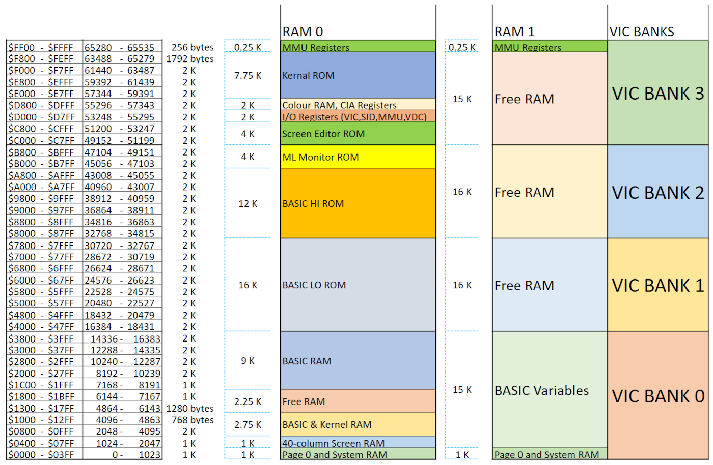

# Memory map

Banking is a process in which a section of memory is addressed by the microprocessor.
The memory is said to be banked in when it is available to the microprocessor in the
current memory configuration.

There are 16 different default memory configurations possible. In each configuration, the visibility status of ROM and RAM is defined for the various memory addresses. The current configuration is defined by the value present in the configuration register of the C128 MMU.

The 16 different memory configurations, which can be used in Basic or with the Machine Language Monitor, require different values ​​to obtain a particular configuration of ROM and RAM.
For example, the character Rom is available only in configuration 14: in this configuration the I/O registers accessible between the addresses $d000 and $dfff are replaced by the character Rom.
Below is a table with all the available configurations and their respective contents in the memory areas.

|Bank|Configuration|
|-|-|
|0|RAM(0) only|
|1|RAM(1) only|
|2|RAM(2) only (same as 0)|
|3|RAM(3) only (same as 1)|
|4|Internal ROM, RAM(0), I/O|
|5|Internal ROM, RAM(1), I/O|
|6|Internal ROM, RAM(2), I/O (same as 4)|
|7|Internal ROM, RAM(3), I/O (same as 5)|
|8|External ROM, RAM(0), I/O|
|9|External ROM, RAM(1), I/O|
|10|External ROM, RAM(2), I/O (same as 8)|
|11|External ROM, RAM(3), I/O (same as 9)|
|12|Kernal and Internal ROM (LOW), RAM(0), I/O|
|13|Kernal and External ROM (LOW), RAM(0), I/O|
|14|Kernal and BASIC ROM, RAM(0), Character ROM|
|15|Kernal and BASIC ROM, RAM(0), I/O|

## The two 64K ram banks
The Commodore 128's memory is made up of two RAM banks (called 0 and 1), each with 64K of RAM. 8502 like its predecessors is equipped with a 16-bit address bus, which allows it to address 65536 (64 KB) memory locations.
Despite this, the MMU allows sharing up to 16Kb of RAM memory between the two banks.

The 8502 processor and Vic video chip can access two different banks.
The bank accessed by the processor is managed by bits 6-7 of register $d500 (configuration register) while for the Vic chip it is managed by bits 6-7 of register $d506 (Ram configuration register).

The configuration set via the configuration register allows you to obtain a composition of Ram and Rom.
A read (a PEEK) returns the value of the ROM while a write (a POKE) stores the value in the underlying RAM.
It is possible to freely set the presence of the ROMs (via bits 0-5 of the configuration register) and simultaneously use any of the memory banks: it is possible to switch between banks 0 and 1 while maintaining the visibility of the ROMs.

## Memory layout

## Common Ram layout

TBD 

## References

* Mapping the Commodore 128 - Ottis Cowper
* Tips and Tricks for C128 - [http://commodore128.mirkosoft.sk/herdware.html](http://commodore128.mirkosoft.sk/herdware.html)
