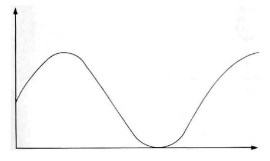
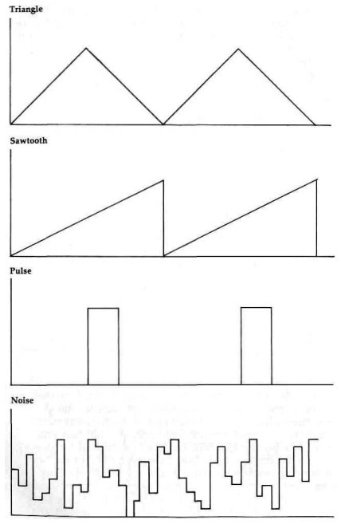
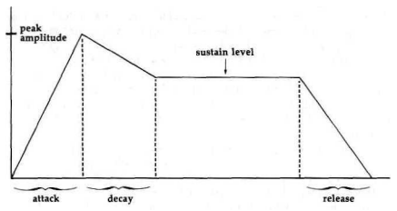
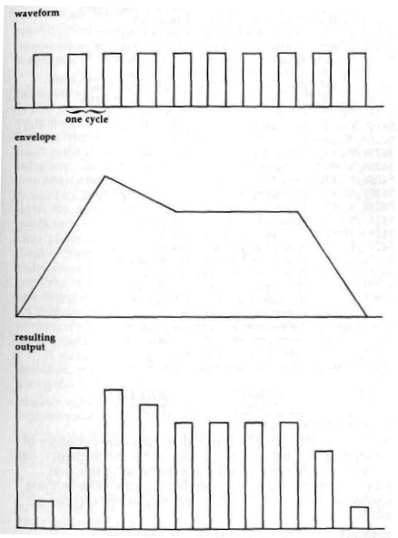

# SID (Sound Interface Device)

The SID (Sound Interface Device) chip, officially designated
the 6581, was a remarkable breakthrough when it was first
introduced in the Commodore 64. It remains the most sophisticated
piece of standard audio hardware in any currently
available home computer. The SID incorporates most of the
features of a complete sound synthesizer in a single chip, and
it has been a key to the Commodore 64's success as a music
machine.

Some sound fundamentals: Most sounds we hear are
transmitted in the form of pressure waves through the air. The
sounds humans usually consider pleasant have regularly repeating
patterns. To duplicate (synthesize) these sounds, an
electronic device such as the SID chip generates patterns of
electrical signals that are passed through an amplifier to a
speaker, which translates the signals into corresponding sound
waves. The most rudimentary characteristic of a sound wave is
its frequency, the measure of how many times per second the
bask sound pattern repeats. In music, frequency is expressed
as pitch. The higher the frequency of a sound wave, the
higher its pitch. Frequency is measured in units of cycles per
second, called hertz (Hz). The generally accepted range of frequencies
audible to humans is 20 Hz to 20,000 Hz. Any computer that provides
for sound output will allow you to control
the frequency of the sound. For those computers like the IBM
and Apple that have only rudimentary sound capabilities, frequency
is the only component you can control.

In the common musical scale, every note is assigned a
particular frequency. But you don't have to
know much about music to know that a C note played on a
guitar sounds different from one played on a piano or flute or
organ. Obviously, there is more to sound than just frequency.
The next important characteristic is waveform. The sound
wave for a "pure" tone will have a sinusoidal waveform, as
shown in next figure. However, a sine waveform is relatively
difficult to synthesize digitally, so it is fortunate that pure
tones are relatively rare.

Most sounds, including the sounds of almost all musical
instruments, contain harmonics in addition to the fundamental
frequency. Harmonics are components of complex sound
waveforms which are exact multiples of the fundamental frequency.
For example, the first harmonic of a 120-hertz wave
will have a frequency of 120 Hz (the fundamental frequency).
The second harmonic will have a frequency of 240 Hz, and
the third harmonic will have a frequency of 360 Hz. Any
wave shape can be expressed in terms of a fundamental sine
wave and additional harmonics. The SID can generate three
different wave shapes: the triangle, which corresponds to a
fundamental frequency plus odd harmonics in diminishing
proportions; the sawtooth waveform, which corresponds to a
fundamental frequency plus both odd and even harmonics in
diminishing proportions; and the pulse waveform, which has a
varying mix of harmonics depending on the width of the pulse

Next figure illustrates these waveforms. The triangle waveform
corresponds to mellow sounds like those of the xylophone. The
sawtooth waveform corresponds to the slightlyharsher sound of
instruments like the guitar or accordion. Because the harmonic
content of the pulse waveform is variable, it can be used for
a variety of sounds ranging from piano to trumpet.

Note that next figure includes a fourth waveform not previously
mentioned. In addition to the "orderly" waveforms, the SID can
also produce a waveform that varies constantly with no discernible
frequency. Such a pattern (or lack of pattern) is characteristic
of the class of sounds we call noise. Depending on how fast the
wave changes levels, it can range from a low buzz to a high hiss like
radio station static.

The final component of sound that can be controlled by the SID
is the envelope. If you visualize the sound waveforms as shown
in previous figure, the volume of the sound corresponds to the
height of the waveform, technically called the amplitude of the
wave. While some instruments like the organ can start a note
playing at a constant amplitude (volume) and turn it off almost
immediately, most instruments take a certain amount of time to
bring a note to full amplitude, and in some instruments a note
will linger for a brief period after it has been played. This
rise and fall of amplitude is called the envelope of the waveform,
and is usually described in terms of attack, decay, sustain, and
release (ADSR), as illustrated in next figure. Each class of
instrument has a characteristic ADSR envelope.

The attack is the time required for the note to rise from silence
to maximum volume after it is begun-for example, after a string
is picked or bowed or struck. Decay is the time required for the
note to drop from maximum volume to its sustain level, where it
remains until it begins to die away to silence again (the release
phase). Not every sound will exhibit every phase of the ADSR envelope.
For example, the envelope for instruments like the guitar or piano
which have plucked or struck strings will have almost no attack time;
the envelope for instruments like the flute, where the player must
start a column of air vibrating, have a significant attack time.
The discussion of the ENVELOPE statement in the System Guide that
came with your 128 shows the relative ADSR parameters of a
variety of instrument types. If you are confused about the relationship
between frequency, waveform, and envelope, next figure
should help clear up some of the confusion.

Here you can find the lists of the [available registers](D400)
of the SID chip. A detailed description of each follows.
The SID's 29 registers fall into two distinct classes.
The first 25 are write-only; reading from them returns zeros or
meaningless values. The final 4 are read-only; writing to
them has no effect. All 128 SID registers
appear in the same locations and have the same functions as
the Commodore 64's SID chip. Thus, any Commodore 64
sound routine should also work in Commodore 128 mode. In
addition to being loaded directly, some of these registers can
also be loaded indirectly from shadow registers as part of the
BASIC IRQ service routine.

## See also

* [$D400-$D41C - SID Chip Registers](D400)
