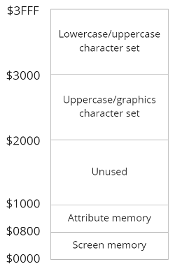

# VDC (video display controller)

The VDC (video display controller), officially designated the
8563, is a custom chip designed by Commodore's engineers
especially to provide the 80-column display for the 128.

The VDC provides a digital RGBI signal requiring a special monitor, 
but other than that the fundamentals of its video display
are similar to those described for the VIC chip.

The other thing that distinguishes the VDC from the VIC is the VDC's
high degree of programmability. Many of the features that are
fixed in the silicon of the VIC can be customized on the VDC
simply by storing a value in one of its registers.
For example, the VDC gives you complete control over the number of rows
and columns in the screen display, and even over the number
of pixels and scan lines in each character position.

Although the VDC does have a graphic mode (see the entry for
bit 7 of register [25/$19](#19)), it is primarily used for text
displays. In this mode, it uses the same basic elements as the
VIC: screen memory, character memory, and attribute memory
(which corresponds to the VIC's color memory).

However, all these elements for the VDC appear in a 16K block of memory
that is totally separate from the 128's system address space.
This separate block is reserved solely for the VDC. Next figure
illustrates the configuration of VDC memory.



VDC screen memory holds screen code values identical to
the screen codes for the VIC display. For each screen position,
the screen code serves as an index into character memory to
select the pattern to be displayed in the position. All character
patterns are in RAM. The VDC has no character ROM of its
own, so the contents of the VIC's character ROM is copied
into VDC RAM during system initialization. Redefining characters
for the VDC is as simple as storing the new pattern in
the proper area of character memory.

Each character definition
is 16 bytes long, but because the default character height is
eight scan lines, only the first eight bytes are used to hold
character pattern information. The remaining eight bytes are
generally padded with zeros.
To determine the starting address for the definition for any character, use the appropriate
formula from the following:
* for uppercase/graphics character set:
  address = (screen code * 16) + 8192
* for lowercase/uppercase character set:
  address = (screen code * 16) + 12288

The remaining memory area is attribute memory, which
determines the display characteristics for the character
specified in screen memory.
It is called attribute memory to distinguish it from simple color
memory because each attribute
memory location specifies more than just the color. Next figure
shows the use of each bit of attribute memory


| Value    | VDC color                |
| -------- | -----------              |
|  0/$00   | black                    |
|  1/$01   | dark gray (light black)  |
|  2/$02   | dark blue                |
|  3/$03   | light blue               |
|  4/$04   | dark green               |
|  5/$05   | light green              |
|  6/$06   | dark cyan                |
|  7/$07   | light cyan               |
|  8/$08   | dark red                 |
|  9/$09   | light red                |
| 10/$0A   | dark purple              |
| 11/$0B   | light purple             |
| 12/$0C   | dark yellow              |
| 13/$0D   | light yellow             |
| 14/$0E   | light gray (dark white)  |
| 15/$0F   | white                    |

**Bit 4** selects the flash attribute, causing the character in
the corresponding character position to blink at the rate specified
in bit 5 of internal register [24/$18](#18).

**Bit 5** selects the underline attribute, but the line can be moved to any
scan line of the character position.

**Bit 6** controls the reverse attribute,
which reverses the foreground and background pixels of the
character pattern. However, this attribute isn't used by the 128,
which instead has reversed character patterns as part of the standard character sets.

Finally, **bit 7** selects which of the two character sets will be used. The VIC allows only one of the two
character sets to be used at any one time, but the VDC allows
ju to select the character set independently for each character
position.

The register structure of the VDC chip is rather unusual. It
has only two registers visible in the normal system address
space. You must go through these registers to access any of the
internal functions of the VDC. Next table lists the VDC communications
registers visible to the processor.
A detailed description of
both locations follows.

| Address                   | Description                  |
| ------------------------- | ---------------------------- |
| [54784/$D600](D600)       | VDC address/status register  |
| [54785/$D601](D600#D601)  | VDC data register            |

## VDC Internal Registers <a name="vdcinternalregister"></a>

|Register number|Description|
|----|----------|
|[0/$00](#00)|Total number of horizontal character positions|
|[1/$01](#01)|Number of visible horizontal character positions|
|[2/$02](#02)|Horizontal sync position|
|[3/$03](#03)|Horizontal and vertical sync width|
|[4/$04](#04)|Total number of screen rows|
|[5/$05](#05)|Vertical fine adjustment|
|[6/$06](#06)|Number of visible screen rows|
|[7/$07](#07)|Vertical sync position|
|[8/$08](#08)|Interlace mode control register|
|[9/$09](#09)|Number of scan lines per character|
|[10/$0A](#0A)|Cursor mode control|
|[11/$0B](#0B)|Ending scan line foT cursor|
|[12/$0C](#0C)|Screen memory starting address (high byte)|
|[13/$0D](#0D)|Screen memory starting address (low byte)|
|[14/$0E](#0E)|Cursor position address (high byte)|
|[15/$0F](#0F)|Cursor position address (low byte)|
|[16/$10](#10)|Light pen vertical position|
|[17/$11](#11)|Light pen horizontal position|
|[18/$12](#12)|Current memory address (high byte)|
|[19/$13](#13)|Current memory address (low byte)|
|[20/$14](#14)|Attribute memory starting address (high byte)|
|[21/$15](#15)|Attribute memory starting address (low byte)|
|[22/$16](#16)|Character horizontal size control register|
|[23/$17](#17)|Character vertical size control register|
|[24/$18](#18)|Vertical smooth scrolling and control register|
|[25/$19](#19)|Horizontal smooth scrolling and control register|
|[26/$1A](#1A)|Foreground/background color register|
|[27/$1B](#1B)|Address increment per row|
|[28/$1C](#1C)|Character set address and memory type register|
|[29/$1D](#1D)|Underline scan-line-position register|
|[30/$1E](#1E)|Number of bytes for block write or copy|
|[31/$1F](#1F)|Memory read/write register|
|[32/$20](#20)|Block copy source address (high byte)|
|[33/$21](#21)|Block copy source address (low byte)|
|[34/$22](#22)|Beginning position for horizontal blanking|
|[35/$23](#23)|Ending position for horizontal blanking|
|[36/$24](#24)|Number of memory refresh cycles per scan line|

### <a name="00"></a> 0/$00 Total number of horizontal character positions 
The value in this register determines the total width (in character
positions) of each horizontal line of the display. The
value stored here should be one less than the desired number
of horizontal character positions. This total includes the active
portion of the display (where characters can be displayed), the
left and right borders, and the horizontal sync width.

The total number of horizontal pixels is given by multiplying the value
here (plus 1) by the total number of pixels per character position
(the value in bits 4-7 of register [22/$16](#16) plus 1).
The default value for this register, established during the
IO1NIT routine [$E109], is 126/$7E, This provides 127
horizontal character positions. You'll need to reduce this by half if
you enable the pixel double feature (see the entry for bit 4 of
register [25/$19](#19)). You may need to increase the value here
slightly if you use one of the interlaced modes.

### <a name="01"></a> 1/$01 Number of active horizontal character positions
The value in this register determines how many of the horizontal character
positions specified in register [0/$00](#00) can actually be used to display
characters. The value stored here
should be the desired number of columns for the display. The
value here must be less than the value in register 0/$00. The
default value for this register is 80/$50, since the default VDC
display is an 80-column text screen. The value here also determines
the width of the bitmap when the VDC is set for graphic
mode. The bitmap width is given by multiplying the number
of character positions by the character-position width specified
in bits 0-3 of register [22/$16](#16).

The screen editor routines that support printing to the 80-
column screen assume that each screen line occupies 80 screen
memory locations. If you want the screen printing routines to
continue to function properly after you reduce the number of
active character positions in this register, you should increase
the value in register [27/$1B](#1B) so that the sum of the value in
that register plus the value in this register remains equal to 80.
Reducing the value here removes characters from the right of
the display area. To center the active display area after reducing
the number of character positions, you must reduce the
value in register [2/$02](#02). The screen editor routines will not
support a display wider than 80 columns, so you'll have to
write your own text handling routines if you want to use a
wider display.

### <a name="02"></a> 2/$02 Horizontal sync position
The value in this register determines the character position at
which the vertical sync pulse begins. The value here also
determines the horizontal position of the active portion of the
screen within the total display.

The default value here is
102/$66. Increasing this value moves the active screen area to
the left; decreasing it moves the active area to the right.

### <a name="03"></a> 3/$03 Horizontal and vertical sync width
**Bits 0-3**: These bits specify the width of the horizontal sync
pulse. The value here should be one greater than the desired
number of character positions for the pulse. The default value
for these bits is 9/$9, for a pulse eight character positions wide.

**Bits 4-7**: These bits specify the width of the vertical sync
pulse. The bit value here should be equal to the desired number
of scan lines for the pulse, unless the interlaced sync and
video mode is being used (in that case, use a value that is
twice the desired number of scan lines). The default value for
these bits is 4/$4, for a pulse four scan lines wide.

### <a name="04"></a> 4/$04 Total number of screen rows
This register specifies the total height (in character positions)
of the VDC display. The value stored here should be one less
than the desired number of vertical character positions. The
total includes the rows for the active display, the top and
bottom portions of the border, and the vertical sync width.

To determine the height of the raster in scan lines, multiply the
value in this register (plus 1) by the number of scan lines per
character position (the value in register [9/$09](#09) plus 1) and add
any additional scan lines specified in register [5/$05](#05).
The proper number of scan lines for the display is a function
of the video system being used; it's different for NTSC
(North American) and PAL (European) systems. During the
IOINIT routine [$E109], the 128 checks the VIC chip to determine
which system is being used (since the VIC isn't programmable
like the VDC, there is a different version of the
VIC for each of the two video systems).

This register is then
initialized accordingly: to 32/$20 for NTSC systems or 39/$27
for PAL systems, selecting 33 or 40 rows, respectively. Since
the default character-position height is eight scan lines,
the respective total heights are 33 * 8, or 264 lines, for NTSC, and
40 * 8, or 320 scan lines, for PAL. These scan-line totals
should remain constant, so if you increase the character height
you must decrease the total number of rows, and vice versa.

### <a name="05"></a> 5/$05 Vertical fine adjustment 
**Bits 0-4**: the total number of scan lines in the VDC's video
display should be 264 for an NTSC (North American) system
or 320 for a PAL (European) system. The number of scan lines
used in the VDC display is given by the total number of vertical
positions (specified in register [4/$04](#04)) multiplied by the
number of scan lines per character position (specified in register
[9/$09](#09)). If the result doesn't come out exactly equal to the
required 264 or 320, the VDC can add a few extra scan lines at
the end to achieve the proper result.
The value in this register
specifies the number of extra scan lines to add. The available
five bits allow up to %11111 = 31/$1F additional scan lines.
The default character height of eight scan lines is an exact
multiple of both 264 and 320 (33 * 8 = 264 and 40 * 8 =
320). Thus, no extra scan lines are required, so this register is
initialized to 0/$00 by the Kernal IOINIT routine [$E109]. As
an example of the use of this register, assume that you increased
the character height to nine scan lines. For an NTSC
system, 264 / 9 = 29 with a remainder of 3. Thus, for this
case you should specify 29 for the total number of vertical
character positions and store a 3 in this register to provide the
required additional scan lines.

**Bits 5-7**: These bits are unused; writing to them has no effect,
and they always return %1 when read. Thus, the value you
read from this register will always be at least 224/$E0. To
mask off these bits and see only the valid bits of the register,
use AND 31 in BASIC or AND #$1F in machine language.

### <a name="06"></a> 6/$06 Number of visible screen rows
The value in this register determines how many of the vertical
character positions specified in register [4/$04](#04) can actually be
used to display characters. The value here must be less than
the total number specified in register [4/$04](#04). The default value
established for this register by the Kernal IOINIT routine
[$E109] is 25/$19, which sets up the standard 25-row display.
One obstacle to selecting other numbers of rows is that the
screen editor ROM routines will, by default, assume a 25-line
screen.

When decreasing the number of rows, you can make
the screen editor use the reduced number by storing a value
equal to the new number of rows minus 1 in location [237/$ED](0000#ED),
then resetting the output window to full screen size (by
printing two cursor-home characters, for example). The screen
editor routines will not support a display with more than 25
rows, so you'll have to provide your own character manipulation
routines to use such a screen.

### <a name="07"></a> 7/$07 Vertical sync position
The value in this register determines the vertical character
position at which the vertical sync signal will be generated. This
register can be used to adjust the vertical location of the active
display area within the screen. The default value for this register,
established by the IOINIT routine [$E109], is 29/$1D for
NTSC (North American) systems or 32/$20 for PAL (European) systems.
Decreasing the value here will move the active
display area down the screen, while increasing the value will
move the active display area upwards. However, you should
not increase the value here above the maximum number of
rows specified in register [4/$04](#04).

### <a name="08"></a> 8/$08 Interlace mode control
**Bits 0-1**: The value in these bits controls the interlace mode of
the screen. The complete standard for NTSC video calls for a
frame (raster) of 525 lines to be redrawn 30 times per second,
while the PAL standard calls for 625 lines redrawn 25 times
per second. The full screen isn't drawn all at once; instead, it's
drawn in two passes with half the lines for the frame drawn
on each pass. The lines for the second pass of the frame are
drawn between the lines for the first. Like most computer displays,
the VDC normally takes a shortcut and draws half the
full number of lines at twice the rate. This noninterlaced display
provides sufficiently sharp output for most uses.
However, the VDC is also capable of producing two interlaced
display modes. The modes are selected as follows:

|Bits 1-0| Value|Interlace mode|
|--------|------|--------------|
|x 0|0 or 2|noninterlaced|
|0 1|1|interlaced sync|
|1 1|3|interlaced sync and video|

The default value is 0/$00, which selects the standard
noninterlaced mode. The system never uses any other mode.
In the interlaced sync mode, the number of scan lines is doubled.
Each horizontal scan line is drawn twice, once on the
first pass and very slightly lower on the second pass. The result
should be greatly improved vertical resolution, but you'll
probably be disappointed.

Remember that each tiny dot on the
screen glows only very briefly after being struck by the raster
video beam. Since this mode must draw twice as many lines,
it draws each line only half as often. On most video monitors,
the first set of lines will have started to fade before the second
set is completely drawn. As a result, the screen will appear to
jitter annoyingly in this mode.
The remaining choice is interlaced sync and video mode.
In this case, the VDC also draws twice as many lines as noninterlaced
mode, but the alternating half-frames are independent, so you can use
twice as many horizontal lines per frame
(the maximum screen height in scan lines is double that of the
noninterlaced mode). This creates the tantalizing prospect of
an 80-column X 50-line text screen. The following routine
sets up such a display:

``` BASIC
10 WR=DEC("CDCC")
20 SYS WR,3,8
30 SYS WR,64,4
40 SYS WR,50,6
50 SYS WR,58,7
60 SYS WR,128,0
```

However, this setup does have limitations. It suffers from the
same jitter problems as the other interlaced mode. Furthermore,
the screen editor routines that control printing to the screen
will not support a display longer than 25 lines, so
you'll have to write your own text manipulation routines to
handle the extra 25. Nevertheless, this mode has interesting
possibilities.

**Bits 2-7**: These bits are unused; writing to them has no effect,
and they always return %1 when read. Thus, the value you
read from this register will always be at least 252/$FC. To
mask off these bits and see only the valid bits of the register,
use AND 3 in BASIC or AND #$03 in machine language,

### <a name="09"></a> 9/$09 Total number of scan lines per character
**Bits 0-4**: These bits determine the total vertical height (in scan
lines) of each character position. The value stored here should
be one less than the desired number of scan lines. The total
vertical height value includes the scan lines for the active
portion of each character position, plus any desired number of
blank scan lines for intercharacter vertical spacing. The height
of the active portion of the character position is determined by
the value in register [23/$17](#17).

The default value for this register, established during the
IOINIT routine [$E109], is 7/$07, for a total character-position
height of eight scan lines. In this case, there will be no vertical
intercharacter spacing because this is less than the active character
height. (In the default character set, intercharacter spacing
is achieved by leaving the bottom row of the character pattern
blank.) The five available bits allow values up to %11111 =
31/$1F, for character-position heights of up to 32 scan lines.
However, when changing this value to allow for greater vertical
resolution, you must keep in mind that the value here multiplied
by the total number of rows specified in register [4/$04](#04)
(and plus the number of extra scan lines specified in register
[5/$05](#05)) determines the number of scan lines in the display.
This total should always be 264 lines for NTSC (North American)
systems or 320 lines for PAL (European) systems.

The value here also determines how much memory is required for
character pattern memory. While the value here is
less than or equal to 15 (while the character height is 16 or
fewer scan lines), each character pattern is allocated 16 bytes.
Since the VDC supports two complete 256-character sets, a total of
512 * 16, or 8192 bytes, are required for character memory.
However, if the character height exceeds 16 scan lines (if
the value here is greater than 15), then 32 bytes are allocated
for each character pattern. In this case, 512 * 32, or 16,384
bytes, are required for character memory. Note that this is all
the memory available to the VDC.

**Bits 5-7**: These bits are unused; writing to them has no effect,
and they always return %1 when read. Thus, the value you
read from this register will always be at least 224/$E0. To
mask off these bits and see only the valid bits of the register,
use AND 31 in BASIC or AND #$1F in machine language.

### <a name="0A"></a> 10/$0A Cursor mode control
The value in this register cannot be changed directly while the
standard screen editor ROM routines are used for printing.
The contents of a shadow location at 2603/$0A2B are copied
to this register each time the cursor position is updated. Thus,
to change the value in this register, you must store the desired
value in the shadow location rather than in the register.

**Bits 0-4**: The value in these bits determines the scan line
within each character position for the top of the cursor. Scan
lines within character positions are numbered beginning with
0 for the top line of the position. Bits 0-4 of register [11/$0B](#0B)
determine the bottom line, and together these registers determine
the height of the cursor. The available five bits allow
starting row numbers as large as %11111 = 31/$1F. The default value
for these bits is %00000, to start the cursor at character scan line
0, the top line of the character, for the standard
full-height block cursor. The operating system also supports
an underline cursor, selected by printing ESC U [$CAFE], In
this case, the value here is changed to %00111 (7) to start the
cursor on the bottom line of the standard character position.
The value for the top scan line should be no greater than the
maximum number of scan lines specified in register [9/$09](#09), or
else the cursor will not be visible.

**Bits 5-6**: These bits control the type of cursor provided. Unlike
the VIC, where the cursor is an effect maintained by software,
the VDC has hardware to generate a cursor automatically. The
possible modes are as follows:

|Bit values|Cursor mode|
|-|-|
|0/$00 |solid (nonblinking) cursor|
|32/$20|no cursor|
|64/$40|blinking at 1/16 screen refresh rate|
|96/$60|blinking at 1/32 screen refresh rate|

The default setting for these bits is %11, specifying a cursor
blinking at the slower of the two rates. The operating system
also supports a nonblinking cursor, selected by printing ESC E
[$CB0B]. In this case, the bits are changed to %00. To rum the
cursor off when the system is not accepting input (as when a
program is running), these bits are reset to %01 [$CD9F].

**Bit 7**: This bit is unused; writing to it has no effect, and it
always returns %1 when read. Thus, the value you read from
this register will always be at least 128/$80. To mask off this
bit and see only the valid bits of the register, use AND 127 in
BASIC or AND #$7F in machine language.

### <a name="0B"></a> 11/$0B Bottom scan line for cursor
**Bits 0-4**: These bits determine the scan line within a character
position for the bottom of the cursor. Together with bits 0-4
of register [10/$0A](#0A), this serves to determine the height of the
cursor. The value here should be one greater than the desired
bottom scan line (scan-line numbering starts with 0 for the top
scan line of the character position). The five available bits
allow values up to % 11111 = 31/$1F, so the cursor can go as
low as scan line 30, However, the actual displayed cursor
height will never be greater than the character-position height
specified in register [9/$09](#09). The default value for this register,
established by the IOINIT routine [$E109], is 7/$07, so the
normal bottom scan line of the cursor is scan line 6 of the
character position.

**Bits 5-7**: These bits are unused; writing to them has no effect,
and they always return %1 when read. Thus, the value you
read from this register will always be at least 224/$E0, To
mask off these bits and see only the valid bits of the register,
use AND 31 in BASIC or AND #$1F in machine language.

### <a name="0C"></a><a name="0D"></a> 12/$0C 13/$0D Starting address for screen memory
For standard text mode, the value in this register pair determines
the starting address for screen memory, the area which
holds screen codes specifying which character will be displayed
in each screen position. The size of the screen memory area is
determined by the number of active horizontal positions (specified in
register [1/$01](#01)) multiplied by the number of active rows
(specified in register [6/$06](#06)) and the address increment per
row (specified in register [27/$1B](#1B)).

The order of bytes for the
pair is opposite that normally used in the 128 system: The first
register (12/$0C) holds the high byte and the second (13/$0D)
holds the low byte. Unlike VIC screen memory, which must
begin on an even 1K address boundary, VDC screen memory
can begin at any address in the VDC's address space. 

DETERMINE WHICH FIGURE

See Figure 8-16 for a diagram of the VDC's memory configuration.

For graphic mode, the value in this register pair determines the
starting address for the bitmap of the graphic
screen. The amount of memory required for the bitmap is
found by multiplying the number of horizontal character positions
(from register [1/$01](#01)) by the number of vertical character
positions (in register [6/$06](#06)) times the total height of each
character position (from register [9/$09](#09) plus 1). The bitmap
can be started at any address in the VDC address space.
Even if you change the value here, the screen editor ROM
routines will continue to assume that screen memory is located
in its default position unless you also change the value in the
screen memory starting-page pointer at 2606/$0A2E.

### <a name="0E"></a><a name="0F"></a> 14/$0E 15/$0F Address of current cursor position
For the VIC chip's display, the cursor is an effect laboriously
maintained by software. The VDC, by contrast, has hardware
to maintain the cursor for its display automatically. The cursor
will appear at the character position with the screen memory
location specified in this register pair.

If the address specified
here is outside the area of VDC memory currently being used
for screen memory, no cursor will be visible. Other characteristics
of the cursor such as its blinking status and position within
the character are specified in registers 10/$0A and 11/$0B.
The value in these registers cannot be changed directly
while the normal screen editor 80-column printing routines are
in use. The printing routines update the cursor position after
each character is printed so that these registers always hold
the address of the next available character position.

### <a name="10"></a><a name="11"></a> 16/$10 17/$11 Light pen vertical and horizontal positions
Whenever the LP input line to the VDC chip is brought to a
low (0 volts) state, the row and column values for the current
position of the raster beam are latched into these registers. The
vertical (row) number will be latched into register 16/$10, and
the horizontal (column) number will be latched into register
17/$11. To signal that a value has been latched, the LP flag
(bit 6 of the external register at 54784/$D600) will be set to
%1. That bit will remain at %1 until either of these registers is
read, at which time it will be reset to %0. However, reading
these registers does not clear them; the latched values will be
retained until the LP line is brought low again.

The VDC's LP line is connected to pin 6 of control port 1
(control port 2 does not support a light pen). A light pen has
at its tip an electronic device known as a phototransistor,
which is connected so as to cause a low pulse whenever the
video beam moves past the pen. Note that the pen will not be
triggered if the screen position is black or one of the other
dark colors. Only positions which have bright characters can
be read. The ideal character to read with a light pen is a white
re verse-video space.

When a light pen is used, the range of values in these
registers depends on the screen width and height selected by
other VDC registers. Unlike the VIC chip, whose light pen
registers return scan line and dot position values, these
registers return row and column numbers corresponding to the
light pen position. This makes the results much easier to
interpret, but does not allow precise positioning, so it is unlikely
that you'll see any 80-column drawing programs using the
light pen as an input device. For the standard 80-column X
25-line screen, the value in register 16/$10 corresponds very
closely to the row number: ranging from 1/$01 at the top of
the screen to 25/$19 at the bottom. Actually, you may find
that if you position the pen slightly below the bottom screen
line you can get a reading of [26/$1A](#1A).

While the vertical resolution is good, the horizontal resolution
is quite poor. The horizontal reading won't correspond
to the row number (1-80). Instead, it corresponds approximately
to the absolute horizontal character position, which includes
the border areas on the left and right edges of the
screen. You should find that when the pen is pointed at the
leftmost character position, you get a reading of about 27-29
in register 17/$11. This implies that the rightmost character
position should give readings of about 106-108. Actually, you
may get higher readings—120 or more. In fact, even if you
hold the pen perfectly still you may see the character position
vary up or down by 4 or 5. The moral is that the light pen is
much better at reading vertical than horizontal positions.
You'll have better luck if you limit yourself to checking
whether the pen is within a range of horizontal positions. For
example, if you read the horizontal position and store the
result in the variable H, then an expression such as

H = INT((H — 30) / 8)

will return a range of values 0-9 indicating
roughly which one of ten eight-column horizontal areas the
pen is pointing to.
You should be aware that these registers can be tricked
into reading false values. Pin 6 of control port 1 is also used
for light pen input for the VIC chip, and a light pen signal
generated on the 40-column screen will latch meaningless values
in these registers. In lieu of a light pen, several other
events can cause a pulse on the LP line. That control port pin
is also used for the joystick fire button, so pressing the button
of a joystick plugged into port 1 will also latch values in these
registers. Because of this joystick button function, the port line
is also connected to the line from row 4 of the keyboard matrix.
This has two consequences. First, pressing any of the following
keys with no light pen connected will latch meaningless
values: F1, Z, C, B, M, period, right SHIFT, space, the 2 and
ENTER keys on the numeric keypad, and the ^ key in the
cursor group. More significantly, while a light pen is connected,
all of these keys will be "dead" and cannot be typed.

### <a name="12"></a><a name="13"></a> 18/$12 19/$13 Current memory address
This register pair specifies which address in the VDC's private
block of RAM will be referenced by the next read or store operation
involving register [31/$1F](#1F). As with the other VDC address register
pairs, the first register (18/$12) holds the high
byte of the address and the second (19/$13) holds the low
byte. A value stored in register [31/$1F](#1F) is transferred to the
VDC memory location specified in this register pair. Reading
register [31/$1F](#1F) returns the value in the location in VDC memory
with the address specified in this register pair. For copy or
fill operations, the value in these registers determines the destination
address for the operation. These registers are autoincrementing,
meaning that the address value here is automatically increased
by 1 after each read or store to register [31/$1F](#1F).

Thus, when you wish to read or load a continuous series of
VDC memory locations you only need to set the memory address in
these registers before the first read or store.
After that, you can just read from or write to register [31/$1F](#1F)
and the address will be handled automatically.

### <a name="14"></a><a name="15"></a> 20/$14 21/$15 Starting address for attribute memory
When attributes are activated, this register pair determines the
starting address for attribute memory, the area which holds
attribute values for each active character position on the
screen (attributes can be turned on and off by setting bit 6 of
register [25/$19](#19)). The size of the attribute memory area depends on
the number of active rows and columns specified in
registers [2/$02](#02) and [6/$06](#06), and will be the same as the size of
the screen memory area.

See the discussion of attributes in the
introduction to this section for more information.
These locations are initialized to 2048/$0800, the default
starting address for attribute memory. Like the other address
pairs in the VDC, the first register [20/$14](#14) holds the high
byte and the second [21/$15](#15) holds the low byte. Attribute
memory can start at any address within the VDC's address
space. Even if you change the value here, the screen editor
ROM routines will continue to assume that attribute memory
is in its default position unless you also change the value in
the attribute starting-page pointer at 2607/$0A2F.

### <a name="16"></a> 22/$16 Character horizontal size control
**Bits 0-3**: the value in these bits determines how many of the
total horizontal pixels in the character position will be used to
display character pattern data. The total number is specified
in bits 4-7 of this register. If the number of active pixels is
less than the total number of pixels, the extra pixels will be
blank for intercharacter spacing. If you specify a value here
that is greater than the total number of pixels available for the
position, only the specified total number of pixels will be visible.
However, the value here should not exceed 8, since a
maximum of eight bits are available per byte of character pattern
data. Even for values greater than 8, no more than eight
pixels will be active per horizontal scan line within the character
position. For graphic mode, the value here should be equal
to the total number of pixels; otherwise there will be gaps in
the display.

The default value for these bits is 8, for eight active horizontal
pixels per character-position scan line. This is the same
as the total number of pixels per position, so there will be no
intercharacter spacing. (For the default character set, the
rightmost column of each character pattern is left blank to provide
the effect of intercharacter spacing,)

**Bits 4-7**: the value in these bits determines the width of each
character position (in pixels). The value stored here should be
one less than the desired total number of pixels. If the total is
greater than the number of active pixels specified in bits 0-3
of this register, the extra pixels will be blank for intercharacter
spacing. The default value for these bits is 7, for eight total
pixels per character position. The total number of horizontal
pixels is determined by multiplying the value here (plus 1) by
the total number of character positions (from register [0/$00](#00)).

### <a name="17"></a> 23/$17 Character vertical size control
**Bits 0-4**: The value in these bits determines how many of the
total scan lines for each character position (specified in register
[9/$09](#09)) will be used to display character pattern data. The
available five bits allow you to specify values up to %11111
= 31/$1F. If the value here is less than the total number of
scan lines for the character position, the extra lines will be
blank for intercharacter spacing. If the value here is greater
than the total number of scan lines, only the total number of
scan lines will be displayed. For graphic mode, the value here
should be at least equal to the total number of scan lines (the
value in register [9/$09](#09) plus 1); otherwise there will be gaps in
the display.
The default value stored in this register is 8/$08, for eight
active scan lines per character position. This is equal to the
default total number of scan lines for the position, so there will
be no intercharacter spacing. For the standard character set,
intercharacter spacing is achieved by leaving the bottom row
of most character definition patterns blank.

**Bits 5-7**: These bits are unused; writing to them has no effect,
and they always return %1 when read. Thus, the value you
read from this register will always be at least 224/$E0. To
mask off these bits and see only the valid bits of the register,
use AND 31 in BASIC or AND #$1F in machine language.

### <a name="18"></a> 24/$18 Vertical smooth scrolling and control
**Bits 0-4**: these bits can be used to smoothly scroll the screen
vertically upward. The value here specifies the number of scan
lines the display should be shifted upward. Although five bits
are available, the value here should not exceed the value in
register [9/$09](#09).

**Bit 5**: this bit controls the blinking rate for all characters on
the screen with the flash attribute. A character position has the
flash attribute when bit 4 of its corresponding attribute memory is
set to %1 . The two available blinking rates are once
each 16 times the screen is refreshed (selected when this bit is
set to %0) or once each 32 times (selected when this bit is set
to %l). For NTSC (North American) systems, the screen is redrawn
60 times per second, so the corresponding blinking
rates are about four times per second when the bit is %0 and
about twice per second when the bit is %1 .
The default setting for this bit is %1 , for the slower blinking rate.
This is established during the IOINIT routine [$E109],
part of both the reset and RUN/STOP-RESTORE sequences.
This setting is not changed by any other ROM routine.

**Bit 6**: this bit controls a special VDC feature known as reverse
mode. While this bit is %0, all pixels on the screen represented
by %0 bits in character patterns or the graphic screen
bitmap take the background color specified in bits 0-3 of register
[26/$1A](#1A), and all pixels represented by %1 bits take the
foreground color specified in a corresponding attribute memory location
(or in bits 4-7 of register [26/$1A](#1A) if attributes are
disabled). Setting this bit to %1 reverses the color sources, so
that all pixels for %0 bits take the foreground color and all
pixels for %1 bits take the background color.
This bit is initialized to %0 for a normal screen display.
The screen editor ROM supports escape sequences to change
this bit. The ESC R sequence will set the bit to %1, reversing
the screen display. The ESC N sequence will clear the bit to
%0, returning the display to normal.

**Bit 7**: this bit determines whether the next block operation
initiated by writing to register [30/$1E](#1E) will be a copy or a fill.
Setting this bit to %0 specifies a fill operation, while setting it
to %1 specifies a copy operation. See the entry for register
[30/$1E](#1E) for more information on VDC block operations. This
bit is set to %0 when the register is initialized during the
IOINIT routine [$E109].

### <a name="19"></a> 25/$19 Horizontal smooth scrolling and control
**Bits 0-3**: these bits can be used to smoothly scroll the screen
horizontally. The use of these bits depends on the version of
the VDC in your 128. The version number can be determined
by reading bits 0-2 of the external communications register at
54784/$D600. For version 1 of the VDC, which includes most
128s, this register should be initialized to the maximum character
width (in bits 4-7 of register [22/$16](#16)). Each decrement of
this register shifts the display one pixel to the left. For the
older version 0 of the VDC, these bits should be initialized to
%0000. In this case, each increment of these bits shifts the display one pixel to the right.

**Bit 4**: this bit controls the VDC's pixel double feature. While
this bit is %0, pixels will be their normal size. Setting this bit
to %1 will double the size of all horizontal screen pixels. Since
each pixel is twice as large, there will be room for only half as
many on the screen. Thus, you must reduce the values in the
horizontal screen width registers (0-2/$00-$02) to half their
normal values. The following routine sets up a VDC 40-column
display that will be very similar to the VTC's 40-column display:
``` BASIC
10 WR=DEC("CDCC"):RR=DEC("CDDA")
20 SYS WR,63,0:SYS WR,40,1:SYS WR,55,2
30 SYS RR,,25:RREG A:SYS WR,(A OR 16),25
40 SYS WR,(8*16)+9,22
50 SYS WR,40,27
60 POKE 238,39
70 PRINT"{2 HOMEllCLR}"
```

**Bit 5**: this bit controls a special VDC feature called
semigraphic mode. When semigraphic mode is activated
(when this bit is %1), the rightmost active pixel will be
repeated through the intercharacter spacing pixels. For this
mode to have any visible effect, there must be some
intercharacter spacing (the value in bits 0-3 of register [22/$16](#16)
must be less than the total number of pixels specified in bits
4-7 of that register). This mode has no effect in graphic mode.
One use of this mode is to create a simple "digital" character
effect. Try these lines:
``` BASIC
SYS 52684,118,22
SYS 52698,,25: RREG A: SYS 52684,(A OR 32),25
```

**Bit 6**: the VDC has two methods of supplying foreground
information for its display. When this attribute enable bit is set
to %1 , each character position will have a corresponding
attribute memory location. Refer to the introduction to this
section for details on attributes. The starting address of attribute
memory is determined by the value in registers [20-21/$14-$15](#14).
When this bit is %0, attribute memory is not used. Instead, all
character positions take the foreground color specified
in bits 4-7 of register [26/$1A](#1A). In this case, the character
positions cannot have the flash, underline, or reverse attributes,
and only the first of the two character sets will be available.

**Bit 7**: this bit determines whether the VDC will operate as a
text or graphics display. Text mode, selected when the bit is
set to %0, is the only one supported by the 128 operating
system (%0 is the default value for this bit). In that mode, each
screen memory position holds a screen code which serves as
an index into character memory to specify the pattern to be
displayed in that position.
When this bit is set to %1, graphics mode is selected. In
that mode, screen memory is replaced with a bitmap. There is
no cursor on the graphic display. Each bit in the bitmap controls
the state of one pixel in the display. The layout of the
bitmap is much simpler than that for'the VIC screen.

Each
horizontal scan line is controlled by a sequential series of
bytes. The size of the bitmap (in bytes) is determined by the
number of active horizontal positions times the number of
vertical positions times the number of scan lines per vertical
position. For the standard screen setup, this means that 80 * 25 *
8, or 16,000 bytes, are required—almost all of the available
VDC memory. At eight pixels per byte, there are 128,000 individual
pixels on the graphic display.

The graphic display can use attribute memory for color
information. In this case, the relationship of attribute locations
to bitmap positions is similar to that for the VIC screen. Each
attribute memory location controls the color for all pixeis
within a character-position area on the screen. However, there
isn't enough free memory available for a full bitmap and a full
attribute memory area. One solution is to turn off attributes
(set bit 6 of register [25/$19](#19) to %0). This limits all
screen positions to the same foreground and background colors
(as specified in register [26/$1A](#1A)). The other solution is
to reduce the
size of the active screen area to free up enough memory for an
attribute area. For example, if you reduce the number of active
rows to 22, then 80 * 22 * 8, or 14,080 bytes, will be required
for the bitmap, and 80 * 22, or 1760 bytes, will be required for
attribute memory, so there will be enough room within VDC
memory for both bitmap and attributes.
When attribute memory is enabled for a graphic display,
the lower four bits of each attribute memory location determine
the color of all foreground (%1) pixels in the corresponding
character-position area, and the upper four bits determine
the color of all background (%0) pixels in the character
position.
Next program is a very simple example of a bitmapped
drawing program for the VDC. Use a joystick in port 2 to
sketch. Pressing the B key will change the background color
and pressing the F key will change the foreground color
(attribute memory is turned off, so all character positions use
the same foreground and background colors). The CLR/
HOME key can be used to move the drawing point back to its
home position in the center of the screen, and SHIFT -
CLR/HOME will clear the display.

``` BASIC
100 GRAPHIC 0:FAST
110 WR=DEC("CDCC"):RR=DEC("CDDA")
120 SYS RR,,25:RREG A:SYS WR,(A AND 63)OR 128,25
130 SYS RR,,24:RREG A:SYS WR,A AND 127,24
140 SYS WR,0,13:SYS WR,0,19:SYS WR,0,31
150 FOR 1=0 TO 63:SYS WR,255,30:NEXT 1
160 X=320:Y=100:BC=0:FC=15
170 GET KS:ON INSTR( "BF{HOME HCLR j " , KS ) GOTO 180,1
80,160,140:GOTO 190
180 BC={BC-(K?="B"))AND 15:FC=(FC-(K$="F"))AND 15:
SYS WR,FC*16+BC,26
190 D=JOY(2) AND 15:IF D=0 THEN 170
200 Y=Y+(D<3 OR D=8)-(D>3 AND D<7);IF Y<0 THEN Y=l
99:ELSE IF Y>199 THEN Y=0
210 X=X-(D>1 AND D<5)+{D>5):IF X<0 THEN X=639:ELSE
IF X>639 THEN X=0
220 AD=(Y*80)+INT(X/8):AH=INT(AD/256):AL=AD-(AH*25
6)
230 SYS WR, AH ,18:SYS WR,AL,19
240 SYS RR,,31:RREG A
250 SYS WR,AH,18:SYS WR,AL,19
260 SYS WR,A OR 2T(7-(X AND 7)),31
270 GOTO 170
```

### <a name="1A"></a> 26/$1A Background and foreground colors
**Bits 0-3**: the value in these bits determines the background
color of the display. For text mode, this is the color of all
pixels represented by %0 bits in the pattern definition for the
character in each screen position. For graphic mode with
attribute memory disabled, the value here determines the color
of all pixels represented by %0 bits in the bitmap. The
correspondence between register value and background color is
as shown in Table 8-5. For graphic mode with attribute memory
enabled, the value here determines the color of the screen
border only.

The default background color value, 0/$00 (black), is
established by the Kernal IOINIT routine [$E109], part of both
the reset and RUN/STOP-RESTORE sequences. From BASIC
the background color can be changed using the statement
COLOR 6, color number. However, the values for the color
number parameter are not the same as the color values shown in
Vdc color table. Refer to the description of the COLOR statement in
the System Guide that came with your 128 for more information.

**Bits 4-7**: when attributes are disabled (by setting bit 6 of register
[25/$19](#19) to %0), the value in these bits specifies the foreground
color for the display. For text mode, this is the color
for all pixels represented by %1 bits in the pattern definitions
for all screen positions. For graphic mode, the value here determines
the color of all pixels represented by %1 bits in the
bitmap. For either mode, if the screen is switched to reverse
mode (by setting bit 6 of register [24/$18](#18)), the value here will
instead determine the color for all pixels represented by %0
bits in the character pattern or bitmap. The correspondence
between bit values and colors is as shown in Vdc color table.

### <a name="1B"></a> 27/$1B Address increment per row of characters
The value in this register will be added to the value in register
[1/$01](#01) to determine the amount by which to increase the screen
memory address for each new row of the display. This allows
you to set up a virtual screen wider than the actual screen.
You can scroll back and forth across the virtual screen by adjusting
the screen starting address in registers [12-13/$0C-$0D](#0C).
The default value for this register is 0/$00, since no extra
columns are used with the 80-column text display. The screen
editor routines that support printing to the VDC screen all
assume an 80-column screen line. If you reduce the number of
active columns in register [1/$01](#01), you should increase the value
in this register correspondingly so that the total remains 80.

### <a name="1C"></a> 28/$1C Character pattern address and memory type
**Bits 0-3**: these bits are unused; writing to them has no effect,
and they always return %1 when read. Thus, the value you
read from this register will always be at least 15/$0F. To mask
off these bits and see only the valid bits of the register, use
AND 240 in BASIC or AND #$F0 in machine language.

**Bit 4**: this bit specifies the type of RAM chip used for VDC
video memory. When the bit is %0, the VDC is configured for
4416 chips (16K X 4 bits). When the bit is %1, the VDC is
configured for 4164 chips (64K X 1 bit). Since the 16K VDC
video memory space in the 128 is provided by two 4416 chips,
this bit is initialized to %0 by the Kernal IOINIT routine
[$E109].

It is theoretically possible to replace the existing chips
with the 64K variety to quadruple the amount of available
VDC RAM. However, the swap involves unsoldering the existing
chips from the circuit board and soldering the new ones in
their place. This is not a task for the inexperienced, and will
most certainly void any warranty on your 128.

**Bits 5-7**: these bits determine where within VDC memory the
character pattern definitions will be located. The amount of
memory required for the character set depends on the value in
register [9/$09](#09). If the character height is 16 or fewer scan lines,
each character set requires 4K (4096 bytes). Character heights
of 17-32 scan lines require 8K (8192-byte) character sets.

The VDC normally supports a pair of character sets, using bit 7 of
the attribute memory location to select between them for each
character position. Thus, 8K is normally used for character sets
when the character height is 16 or fewer scan lines, and 16K is
used when the character height is greater than 16 scan lines.
In the latter case, bit 5 is not used in the address selection.
The possible starting addresses for character patterns are as
follows (the asterisks indicate valid selections for 16K-character
set pairs):

|Bits 7-6-5 | Character memory starting address |
|-|-|
|0 0 0|0/$0000 *|
|0 0 1|8192/$2000|
|0 1 0|16384/$4000 *|
|0 1 1|24576/$6000|
|1 0 0|32768/$8000 *|
|1 0 1|40960/$A000|
|1 1 0|39152/$C000 *|
|1 1 1|57344/$E000|

Since the 128 has only 16K of RAM for the VDC, only the
first two settings are currently valid. Note that there is
insufficient room in the 128's 16K of VDC video memory for a 16K
character set plus screen and attribute memory. These bits are
initialized to %001 by the IOINIT routine [$E109], part of the
reset and RUN/STOP-RESTORE sequences, so the default
character set starting address is 8192/$2000.

Since this area is
RAM, not ROM, it is necessary to copy character patterns into
this area of memory if the VDC is to display recognizable
characters. This step is performed during the IOINIT routine
by calling the screen editor INIT80 routine [$CE0C].

### <a name="1D"></a> 29/$1D Underline scan-line control
**Bits 0-4**: the value in these bits determines which scan line
within the character position will be filled for any characters
with the underline attribute. A character position has the
underline attribute when the corresponding attribute memory
position has bit 5 set to %1.

Since the line can appear on any
horizontal scan line of the character position, it's not strictly
correct to call it an underline. For example, you could move
the line to the top line of the position to be an overbar, or to
the middle line of the position to serve as an overstrike. Scan
line 0 is the top line of the character position. The available
five bits allow a maximum scan-line value of %11111 = 31 /
$1F. However, the underline will not be visible if the value is
greater than the maximum character-position height in bits
4-7 of register [22/$16](#16).

**Bits 5-7**: these bits are unused; writing to them has no effect,
and they always return %1 when read. Thus, the value you
read from this register will always be at least 224/$E0. To
mask off these bits and see only the valid bits of the register,
use AND 31 in BASIC or AND #$1F in machine language.

### <a name="1E"></a> 30/$1E Number of bytes to copy or fill
The VDC has the capability to copy blocks of data up to 255
characters long from one area of VDC memory to another, and
to fill areas up to 255 bytes long with a specified value. The
value in this register determines the number of bytes to be
copied or filled. The copy or fill operation begins immediately
after the count value is stored here. The setting of bit 7 of
register [24/$18](#18) determines whether the operation will be a copy
or a fill.

The operations require different preparatory steps, as
outlined below.

For a fill operation:
1. Set bit 7 of register [24/$18](#18) to %0 to indicate a fill
operation.
2. Load registers [18-19/$12-$13](#12) with the starting address of
the area to be filled (the destination area).
3. Store the value with which the area is to be filled in register
  [31/$1F](#1F). This will fill the first location.
4. Store the number of bytes to be filled, minus one because of
the store performed in step 3, in register [30/$1E](#1E). This will
initiate the block fill operation.

For a copy operation:
1. Set bit 7 of register [24/$18](#18) to %0 to indicate a fill operation.
2. Load registers [18-19/$12-$13](#12) with the starting address of the
area to be filled (the destination area).
3. Store the value with which the area is to be filled in register
[31/$1F](#1F). This will fill the first location.
4. Store the number of bytes to be filled, minus one because of
the store performed in step 3, in register [30/$1E](#1E). This will initiate
the block copy operation.

Either operation can be performed repeatedly to copy or
fill areas larger than 255 bytes. The destination address registers
([18-19/$12-$13](#12)) and, for copy operations, the source address registers
([32-33/$20-$21](#20)) increment automatically each
time a location is copied or filled, so upon completion of one
copy or fill operation they will hold the address of the first
byte beyond the area affected by the copy or fill.

Thus, it is
not necessary to reload the address registers to copy or fill
more subsequent memory locations, nor is it necessary to set
the operation flag or to load the data register after the first
block. For multiple fill operations, the instruction above to
subtract 1 from the desired number of bytes to fill applies only
for the first block.

### <a name="1F"></a> 31/$1F Memory read/write
This register is the gateway between the VDC's private block
of RAM and the rest of the 128 system. When read, this
location reflects the contents of the VDC memory location
addressed in registers [18-19/$12-$13](#12). Writing a value to this
register will cause the value to be transferred to the location
addressed in registers [18-19/$12-$13](#12).

For both reading and writing, the address in registers 
[18-19/$12-$13](#12) will automatically be incremented after this
register is accessed. Thus, to
read or write a sequential series of locations you need only
load the starting address of the series into registers [18-19/$12-$13](#12).
You can then read or write repeatedly to register
[31/$1F](#1F); the destination address will automatically increment
after each read or write.

### <a name="20"></a> 32-33/$20-$21 Source address for block copy
The VDC has the capability to copy blocks of data up to 255
bytes long from one area of memory to another (see the entry
for register [30/$1E](#1E) for details). The value in this register pair
determines the source address for copy operations, the address
from which data will be copied. Like all other address register
pairs in the VDC, the first register (32/$20) holds the high
byte of the address and the second (33/$21) holds the low
byte—the opposite of the normal 8502 address format.

The registers should be loaded with the desired source starting address
before the copy operation is initiated. Upon completion
of the operation, the registers will hold the address of the next
location beyond the last one involved in the operation. Thus,
it is possible to copy blocks of more than 255 successive bytes
by using repeated copy operations without reloading these
registers.

### <a name="22"></a> 34-35/$22-$23 Horizontal blanking positions
The VDC can adjust its horizontal blanking interval to blank a
portion of the screen. These locations control the horizontal
width and position of the blanked area. If the blanked area extends
onto the active portion of the screen, any text under the
blanked area is only covered, not erased. The value in register
34/$22 determines the rightmost blanked column, and the
value in register 35/$23 determines the leftmost blanked column.
The blanked area extends the entire height of the screen
The value in register 34/$22 must be less than the value
in register [0/$00](#00); otherwise, the entire display will be
blanked. The value in 34/$22 here must also be greater than
the value in register 35/$23 to prevent an entirely blank display.

The default values for these locations are 125/$7D and
100/$64, respectively. This positions the blanking interval entirely
outside the active screen area. For purposes of blanking
an area of the screen, a value of 6/$06 in these registers
corresponds to the leftmost column of the standard screen and a
value of 85/$55 corresponds to the rightmost column.

### <a name="24"></a> 36/$25 Number of memory refresh cycles per scan line
**Bits 0-3**: the value in these bits determines the number of
memory refresh cycles per scan line. The RAM chip used for
the VDC's video memory is a type known as dynamic RAM.
A dynamic RAM can hold data only briefly without external
support. Just as the image on the video screen must be constantly
redrawn to keep it from fading away, dynamic RAM
must be constantly refreshed to keep it from losing its contents.

The VDC handles this refresh function automatically for
its video RAM, just as the VIC automatically handles the refreshing
of system RAM. However, for the VDC, the number
of refresh cycles provided during each scan line is programmable.
The IOINIT routine [$E109] initializes these bits to %0101
for five refresh cycles per scan line, and there's no reason to
change that setting.

**Bits 4-7**: these bits are unused; writing to them has no effect,
and they always return %1 when read. Thus, the value you
read from this register will always be at least 240/$F0. To
mask off these bits and see only the valid bits of the register,
use AND 15 in BASIC or AND #$0F in machine language.

### 37-63 $25-$3F Unused
Since the external address register at 54784/$D600 allows a
six-bit register number, these register addresses can also be
specified. However, none of these internal registers are used,
and writing to them has no effect. All register numbers in this
range return the value 255/$FF when read.
