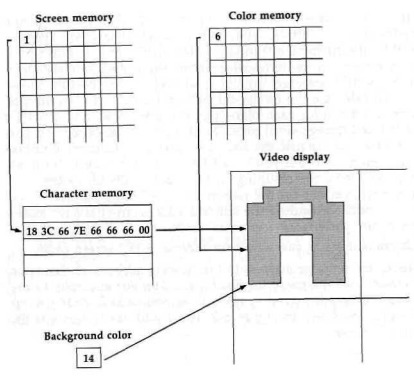
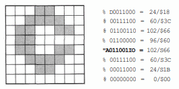
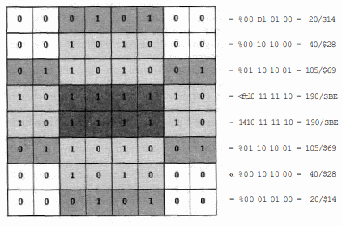
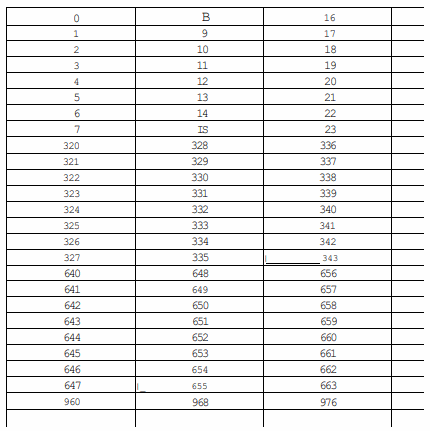

# VIC (Video Interface Controller)

The chip whose registers appear in the $D000-$D030 area of the I/O block
is referred to in Commodore literature as the VIC, even
though it is not exactly the same as the chip with that designation in the 
Commodore 64. However, the chip does provide the same 40-column video display 
features as its Commodore 64 predecessor.

The differences are in the chip's
less familiar, but equally vital function of providing all the
basic riming signals required by the system. The 128's version
of the VIC chip also supports the scanning of the additional 24
keys on the 128's keyboard. For these new features, the 128
version of the VIC has two more registers than its Commodore
64 counterpart (49 instead of 47).

There are actually two different versions of the 128 VIC chip, depending
on the video system required in the country where the computer is sold.
For NTSC (North American) video, the version is officially
designated the 8564 chip, while the PAL (European) model is
designated the 8566. All the registers described below operate
the same on both chips; only the video signal format is different.

## Video Fundamentals
The output signals from the VIC chip tell the video device
(monitor or television) how to draw the screen display.
To understand the operation of the VIC chip, you need to understand
a few of the fundamentals of video displays.

The display is drawn on the monitor or television picture tube by a "gun"
that shoots a beam of electrons at the screen. Where the beam
strikes the face of the screen, a spot on the screen's phosphorescent
coating glows briefly. The electron gun doesn't just
spray electrons at random; the beam is moved in a precisely
controlled pattern. Beginning in the upper left corner of the
screen, the beam is scanned (moved) horizontally across to the
right edge of the screen, drawing a very thin line of dots. It is
then blanked while it is moved back to the left edge, but just
below the top line.

The beam is then scanned horizontally
across the screen again, and the process is repeated until the
stack of thin lines fills the screen display.

Actually, for a color display there are three separate
beams working in conjunction to draw each line—one each
for the colors red, green, and blue. Each dot in the thin screen
line consists of red, green, and blue points. When the relative
intensities of the red, green, and blue points are varied, the
dot can take on a variety of hues. The VIC chip can produce
16 different colors. Whenever a memory location or VIC register
calls for a color value, the color is specified by a value in
the range 0-15. Next table lists the standard designations for
the VIC chip colors.

| Value    | VIC color                |
| -------- | -----------              |
|  0/$00   | black                    |
|  1/$01   | white                    |
|  2/$02   | red                      |
|  3/$03   | cyan                     |
|  4/$04   | purple                   |
|  5/$05   | green                    |
|  6/$06   | blue                     |
|  7/$07   | yellow                   |
|  8/$08   | orange                   |
|  9/$09   | brown                    |
| 10/$0A   | light red                |
| 11/$0B   | dark gray                |
| 12/$0C   | medium gray              |
| 13/$0D   | light green              |
| 14/$0E   | light blue               |
| 15/$0F   | light gray               |

The stack of horizontal video lines is called the raster
(from the Latin word for rake—the pattern of evenly spaced
parallel lines is similar to that produced by pulling a rake
through soil). The individual lines are called raster scan lines.

The number of lines required for a full screen depends on the
video system in use. The North American (NTSC) version of
the VIC chip draws a raster of 264 scan lines,
while the European (PAL) version draws 313. Since the screen phosphor
glows only briefly when struck by the raster beam, the screen
must be constantly redrawn.

The rate of redrawing also depends on the video system: 60 times per second
for NTSC systems or 50 times per second for PAL systems. Not all of these
raster lines are used for the active video display. Most televisions and
monitors overscan. That is, some raster lines at the
top, bottom, or both are actually drawn off the screen.

The VIC compensates by restricting the active portion of the display,
the area where characters and graphics can be displayed,
to 200 lines in the middle of the raster for both NTSC and
PAL systems (this can be reduced to 192 lines. For details,
see the entry for [53265/$D011](D011)). The inactive lines form the
top and bottom portions of the border, a solid-color frame
around the active screen.

The horizontal dots that make up each scan line are called
pixels (short for picture elements). The number of pixels in a
scan line depends on the screen mode, and is limited by the
speed at which the VIC chip can read data from memory.

In the standard two-color modes, where a single bit determines
the pixel color, the VIC chip draws 320 active pixels per scan
line. In the four-color (multicolor) modes, two bits are required
to specify the color of each pixel. Since the VIC must read
twice as much data per pixel, only half as many pixels can be
drawn in the time allotted for a single scan line. As a result,
the multicolor modes have only 160 active pixels per scan line.

The display is still the same size; the pixels are twice as wide
(the screen width can also be reduced to 304 standard pixels
or 152 multicolor pixels. For details, see the entry for
[53270/$D016](D016)). Just as the VIC draws extra lines above and below the
active ones, it also draws extra pixels to the left and right of
the active ones. The inactive pixels form the sides of the
solidcolor border.

The VIC chip supports two major classes of display
modes—character and bitmapped. These are also referred to
as low resolution and high resolution, but that's somewhat
misleading, since both provide the same active screen areas—
320 pixels X 200 lines for standard modes or 160 pixels X 200
lines for multicolor modes.

The difference between the classes is in the degree of control
over individual pixels.

The bitmapped (high-resolution) modes allow you to determine the color of
each pixel individually, while the character (low-resolution)
modes only allow control of groups of pixels. The tradeoff is
that the character display modes use much less memory.

## Video Banks
Before you read a discussion of the display modes, it's
important to understand how the VIC chip sees memory.

The VIC uses the same RAM as the 8502 microprocessor, but it views
the memory very differently. The VIC chip has only 14 address lines
compared to the processor's 16. This means that
the VIC can, at any given time, address only 16K (16384
bytes) out of the 64K of RAM in a block. The 16K area seen
by the VIC chip is referred to as a video bank, not to be confused
with one of the processor's bank configurations—there
is no relationship.

All of the information for the VIC screen
display must be visible within the same video bank. There are
four possible video banks per 64K block, or a total of eight
possible video banks in the two RAM blocks in the 128. Bits
0-1 of the CIA #2 register at [56576/$DD00](DD00) select one of the
four banks, and bit 6 of the MMU register at [54534/$D506](D506) selects
which 64K-RAM block the video bank will be seen in.
Refer to the entries for those locations later in this chapter for
more details. The base (starting) addresses for the banks are as
follows:

| Bank | Base address   |
| ---- | -------------- |
|  0   |     0/$0000    |
|  1   | 16384/$4000    |
|  2   | 32768/$8000    |
|  3   | 49152/$C000    |

## Character Display Modes
The VIC provides three character display modes: standard,
multicolor, and extended background color.

The standard
character display mode is the default system for the VIC—the
one which is active when no other mode is selected. The other
two modes are not directly supported by the 128 operating
system (there's no GRAPHIC statement to select these modes),
so you must enable them by directly setting the appropriate
bits in VIC registers. As a result, those modes are a bit more
difficult to use effectively.

For a standard (GRAPHIC 0) character display, the 320
pixel X 200 line active screen area is divided into 1000 8-pixel
X 8-line character positions, arranged as 25 rows with 40
character positions per row. The contents of the character positions are 
determined by values stored in a 1000-byte area of
screen memory (sometimes referred to as the video matrix).
Each location in screen memory corresponds to a single character position on the 
screen. The value in a screen memory location selects one of 256 standard 
character-pattern definitions
to be drawn in the corresponding character position.

The screen memory values are referred to as screen codes, and
they are not the same as character codes. See Appendix C for
a list of screen codes and corresponding character patterns.
The location of screen memory within the current video bank
is controlled by bits 4-7 of the VIC register at [53272/$D018](D018).
See the entry for that register for details.

The pattern definitions come from another area of memory known as
character memory. As mentioned above, each
character position consists of eight scan lines with eight pixels
per line—a total of 64 pixels per position. In standard character mode,
a pixel can be one of two colors, so only one bit
(which can be either %0 or %1) is required per pixel. Thus, a
character-pattern definition requires 64 bits, or eight bytes.
The pixels represented by %0 bits in the pattern definition are
drawn in what is referred to as the background color, which is
common to all screen positions. The pixels represented by %1
bits are drawn in what is referred to as the foreground color,
which can be independently selected for each character position.

The location of character-pattern memory within the current video bank
is controlled by bits 1-3 of the VIC register at
[53272/$D018](D018). See the entry for that register for more details.
Standard character definitions for the 128 come from the character ROM.
This ROM is located beginning at address [53248/$D000](D000)
in the system's address space, but can be made visible
in any video bank. See the section on character ROM later in
this chapter for more information.

The background color for %0 bits in all character positions
is determined by the value in the VIC register at
[53281/$D021](D021). The foreground color for the %1 bits in each
character position is determined by values in another 1000-
byte area of memory known as color memory. As in screen
memory, each location in color memory corresponds to a character
position on the screen.

Unlike the case of screen and
character memory, however, the location of VIC color memory
is fixed and does not have to be within the current video bank.
It always appears to the processor at locations 55296-56319/
$D800-$DBFF in the I/0 block. Refer to the section on color
memory later in this chapter for details.
The procedure for displaying the character A in blue at
the upper left corner of the screen would be something like
this: The VIC looks to the first location of screen memory to
determine which character pattern to display in that position.

The screen code for A is 1, so this value is used as an index to
the eight-byte pattern definition in character memory. The VIC
then looks to the first location of color memory and proceeds
to draw pixels in the color specified there (6 for blue) for all
%1 bits in the pattern. For all %0 bits, pixels are drawn in the
color specified in the background color register. Next figure
illustrates the process.

## Custom Characters
You are not limited just to the character patterns provided in
the ROM. It is relatively simple to design your own characters.
However, using custom characters is an all-or-nothing affair.
Once you switch off the standard ROM-based character set,
you must provide definitions for every character you wish to
use. You must begin by selecting the area of RAM where you
will place the new character set. See the entry for the register
at [53272/$D018](D018) for details.

If you only want to use a few custom characters while retaining
the majority of the standard
character set, the next step is to copy the standard character
patterns from ROM to the selected RAM area. If you do this,
you'll only have to provide custom pattern information for
those characters you wish to redefine.
To calculate the proper byte values for a custom character
definition, use an 8 X 8 grid as shown in the next figure. Fill in
the grid squares for those pixels you wish to have displayed in
the foreground color. Unless you are designing patterns that
will connect with adjacent patterns (such as the line segments
in the standard character set), it is customary to leave at least
one row and one column of the pattern blank to provide some
horizontal and vertical separation between characters.

The
ROM patterns for the standard letters and numbers don't fill
in any pixels in the leftmost column, and only lowercase characters
with descenders (g, j, p, q, and y) use the bottom row.
To calculate the binary bit pattern for each row of the pattern,
use a %0 for each blank (background) pixel and a %1 for
each filled (foreground) pixel. Next, convert the binary
bit pattern to a number (use the machine language monitor's
number conversion feature if you're not handy with binary). The final
step is to store the resulting eight values in the character
memory locations for the pattern you are changing.
The simple formula for finding the starting address in
character memory of the pattern for any character is:

pattern address = character base address + (8 * screen code)

The character base address is the starting address of character
memory (see the entry for [53272/$D018](D018)).
For example, to replace the British pound symbol (£, screen code 28/$1C) with
the pattern shown in next figure, you could use statements like
the following:

## Multicolor Character Mode
Multicolor character mode is similar in operation to standard
character mode. The difference is that each multicolor character
position consists of 4 pixels X 8 lines (instead of 8 X 8).
The number of positions remains the same (25 rows X 40 columns)
and the positions are the same size, but now each pixel
is twice as wide (there are only 160 pixels per raster line).
However, each pixel can be one of four colors instead of just
one of two colors. Screen memory still holds pointers to pattern
definitions in character memory, but the pattern information is
interpreted differently. It now takes two bits per
pixel to select the color instead of just one, but since there are
only half as many pixels per pattern, the number of bits required for each definition remains the same (2 bits per pixel *
4 pixels * 8 lines = 64 bits).

To select multicolor character mode, you must set bit 4 of
the VIC register at location [53270/$D018](D016). However, there's a
problem here because the screen editor IRQ routine always resets
this bit to %0 when setting up the text screen (see the section
below on the screen editor IRQ routine). To prevent this,
you must turn off the screen-setup portion of the IRQ by storing
the value 255/$FF in location 216/$D8. Setting the VIC
register bit makes it possible to enable multicolor character
mode for any or all screen positions, but it doesn't actually
switch any screen positions to multicolor mode.

Multicolor
mode must be enabled individually for each character position
on the screen. The controlling factor is **bit 3** of the
color memory location for each character position. When that bit is %0
in a color memory position, the corresponding character position
on the screen remains in standard character mode, so it is
possible to intermix standard and multicolor character modes
on the same screen display. However, only **bits 0-2** of the
color memory location are now available to hold color values,
so the foreground color for standard mode positions in a multicolor display is limited to the first eight values in Vic color table black-yellow,
values 1-7.

To select multicolor character mode
for a screen position, you must set bit 3 of the corresponding
color memory location to %1 . That is, you must store a value
of 8 or greater in the location.

When a multicolor character is drawn, all pixels in the
pattern represented by %00 bit pairs will be drawn in the
background color specified in the VIC register at [53281/$D021](D021).
All pixels represented by %01 bit pairs will be drawn
in the color specified by the value in the register at [53282/$D022](D022),
and all pixels for %10 bit pairs will be drawn in the
color specified in the register at [53283/$D023](D023).

All of these
registers can take any of the 16 standard colors listed in Vic color
table, but since the registers are common to all positions, the
color for pixels with %00, %01, and %10 patterns will be the
same for all characters. However, the color for pixels with
%11 bit patterns can be specified individually for each screen
position in the corresponding color memory location. Since bit
3 of the color memory location is used to specify multicolor
mode, only bits 0-2 are available to hold color values.

As a result, only the first eight colors are available. But since bit 3
must be set to %1 , the values you store in color memory to
achieve these colors are different from the standard values. For
multicolor character mode, the values to store in color memory
to select the available colors for %11 bits are as follows:

| Desired %11 bit color | Value to store in color memory |
| ----------------------| ------------------------------ |
| black                 |  8/$08                         |
| white                 |  9/$09                         |
| red                   | 10/$0A                         |
| cyan                  | 11/$0B                         |
| purple                | 12/$0C                         |
| green                 | 13/$0D                         |
| blue                  | 14/$0E                         |
| yellow                | 15/$0F                         |

Because the standard character sets were not designed to
be displayed in multicolor character mode, any text printed to
the screen in this mode will be at best barely legible.
As a result, multicolor mode is practical only when you are
using custom characters designed specifically for this mode. The rules
for designing custom characters for multicolor mode are the
same as for the standard character mode, except that you
design the characters in a 4 X 8 grid, as shown in Figure 8-3.

Each grid position can hold one of four two-bit values
representing the four color choices:

| | |
|-|-|
| %00 | Background color 0 (common to all characters) |
| %01 | Background color 1 (common to all characters) |
| %10 | Background color 2 (common to all characters) |
| %11 | Foreground color {independently selectable for all characters, but only eight colors are available) |

Once the design is completed, the byte values for the
character-pattern definition are calculated just as for
standard character mode.

## Extended Background Color Mode
The third character mode, extended background color mode, is
selected by setting bit 6 of the VIC register at [53265/$D011](D011) to
%1. It also uses the same fundamental elements as standard
character mode: screen memory, character memory, and color
memory. As in standard character mode, the extended background color
mode screen is divided into a 25-row X 40-column
grid of 8-pixel X 8-line character positions.

As in standard
character mode, each position has a corresponding screen
memory location that holds a value indicating which pattern
from character memory is to be drawn in the position. And, as
in standard character mode, each character position on the
screen takes its foreground color (the color for pixels represented
by %1 bits in the character pattern) from the value in a
corresponding color memory location. The difference is that
extended background color mode allows you to select from
among four different background colors for the pixels represented
by %0 bits in the character patterns.

The background color for each position is specified by bits
6-7 of the screen code for the position. These bits select which
of the four background color registers will specify the background
color for the position:

|Bits 7-6 | Background color source                   |
|-------- | ----------------------------------------- |
|   0 0   | background color register 0 (53281/$D021) |
|   0 1   | background color register 1 (53282/$D022) |
|   1 0   | background color register 2 (53283/$D023) |
|   1 1   | background color register 3 (53284/$D024) |

Since the highest two bits of each screen memory location
are used to specify background color, only bits 0-5 are available
to hold screen code data. Thus, there are only 64 different
unique screen code values (0-63), so only the first 64 eight-bit
pattern definitions in character memory are used in this mode.

For example, screen memory values of 1/$01, 65/$41, 129/$81,
and 193/$C1 all produce the same character (screen code 1,
the letter A in the standard character set), but each provides a
different background color for that character.

## Bitmapped Display Modes
The VIC provides for two bitmapped modes: standard and
multicolor. In these modes, the state of each pixel in the
screen display can be controlled independently. The standard
bitmapped mode allows you to select one of two colors for
each pixel, while the multicolor mode allows you to chose
from among four colors. Both modes are supported by the
operating system: standard bitmapped mode as GRAPHIC 1 (or,
with a text window, as GRAPHIC 2) and multicolor bitmapped
mode as GRAPHIC 3 (or, with a text window, as
GRAPHIC 4).

Standard bitmapped mode is selected when bit 5 of the
VIC register at [53271/$D017](D017) is set to %1 (but see the section
below on the screen editor IRQ for information about the
shadow for this bit). This mode provides for 320 horizontal
pixels per line, each of which can be one of two colors.
A single bit is required to specify the color of each pixel, so 320 *
200, or 64,000 bits, are required to "map" the entire display
area. At 8 bits per byte, 8000 bytes are required for the bitmap.
This is half of the available space in the 16K video bank.
The starting address of the bitmap is specified in bit 3 of the
register at [53272/$D018](D018).
The VIC's scheme for mapping the screen is simple for
the chip (it's a variation of character mode), but it's rather
complicated for the programmer. As you would expect, the
first eight pixels on the screen, starting in the upper left corner
of the first vertical line, are controlled by the eight bits of the
first byte of the bitmap. However, the next eight pixels are
controlled by the bits of the ninth byte. The bits of the second
through eighth bytes in the bitmap control the leftmost eight
pixels of the second through eighth vertical lines. This scheme
is repeated across the screen. Figure 8-4 illustrates the offsets
from the bitmap starting address for the bytes which control
the pixels in the upper left corner of the screen.

This obviously isn't very convenient. Most programmers
prefer to use a more familiar ^-coordinate system.
In this system, the horizontal (x) pixel position
will be in the range 0-319 and the vertical {y) position will be
in the range 0-199. In x,y format, the upper left corner of the
screen is position 0,0 and the lower right corner is position
319,199. This is also the format used to specify screen
positions in BASIC statements such as BOX, CIRCLE, and DRAW,
To determine the byte offset (0-7999) within the bitmap and
the bit (0-7) within that byte which corresponds to a
particular ^-coordinate pair, use the following formulae:

byte offset = 40 * (y AND 248) + (x AND 504) + (y AND 7)

bit = 7 - (x AND 7)

where x will have a value in the range 0-319 and y will have
a value in the range 0-199.
Each bit in the bitmap can be either %0 or %1, so each
corresponding pixel on the screen can be one of two colors.

By convention, the color specified by a %0 bit is referred to as the
background color and the color specified by a %1 bit is
referred to as the foreground color. The values for both colors
come from the video matrix, the area used as screen memory
in the character display modes. (Color memory and the background
color registers are not used in standard bitmapped
mode.) The low nybble (bits 0-3) of a video matrix location
holds the background color value and the high nybble (bits
4-7) holds the foreground color value. Either foreground or
background can take any of the 16 colors listed in Table 8-1.
However, since there are only 1000 video matrix positions, the
foreground and background color cannot be specified individually
for each of the 64,000 pixels on the screen. All 64 pixels
within an 8-pixel X 8-line area will share foreground and
background colors. The common areas are arranged in the
same fashion as screen memory: 25 rows X 40 columns.^ To
determine the video matrix location that holds the color
information for a particular x,y coordinate, use the following
formula:

color byte = 40 * INT(y / 8) + INT(x / 8) + screen base address

## Multicolor Bitmapped Mode
Multicolor bitmapped mode is similar to bitmapped mode, but
the number of possible colors per common color area is increased
to four. To select among four different colors, two bits
are required for each pixel. Since twice as many bits are
required to specify the color of each horizontal pixel, only half
as many pixels can be displayed per line; horizontal resolution
is reduced to 160 pixels per line. The display will still be the
same size, but each pixel will now be twice as wide.

To determine the byte offset (0-7999) within the bitmap and the bit
pair (0-3) within that byte which correspond to a particular
^-coordinate pair, use the following formulae:

byte offset = 40 * (y AND 248) + 2 * (x AND 252) + (y AND 7)

bit pair = 3 - (x AND 3)

where x will have a value in the range 0-159 and y will have
a value in the range 0-199.

Of the four color sources in multicolor mode, one is common
to all pixels on the screen and the other three can be
selected independently for each common color area. Common
color areas correspond in size {4 pixels X 8 lines) and layout
(40 X 25) to multicolor character positions. All pixels
represented by %00 bit patterns in the bitmap will take the color
specified in the VIC background color register at [53281/$D021](D021).

As in standard bitmapped mode, the video matrix
(screen memory) area holds color information. In this case, the
lower nybble (bits 0-3) of each video matrix location specifies
the color for all %10 bit patterns within the corresponding
common color area, while the upper nybble (bits 4-7) specifies
the color for alt %01 bit patterns in the common color area.
The color for any %11 bit patterns in each common color area
is determined by the value in the corresponding color memory
location (55296-56295/$D800-$DBE7). Any of these color
sources can take any of the 16 vic color values.

## Sprites
Sprites, which Commodore officially calls movable object
blocks (MOBs), are a special feature of the VIC. As their
official name implies, sprites are images that can be easily moved
about on the screen. Sprites are completely independent of the
background display, and can be made to appear either in front
of or behind screen foreground objects. They can move with
equal ease over character and bitmapped screens. The manipulation
of sprites consumes a substantial portion of the VIC
chip's internal hardware. You'll notice in the discussion of VIC
registers that 34 of the chip's 49 registers are used for some
sort of sprite manipulation. This section uses the standard VIC
number designations, 0-7, for the eight sprites. BASIC, on the
other hand, uses sprite numbers 1-8. Add 1 to the VIC sprite
number to get the corresponding BASIC sprite number, or
subtract 1 to convert the BASIC sprite number to a VIC sprite
number.

Sprites have the same two basic modes as screen displays:
standard and multicolor. Standard sprites are 24 pixels wide X
21 scan lines tall, and can have only one color. Multicolor
sprites are 12 pixels wide X 21 scan lines tall, and can have
three colors. However, multicolor sprites are the same size as
standard sprites because the multicolor pixels are twice as
wide.

Sprites can also be doubled in size horizontally or vertically
(see the registers at [53271/$D017](D017) and [53277/$D01D](D01D)).
The rules for defining sprite bit patterns are the same as
for custom characters in the corresponding screen modes. Each
standard sprite pixel is represented by one bit in a pattern bitmap,
while each multicolor sprite pixel requires two bits.

Thus, three bytes are required to define each scan line of the
pattern, and each sprite pattern definition requires 3 * 21, or
63 bytes. The rules for calculating byte values are the same as
for custom character patterns. 

For standard sprites, all pixels represented by %0 bits in
the definition pattern will be transparent. That is, whatever is
on the screen behind the sprite will show through. Pixels
represented by %1 bits take the color specified in the color
register for that sprite (53287-53294/$D027-$D02E), so each sprite
can take a different sprite foreground color.

For multicolor
sprites, pixels represented by %00 bit patterns are transparent.
Pixels represented by %01 and %11 patterns take the colors
specified in the sprite multicolor registers (53285/$D025 and
53286/$D026, respectively). These colors are common to all
eight sprites. Multicolor pixels represented by %10 bit patterns
take the color specified in the sprite foreground color registers.
The 63 data bytes for the sprite pattern can't be placed
just anywhere in memory.

The definitions must be located
within the current VIC video bank, and must begin at an address
which is an exact multiple of 64. A 16K VIC video bank
has room for 16384 / 64, or 256 sprite patterns. The pattern
for each of the eight sprites is determined by the value in a
corresponding sprite pointer. The sprite pointers don't occupy
any fixed locations.

Rather, they are found at the highest eight
locations of the current screen memory (video matrix) area, at
offsets of 1016-1023 bytes from the start of the area. The
pointer value (0-255) selects one of the 256 sprite pattern
areas. The relationship between pointer values and definition
pattern area starting addresses is as follows:

pointer value = pattern starting address / 64

or:

pattern starting address = pointer value * 64

The 128 reserves locations 3584-4095/$0E00-$0FFF in
block 0 RAM to hold sprite pattern data. This 512-byte area
provides room for eight patterns, one for each of the eight
sprites. The sprite pointers are initialized to point to patterns
in this area as follows:

|Sprite | Pointer value | Pattern address |
|--|--|--|
|0| 56/$38| 3584-3647/$0E00-$0E3F
|1| 57/$39| 3648-3711/$0E40-$0E7F
|2| 58/$3A| 3712-3775/$0E80-$0EBF
|3| 59/$3B| 3776-3839/$0EC0-$0EFF
|4| 60/$3C| 3840-3903/$0F00-$0F3F
|5| 61/$3D| 3904-3967/$0F40-$0F7F
|6| 62/$3E| 3968-4031/$0F80-$0FBF
|7| 63/$3F| 4032-4095/$0FC0-$0FFF

Even after a sprite is assigned a pattern, it will not appear
on the screen until it is enabled and moved into the visible
area of the screen display. Sprites are enabled by setting the
appropriate bits in the register at [53269/$D015](D015). The position
of each sprite on the screen is specified by values in the registers
at 53248-53264/$D000-$D010. Refer to the discussion of
those registers for details.

When two sprites positions' overlap, one will appear in
front of the other. The one that appears in front is said to
have higher priority. The priority of the sprites in relation to
each other is fixed. Sprite 0 has the highest priority, and will
appear in front of any other sprites it may overlap. Sprite 1
has the next highest priority; it can appear in front of any
sprite except sprite 0. The priority decreases with increasing
sprite number, down to sprite 7, which appears behind any
other sprite it may overlap. The priority of sprites in relationship
to screen foreground objects is programmable; sprites can
appear to pass either in front of or behind screen foreground
pixels. See the discussion of the register at [53275/$D01B](D01B) for
details.

When two sprites overlap, or when a sprite overlaps
screen foreground pixels, a collision is said to occur. The VIC
records these collisions automatically, and can generate
interrupts as a result. See the discussion of the registers at
53278-53279/$D01E-$D01F.

## Screen IRQ Routines
The 128 introduces a feature that may be unfamiliar to those
with previous Commodore experience: shadow registers. A
shadow register is a RAM memory location that is copied into
a hardware register at regular intervals. Shadow registers are a
feature of the system's software, not its hardware. The system
IRQ interrupt sequence, the collection of routines executed
every 1/60 second (1/50 second in PAL systems), includes two
separate sections which affect the VIC chip. The screen editor
IRQ routine [$C194](C194) controls the screen mode and raster interrupt,
and the BASIC IRQ routine [$A84D](A84D) controls sprite
movement, detects sprite collisions, and reads the light pen.

Because these routines maintain shadows of some VIC registers,
the registers cannot be changed directly while the normal
interrupt sequence is active. If you try to store a new value in
a register that has a shadow, the interrupt will replace your
value with the shadow register contents at the next system
IRQ interrupt—within 1/60 second.

The discussion of the VIC
registers below notes which registers have shadows and explains
how to go about changing such registers. Refer to the
appropriate ROM routine entry for more information on the
interrupt routines.
